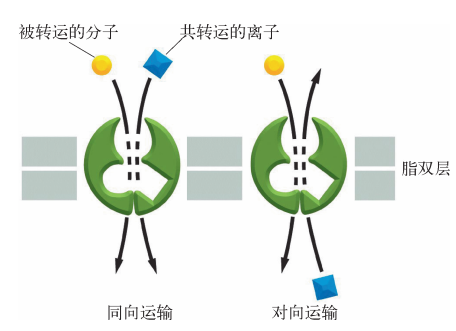

 
 ---
 
 ---

 ***第一篇***  概论

# **第一章** 细胞生物学概述
## 第一节 概念及其研究内容
## 第二节 发展历史及趋势
- 1665罗伯特胡克观察软木木栓组织细胞，发现细胞（死细胞）
- 1667列文虎克用自制显微镜观察活细胞
### 施莱登施旺首次提出细胞学说
> 19世纪自然科学三大发现之一
- 1.细胞是一个有机体，一切动植物都是由细胞发育而来，
并由细胞和细胞产物所构成
- 2.细胞是动物、植物结构和功能的基本单位。
- 3.细胞是一个相对独立的单位，既有它自己的生命，  
又对与其他细胞共同组成的整体生命起作用。

## 第三节 细胞生物学与医学

# **第二章** 细胞的起源与细胞概述
## 第一节 细胞的起源
## 第二节 细胞结构的一般特征
### 细胞的基本共性
- 1.所有细胞表面都包被有由脂质双分子层与蛋白质构成的细胞膜
- 2.所有细胞都有DNA和RNA两种核酸
- 3.所有细胞都有核糖体
- 4.所以有细胞都是以特定的方式进行分裂生殖的
### 细胞的数目
- 生物体或某一器官的细胞数目是根据细胞的提交和生物体或某一器官的体积估计得到的
- 有机体细胞的数目不是固定不变的，而是处于动态平衡之中
- 细胞体积守恒定律：各类细胞体积恒定，器官的大小与细胞数目有关，而与细胞体积无关
### 显微结构（光镜）
- 细胞核、细胞质、细胞膜
### 亚显微结构（电镜）
- 膜相结构（有膜结构的） 
  - 一网 两膜 四体  
    - 内质网、细胞膜、核膜、高尔基复合体、溶酶体、线粒体、微体
  - 膜结构意义：区域化作用
- 非膜相结构

## 第三节 原核细胞和真核细胞
### 原核细胞
#### 细胞壁
- 10~25nm
- 肽聚糖
#### 拟核
#### 质粒
- 双链环形DNA
- 长度常为1000~30000碱基对
- 1.常有某些抗药性基因，是产生耐药性的基础，帮助原核生物适应环境
 2.可作为基因工程的运载体
#### 间体=中间体=质膜体
- 细胞膜内陷折叠形成的结构
- 与能量代谢有关
### 真核细胞
- 由原核细胞进化来，二者有基本的共同特征。但真核细胞更复杂
- 真核细胞有典型核结构、内膜系统
### 真核细胞、原核细胞的区别
> 根本区别：有无真正的细胞核

|特征|原核细胞|真核细胞|
|----|:--------:|:-------:|
|细胞大小|较小，1~10μm|较大，10~100μm|
|细胞核|拟核，无核膜、核仁|真核，有核膜、核仁|
|基因组DNA|环状双链，不与组蛋白结合|线状双链，与组蛋白结合成染色质|
|细胞壁|主要由肽聚糖组成|植物主要纤维素|
|细胞器|无（除核糖体外）|有|
|核糖体|70S(50S+30S)|80S(60S+40S)|
|内膜系统|无|复杂|
|细胞骨架|无|有|
|转录与翻译|转录与翻译同时进行|转录在核内，翻译在细胞质中进行|
|细胞分裂|二分裂|有丝分裂、无丝分裂、减数分裂|
# **第三章** 细胞的分子基础
## 第一节 细胞的小分子物质
### 水
- 最重要的无机小分子，占细胞总质量的70%
- 大多数代谢过程都需要水参与
### 无机盐
- 占细胞总重量的19%左右，以离子形式存在
- 维持细胞内的渗透压和酸碱平衡
- 作为酶的辅助因子
### 有机小分子
> - 是细胞代谢过程中的中间产物，也是构成生物大分子的基本单位
> - 主要包括：单糖、脂肪酸、氨基酸、核苷酸
#### 单糖
- $(CH_2O)_n$,其中，n为3~7
- 如：甘油醛、核糖、脱氧核糖、葡萄糖
#### 脂肪酸
- 是直链脂肪烃有机酸，一般含一个羧基
- 通式：$CH_3(CH)_nCOOH$
- 功能:1、构成细胞膜的主要成分
        2、分解提供能量
#### 氨基酸
- 是组成蛋白质的基本单位，组成蛋白质的氨基酸只有20种，都是α-氨基酸
#### 核苷酸
- 是组成核酸的基本结构单位
- 每个核苷酸含有一个碱基、一个戊糖、一个磷酸分子

## 第二节 细胞的大分子物质
- 细胞的大分子物质有蛋白质、核酸、多糖等，相对分子质量一般为10 000~1 000 000kDa
- 分子质量巨大，结构复杂，功能多样
- 是组成生命物质和行使生命活动的重要分子基础
### 蛋白质(protein)
- 是构成细胞的主要成分，是各种生命物质是主要结构基础
- 基本结构单位：氨基酸
- 基本化学键：肽键
- 氨基酸通过肽键形成多肽链
#### 结构
- 一级结构
  > - 肽键为主键、二硫键为副键
    - 是蛋白质的基本结构和功能基础
    - 即使一个氨基酸的改变也可能导致空间结构变化
    - 只有一级结构被破坏是不可逆的
- 二级结构
   > - 在一级结构的基础上，借**氢键**维持多肽链
     盘绕折叠形成的有规律重复的空间结构
    
  - 基本构象
    - α螺旋
        - 右手螺旋
    - β折叠
    - 三股螺旋
        - 胶原蛋白特有
- 三级结构(有生物活性)
    >- 多肽链在二级结构的基础上的，进一步螺旋折叠形成的空间结构
    >- 维系三级结构的化学键除肽键、氢键和二硫键之外，
    还有各氨基酸侧链之间形成的疏水键、离子键等
    - 氢键、二硫键、疏水键、离子键
    - 亚基：有独立三级结构的多肽链
- 四级结构(有生物活性)
    > 由两条或多条具有独立三级结构的肽链（亚基）   
    相互作用聚合而成
    - 不是所有的蛋白质都具有四级结构
    - 蛋白质必须在三级结构基础上才能表现出生物活性
### 核酸
- 细胞内储存和传递遗传信息的生物大分子物质
- 基本结构单位：核苷酸
- 基本化学键：3',5'-磷酸二酯键
#### 核酸的种类
- 脱氧核糖核酸（DNA）
- 核糖核酸（RNA）
  - 信使RNA(mRNA)
  - 转运RNA(tRNA)
  - 核糖体RNA(rRNA)
#### DNA
- 结构：双螺旋结构......
  - B-DNA(右手双螺旋)，生物体内天然状态的绝大多数DNA以B-DNA形式存在
  - A-DNA和Z-DNA
- 功能：携带和传递遗传信息
#### RNA
- 大RNA三种类型
  - 信使RNA(mRNA)
  - 转运RNA(tRNA)
  - 核糖体RNA(rRNA)（占细胞内RNA总量的80%以上）
- 小RNA：非编码RNA，调控基因表达
  - 微小RNA(micro RNA,miRNA)与靶基因不完全互补结合，抑制翻译或促进去除mRNA的基因表达
  - 小干扰RNA(small interfere RNA,siRNA)变性后与目标mRNA完全互补配对
  - 与PIWI相互作用的RNA（piwi-interacting RNA,piRNA）主要在生殖细胞和干细胞中
  - 核内小RNA(small nuclear RNA,sn RNA)参与mRNA前体的加工，富集于核仁
  - 长链非编码RNA(IncRNA)位于细胞核或细胞质中
- 核酶
  - 具有酶活性的小RNA分子
  - 功能：核酶的底物是RNA分子。它们通过与序列特异性的靶RNA分子配对而发挥作用
  - 类型：自体催化剪切型、异体催化剪切型、第一组内含子自我剪接、第二组内含子自我剪接、锤头状核酶
#### DNA和RNA比较
||DNA|RNA|
|---|:---:|:---:|
|戊糖|脱氧核糖|核糖|
|碱基|A、T、G、C|A、U、G、C|
|磷酸|相同|相同|
|结构|双螺旋|单链或假双链|
|分布|细胞核为主|细胞质为主|
|功能|储存遗传信息|传递和调控遗传信息|
---
---
***第二篇*** 细胞的结构和功能

# **第五章** 细胞膜与物质运输
## 第一节 细胞膜的化学组成和分子结构
> - 细胞膜：构成细胞外层界膜的单位膜，又称质膜
> - 细胞内膜：核膜和构成各种细胞器的膜
> - 生物膜：细胞膜和各种细胞器的统称
### 一、膜的化学组成
  > **脂类**、**蛋白质**、糖类、水、无机盐、金属离子 
  - 功能越复杂的膜蛋白质占比越大，反之越小
#### (一)膜脂
- 细胞膜上的脂类，是细胞的基本组成成分，形成膜的基本骨架
- 包括磷脂、胆固醇、糖脂，以磷脂为主
##### 1.磷脂(主)
> - 磷酸-甘油-2脂肪酸
- 主要的磷脂：磷酸甘油脂和鞘磷脂
- 最简单的磷酸甘油酯——磷脂酸
  主要有PC(磷脂酰胆碱)、PE(磷脂酰乙醇胺)、PS(磷脂酰丝氨酸)、SM(鞘磷脂)
- **双亲媒性分子(兼性分子)**——有亲水性头部和疏水性尾部的分子
- 脂双层在水中的三种存在形式：
  - 单分子团
  - 双分子层
  - 脂质体
    
##### 2.胆固醇(主)
> - 极性烃基-固醇环-非极性脂肪酸链
###### 作用：
- 胆固醇与磷脂的碳氢链(甘油基团)相互作用
- 阻止磷脂凝集成晶体结构，对膜脂的物理状态具有**调节**作用
- 胆固醇有加强细胞膜的作用
##### 3.糖脂
>- 糖脂为含有一个或几个糖基的脂类
- 大约占外层脂类分子的5%左右

#### (二)膜蛋白
##### 1.跨膜蛋白=膜内在蛋白=镶嵌蛋白
> - 占膜蛋白总量的==70%~80%==
> - 属于==兼性分子==
> - 与膜结合==非常紧密==。     
只有用==去垢剂==处理使膜崩解，   
才能使其从膜上溶解下来。
- 作用：受体、载体、酶
##### 2.膜周边蛋白=膜外在蛋白
> - 通过非共价键，如静电作用、离子键、氢键   
与膜脂的极性头部结合。
> - 或与跨膜蛋白亲水部分相互作用
而间接与膜结合
> - 水溶性蛋白质，用较温和的条件处理，就能使膜周边蛋白溶解下来
- 作用：支架、收缩、调节
- 分布：主要分布在膜内侧(*膜的不对称性*)
##### 3.膜锚定蛋白=脂连接蛋白
- 以共价键与脂双层分子结合
  - 与脂双层分子的碳氢形成共价键
  - 通过寡糖链间接结合
##### 跨膜蛋白和膜周边蛋白比较
|名称|含量|分布|解离方法|功能|
|-|-|-|-|-|
|**跨膜蛋白**|70%~80%|镶嵌于   膜脂双分子层中|去垢剂|受体、载体、酶|
|**膜周边蛋白**|20%~30%|主要分布在   膜内表面|改变溶液的离子强度     或pH值    或加入金属螯合剂等|起机械支持、收缩、调节催化等作用|
#### (三)膜糖
- 构成细胞被
- 糖蛋白
- 糖脂
- 主要分布在细胞膜外表面
### 二、膜的分子结构
#### 液态镶嵌模型
脂双层构成膜的连贯主体，它既具有固体分子排列的有序性，又具有液体的流动性。膜中蛋白质分子以不同形式与脂双分子层镶嵌结合。强调了膜的流动性和膜蛋白与脂类分子间的镶嵌关系。 
- 该模型优点：强调了膜的流动性以及球形蛋白质与脂双分子层的镶嵌关系，可以解释许多膜中所发生的现象。
- 该模型缺点：没有说明具有流动性的细胞膜在变化过程中怎样保持膜的相对完整性和稳定性，忽视了蛋白质分子对膜流动性的控制作用。
- “晶格镶嵌模型”和“板块镶嵌模型”对其补充。 
#### 脂筏模型
模型认为生物膜上胆固醇形成的有序脂相如同脂筏一样载着执行某些特定功能的膜蛋白。脂筏是细胞膜上富含胆固醇和鞘磷脂的微结构域，其中聚集一些特定种类的膜蛋白，大小约70nm，是一种动态结构，位于细胞膜的外侧。
### 三、膜的主要理化特性
#### (一)膜的不对称性
- 膜蛋白分布的不对称性
- 膜脂分布的不对称性 
#### (二)膜的流动性
- 1.膜脂的流动性
  - 膜脂双分子层是二维流体
  - 液晶态度膜是处于流动状态，与运动的膜蛋白协同完成膜的各项功能活动
- 2.膜蛋白的流动性
  - 侧向扩散——膜蛋白在脂膜中可以自由漂浮和在膜表面扩散
  - 旋转扩散——膜蛋白能围绕与膜平面相垂直度轴进行旋转运动
-  影响膜流动性的因素
   - 脂肪酸链的长度
   - 脂肪酸链的饱和程度
   - 胆固醇的影响
   - 膜蛋白的影响
   - 其他因素：环境温度、pH、离子强度、金属离子 
## 第二节 细胞膜与物质的跨膜转运
### 与细胞膜有关的物质运输有两类：
- 穿膜运输：小分子和离子
- 膜泡运输：大分子和颗粒物质
### 一、穿膜运输
> 穿膜运输是小分子物质和离子穿过细胞膜的运输方式
#### 根据是否消耗细胞代谢能，穿膜运输可分为：
##### 被动运输
- 被动运输依据是否需要膜运输蛋白分类
  - (一)简单扩散——不要膜蛋白
  - (二)离子通道扩散——要离子通道(有三种)
  - (三)易化扩散——要载体蛋白
  - (四)水通道扩散——要AQPs
- 被动运输：顺浓度梯度，不消耗细胞代谢能
##### 主动运输=代谢关联运输
- 主动运输通过消耗细胞代谢能，将物质逆浓度梯度运输
- 特点： 
  - 逆浓度梯度或逆电化学梯度运输
  - 要消耗细胞的代谢能
  - 需要转运蛋白的帮助
- 影响因素：细胞代谢状态
###### 分类：
- (五)离子泵——由ATP直接提供能量
- (六)伴随运输——由ATP间接提供能量

#### (一)简单扩散
- 指不消耗细胞代谢能，不依靠膜运输蛋白，顺浓度梯度运输小分子的运输方式
- 特点
  - 顺浓度梯度运输
  - 不消耗细胞代谢能
  - 不依靠膜运输蛋白(直接穿过膜的脂双层)
- 能简单扩散的：
  - 一些气体和脂溶性物质：$O_2、CO_2、$乙醚、氯仿、甾类激素等
  - 不带电荷的极性小分子物质：$H_2O$、尿素、甘油等，但速度较慢
- 人工膜(只有脂质，没有蛋白质)对各类物质的通透率：
  - 脂溶性越高通透性越大，水溶性越高通透性越小
  - 非极性分子比极性分子更容易通过，极性不带电小分子，如$H_2O$等，能通过但速度慢
  - 小分子比大分子容易通过；分子量略大一点的葡萄糖、蔗糖很难通过
  - 带电荷的物质，如各类离子高度不通透
- 决定扩散速度的因素：
  - 浓度梯度
  - 通过物质的分子大小
  - 通过物质在脂质中的相对溶解度
#### (二)离子通道扩散
##### 通道蛋白
是细胞膜中一类贯穿整层的镶嵌蛋白，能在膜上形成开放的亲水通道，允许一定大小和携带电荷的溶质顺浓度梯度直接通过。目前发现通道蛋白50余种，绝大多数都形成有选择性开关的跨膜通道，几乎都与离子转运有关，故称离子通道

- $Na^+、K^+、Ca^{2+}$等极性很强的水化离子，借助膜上的*离子通道*由高浓度一侧向低浓度一侧扩散
- *离子通道*为膜上的*跨膜蛋白*，包括三类：(闸门=门控)
- 
  - 电压闸门通道
    - 这类通道依据细胞内外带电离子的状态，通过膜电位的变化使其构象改变，从而使"门"打开 
  - 配体闸门通道
    - 这类通道在细胞内外的特定配体与其表面受体结合时，“门”打开
  - 机械闸门通道
    - 这类通道在细胞内外的机械压力发生变化时，“门”打开 
##### 离子通道蛋白介导的离子转运的特征：
- 转运速度很快
- 高度选择性
- 都是被动运输(被动运输的特征)

#### (三)易化扩散

- 一些非脂溶性的物质，需要借助细胞膜上的***载体蛋白***顺浓度梯度运输
- 葡萄糖、氨基酸等物质的运输，需要载体蛋白的介导
  - 例：葡萄糖载体蛋白介导红细胞膜上葡萄糖的被动运输 

##### 特点
  - 顺浓度梯度运输
  - 不消耗细胞代谢能
  - 依靠膜载体蛋白协助
  - 高度特异性
  - 有载体饱和现象
    - 单个载体蛋白的运输速率有限
    - 载体蛋白的数量有限
  - 可抑制性
#### (四)水通道扩散
- 水是一种极性小分子，不溶于脂，但穿膜速度很快
- 1992年，转运水的特异性通道蛋白被发现，目前已发现13种
- 目前用$AQPs$表示水通道
- $AQPs$没有门控性、饱和性、膜电位依赖性
- 有些$AQPs$除了转运水，还会转运其他物质，如氨基酸、糖，甚至亚砷酸盐
  - AQPs3、AQPs7、AQPs9：水-葡萄糖通道
  - AQPs9：也能转运其他小的极性物质，包括氨基酸、糖，甚至亚砷酸盐

#### (五)离子泵
- 离子泵：是膜上的一种能将离子逆浓度梯度转运的载体蛋白，实质是一种ATP酶
- 离子泵有载体和酶的两重作用。
- 种类
  - 钠钾泵
  - 钙泵($Ca^{2+}-ATP$酶)
  - 质子泵：$P$-型质子泵、$V$-型质子泵、$H^+-ATP$酶
##### $Na^+-K^+$泵
> - 水解1个ATP=泵出3个$Na^+$=泵入2个$K^+$
- 大亚基：跨膜蛋白，具有ATP酶活性，是催化亚单位。在细胞质侧有$Na^+$和ATP结合的部位，外侧有$K^+$和乌本苷的结合部位
  - (乌本苷竞争性抑制钠钾泵)
- 小亚基：有组织特异性的糖蛋白，功能不详
- 作用
  - 维持细胞的渗透压，保持细胞的体积
  - 维持$低Na^+高K^+的细胞内环境$
  - 维持细胞的膜电位
  - 驱动糖与氨基酸等的主动运输(伴随运输)
#### (六)伴随运输=协同运输
- 是一类靠细胞代谢能间接提供能量的主动运输
- 物质跨膜的能量来自膜两侧离子的电化学浓度梯度，这个梯度由钠钾泵或质子泵维持、
- 物质逆浓度梯度运输同时***伴随***离子顺浓度运输
##### 分类
- 共运输(同向协同运输)
  - 例：葡萄糖的伴随运输
- 对运输(反向协同运输)

### 二、膜泡运输
- 通过膜包裹被转运物形成囊泡进行物质转运
- 是大分子和颗粒物的运输方式
- 均消耗代谢能
- 分类：
  - 胞吞作用
    - 吞噬作用
    - 胞饮作用
  - 胞吐作用 
#### (一)胞吞作用
> 是指细胞膜局部发生内陷，将外来的大分子或颗粒物质包裹成小囊泡，最终脱离细胞膜进入细胞内的转运过程
##### 1.吞噬作用
- 是指细胞内吞较大的颗粒物质或大分子复合物的过程
- 吞噬作用形成的囊泡较大，称为**吞噬体=吞噬泡**
##### 2.胞饮作用
- 是指细胞内吞液体和溶质或极小颗粒物质的过程
- 胞饮作用形成的囊泡较小，称为**胞饮小体=胞饮体=胞饮小泡**
##### 3.受体介导的内吞作用=受体介导的胞吞作用=有被小泡运输
- 通过特异性受体——配体结合而引发的吞饮作用，称为受体介导的内吞作用
- 是特异性很强的胞吞作用
- 是一种特异、高效地摄取细胞外大分子的方式
- 【例】==细胞对**胆固醇**的摄取==即**LDL(低密度脂蛋白)受体介导的LDL胞吞**
- > 胆固醇在肝中合成并包装成低密度脂蛋白(LDL)
  

###### 特点：
- 吸收速度快，具有选择性浓缩作用
###### 运输物质：
- 已发现25种受体参与不同大分子的受体介导的胞吞作用，如：==胰岛素==、==某些病毒==、==低密度脂蛋白(LDL)==、==转铁蛋白==
#### (二)胞吐作用
- 是细胞以小泡方式向外界排除物质的过程
- 是一种与胞吞作用相反的外排过程
- 运输物质：细胞分泌产生的激素、酶类、未消化的残渣
- 过程：
- 分类：
  - 固有分泌=连续性分泌
    - 普遍存在于所有细胞内
  - 受调分泌
    - 只存在特化的细胞中
    - 如分泌激素、神经递质、消化酶的分泌细胞
  - 

## 第三节 膜转运系统异常与疾病
- 膜转运蛋白结构、功能异常、缺损，会引起相应物质转运缺陷，导致膜转运系统异常疾病
- 病因：**膜转运蛋白基因**突变或表达异常
### 一、胱氨酸尿症
- 是一种影响**小肠上皮**和**肾小球**对**氨基酸**转运能力的**遗传性**膜转运异常疾病。
- 临床表现：以肾结石引起的肾功能损伤为主。
- 发病机制：氨基酸转运子1基因突变→近端肾小管上皮细胞及空肠粘膜转运胱氨酸及二碱基氨基酸(赖、精、鸟)的载体蛋白异常→**氨基酸转运障碍**→尿中排出过量  
- 胱氨酸不易溶于水，所以排出过量时，易形成结晶，造成尿路结石。 
- 因氨基酸丢失，可影响生长发育，导致矮小体型和智力低下。
### 二、肾性糖尿病
- 属**遗传性**膜**转运异常**疾病。  
- 发病机制：基因突变→**肾小管上皮细胞膜**转运**葡萄糖**的载体蛋白功能缺陷→肾近曲小管对葡萄糖的再吸能力下降→引起**糖尿**→发生肾性糖尿病。 
### 三、囊性纤维化
- 属**遗传性**膜**离子通道异常**疾病。
- 临床表现：呼吸系统主要表现为**反复支气管感染**和**气道阻塞**症状。  
- 发病机制：患者的上皮细胞氯离子通道调节有缺陷；呼吸道黏膜上皮的水、电解质跨膜转运有障碍。
### 四、家族性高胆固醇症
- 是由**19号染色体**上**相应基因突变**使细胞膜上的**低密度脂蛋白(LDL)受体缺陷**引起的遗传性疾病。
- 临床表现：动脉粥样硬化、黄瘤。 
- 发病机制：
- LDLR基因突变→LDL受体缺陷→失去对HMG-CoA还原酶合成的抑制作用→胆固醇合成不受抑制，胆固醇酯也不能形成→游离胆固醇过多→高胆固醇血病。
- LDL受体缺陷包括了数量减少、转运不良、亲和力下降、处理乏能等。 
---
# **第六章** 内膜系统
## 概述
- 内膜系统是指位于**细胞质内**，<u>在结构、功能以及发生上有一定联系的膜性结构的总称</u>
- 内膜系统是真核细胞特有的结构，包括：内质网、高尔基复合体、溶酶体、核膜、各种细胞质内的膜性转运小泡(囊泡)、*过氧化物酶体*
- 这些膜是相互流动的，处于动态平衡，功能上相互协调
- 内膜系统是真核细胞区别于原核细胞的重要标志之一

## 第一节 内质网(ER)
- ER是由一层单位膜包绕成的**管状、泡状和囊状结构**，相互连接形成一个**连续的、内腔相通的**膜性管道系统。
- 它从**核膜延伸至细胞质**中，靠近细胞质内侧。
- 一般情况下，***已分化细胞内质网发达，未分化细胞内质网不发达***
- **内质网发达与否**可以作为判断细胞**分化程度和功能**的**形态学指标**
### 分类
- 糙面内质网 rER
  - 神经元胞质内的尼氏体 
- 光面内质网 sER
  - 苏木精-伊红染色法不易识别
- 微粒体:破碎的内质网自我融合形成的特殊结构
  - 糙面微粒体：表面有核糖体具备蛋白质合成等糙面内质网的基本功能
  - 光面微粒体：表面光滑，可能来自光面内质网，细胞膜、高尔基复合体和其它膜性脆片
- 肌质网:**心肌**和**骨骼肌**细胞中的一种特殊的内质网，其功能是参与肌肉收缩活动。
### 内质网的化学组成
- 主要为蛋白质、脂类
  - 蛋白质：60%~70%，脂类：30%~40%
- 标志酶：**葡萄糖-6-磷酸酶=G-6-P**——内质网
    **细胞色素P450**——光面内质网
- **网质蛋白**普遍存在于**内质网网腔**中。网质蛋白的**羧基端**均含有一个由4个氨基酸残基所构成的**驻留信号KDEL**(赖氨酸-天冬氨酸-谷氨酸-亮氨酸)或**HDEL**(组氨酸-天冬氨酸-谷氨酸-亮氨酸)。该信号与内质网膜上的受体结合使蛋白**驻留**在内质网腔中。
  - **葡萄糖调节蛋白94(GRP94)**是内质网的**标志性分子伴侣**，主要参与新生肽链的折叠和转运。
### 内质网的功能
#### (一)RER的功能
##### 1.参与蛋白质的合成
> - **核糖体是细胞内蛋白质合成的唯一场所**
###### 糙面内质网合成的蛋白质类型：
  - 内源性蛋白质
    - 合成始终在游离的核糖体，不属于RER合成的
    - 如：
      - 分布于细胞质中的驻留蛋白
      - 定位于细胞核的核蛋白
        - ==亲核蛋白==
      - 线粒体中由核基因编码的蛋白质
  - 外输性蛋白质
    - 合成起始于游离的核糖体，转移到糙面内质网，
    - 分类：
      - 外输性蛋白=分泌蛋白
      - 膜整合蛋白
      - 可溶性驻留蛋白
###### 蛋白质如何进入RER腔？——信号假说
- 蛋白质移位的必需成分
  - ①信号肽=信号序列
    - 新合成蛋白质**N末端**的一段由15~60个氨基酸的疏水序列
    - 该序列具有**引导**合成中的多肽链到**内质网膜上**的功能
    - 信号肽本身在蛋白质合成前被**信号肽酶**切除
  - ②信号识别颗粒=SRP
    - 存在于胞质内，是由一个7S的小分子RNA和6个多肽亚单位构成的复合体
    - 三个功能部位：
      - 信号肽结合位点(右上)
      - 翻译暂停结构域(无)
      - SPR受体结合位点(右下)
      - 
    - 作用：识别并结合**信号肽**和内质网膜中的**SRP受体**
  - ③信号识别颗粒受体=SRP-R=SRP受体=停靠蛋白
  - 是存在于**内质网膜中**的**整合蛋白**，为异二聚体
  - SRP受体能与SRP及其核糖体复合体结合，并把它们引导至内质网膜上被称为**位移子=转运体**的通道蛋白

- 新生多肽链从游离的核糖体转移到内质网腔调**过程**：
  - ① 胞质游离核糖体合成**信号肽** 
  - ② **SRP**与信号肽结合，蛋白质的合成暂时终止 
  - ③ **SRP-核糖体复合体**与内质网膜上的**信号识别颗粒受体**结合
  - ④ SRP释放，多肽链经内质网膜上的**通道蛋白**中央的孔进入内质网腔
  - ⑤ 蛋白质协同翻译转运 
  - ⑥ 信号肽酶切除信号肽 
  - ⑦ 蛋白质合成结束

##### 2.帮助新生多肽链的折叠与装配
- 二硫键的形成：
  - 内质网腔中有丰富的**氧化型谷胱甘肽**(GSSG)使腔内形成**高氧化状态**的环境，**二硫键异构酶**使两个**半胱氨酸残基**之间形成**二硫键**。

- 多肽链的折叠
  - 由内质网腔中的**分子伴侣**协助完成(内质网标志性分子伴侣：GRP94)
  - 分子伴侣：是一类在细胞内协助蛋白质多肽链折叠、组装和转运的**蛋白质分子**，但其**本身却不参与**最终产物的形成。分子伴侣可**识别并结合**折叠**错误**的多肽及**尚未完成**装配的蛋白质，使其**滞留**并促使其**重新折叠与装配**，发挥**纠错功能**。
    - "分子伴侣就像是折叠的模具"
##### 3.进行蛋白质的糖基化修饰
- 糖基化：**单糖或寡糖**与蛋白质**共价结合**形成**糖蛋白**的过程
- 糖基化的两种方式：
  - N-连接的糖基化
    - 发生在糙面内质网。始于内质网，完成于*高尔基复合体*
    - 由N－乙酰葡萄糖胺、甘露糖、葡萄糖组成的寡糖与蛋白质的**天冬酰胺残基**侧链上的**氨基基团**共价结合形成(RER、Gc中)
  - O-连接的糖基化
    - 由寡糖与**酪氨酸、丝氨酸、苏氨酸等残基**侧链的**羟基基团**共价结合形成(Gc中)
##### 4.进行蛋白质的细胞内运输
- 在RER上合成的蛋白质进入ER腔经加工修饰后， ER膜以**出芽**的方式将蛋白质包裹形成**膜性转运小泡**，
  - 普遍和最常见的蛋白质分泌途径：运输到**高尔基复合体**，经加工和运输后胞吐出细胞。
  - 另种方式：进入大浓缩泡，发育为**酶原颗粒**，驻留在细胞质中，有**外来信号**刺激的情况下，通过胞吐出细胞。仅见于哺乳动物的胰腺外分泌细胞。
#### (二)SER的功能
- 光面内质网是一**多功能**的细胞器，**不同细胞**中的光面内质网有不同的功能：
  - 脂类合成与转运；
  - 参与脂类代谢；
  - 参与糖原代谢；
  - 参与==肝脏的解毒作用==；
  - 参与Ca2+储存和Ca2+浓度调节；(肌细胞中)
  - 参与胃酸、胆汁的合成和分泌
#### 糙面内质网和光面内质网的区别
|类别|糙面内质网RER|光面内质网SER|
|-|:-:|:-:|
|结构|扁囊状，排列整齐|分支管状和泡状|
|核糖体附着|附有核糖体|无核糖体附着|
功能|蛋白质的合成、折叠与装配、修饰|不同细胞中功能不同

### 内质网与医学
#### (一)内质网形态结构与功能异常
- 内质网敏感，**缺氧、辐射、中毒、感染及某些化学药物**均可引起内质网**形态、结构功能**的异常。内质网可作为细胞生理功能特性的**敏感指标**
- 形态结构改变常见：**肿胀(肥大)、脱粒、囊池塌陷、腔内物质累积**
- 内质网应激与疾病的关系。
#### (二)内质网与阿尔兹海默病(AD)
- **β-淀粉样蛋白(Aβ)** 在脑组织细胞内质网中**沉积**造成脑细胞大量死亡。
- 与AD病变有关的β－淀粉样蛋白、早老素都与内质网有联系。
- 内质网是生成β－淀粉样蛋白的主要场所，早老素定位在内质网上。

---

## 第二节 高尔基复合体(Gc)
> 内网器→高尔基体→高尔基复合体=高尔基堆
### 一、高尔基复合体的形态结构
- 由一层单位膜构成，略呈弓形，结构较为复杂，有极性(唯一有极性的细胞器)
- 主要由相互联系的三个部分组成：
  - 顺面高尔基网(CGN)，凸面朝向内质网，顺面=成熟面=未形成面
  - 中间高尔基网(MGN)
  - 反面高尔基网(TGN)，凹面朝向细胞膜，反面=成熟面=分泌面
  -  
- 顺面的小囊泡
  - 有两种：
    - ①表面光滑的小泡
    - ②表面有绒毛样结构的衣被小泡
  - 顺面的小泡由内质网芽生而来
  - 又称**转运囊泡=转运小泡**
- 反面分布相对小囊泡较大的囊泡——**大囊泡(分泌泡)**
- 
### 二、高尔基复合体的化学组成
- 主要是**蛋白质**和**脂类**
- 含有**多种酶**，如催化糖蛋白合成的**糖基转移酶(标志酶)**，催化糖脂合成的**磺基糖基转移酶**，以及*磷脂酶*、*糖苷酶*等。
### 三、高尔基复合体的极性
- 高尔基复合体是唯一具有极性的细胞器
- 原因：
  - ①构成Gc的各膜囊在形态、化学组成和功能上有**差异性**
  - Gc执行功能时具有**方向性**、**顺序性**
### 四、高尔基复合体的功能
#### (一)细胞内合成蛋白质及脂类运输和分泌的*中转站*
- 高尔基复合体在细胞分泌活动中起着重要的**运输作用**；在分泌颗粒的形成过程中起着   **浓缩、修饰、加工、分选** 等作用。
- .png)
- 普遍和最常见的蛋白质分泌蛋白的合成运输和分泌过程：附着核糖体→RER →转移小泡→顺面高尔基网→中间高尔基网→反面高尔基网→分泌泡→与细胞膜融合通过胞吐作用分泌到细胞外。
#### (二)细胞内合成蛋白质加工的*重要场所*
#####  1、对蛋白质进行糖基化
###### - 分类：
- **N**-连接糖蛋白——始于**糙面内质网**，完成于**高尔基复合体**
- **O**-连接糖蛋白——主要或完全进行和完成于**高尔基复合体** 
###### - 蛋白质糖基化的重要意义：
- 糖基化对蛋白质具有**保护作用**，使它们**免受水解酶的降解**。
- 糖基化具有**运输信号的作用**，可**引导**蛋白质包装形成**运输小泡**，进行蛋白质的**靶向运输**。
- 糖基化**形成细胞膜表面的糖被**，在细胞膜的**保护**、**识别**及**通讯联络**等生命活动中发挥重要作用。

#####  2、分泌性蛋白质 部分肽链的水解
- 将糙面内质网中合成的**无活性蛋白前体**(如胰岛素、甲状腺素、神经肽等)水解，切除部分肽链，转变为**具有生物活性的多肽**
- 

#####  3、对溶酶体酶的磷酸化作用
- 在溶酶体酶糖蛋白寡糖链的甘露糖残基上磷酸化生成**甘露糖-6-磷酸(M6P)**——**溶酶体酶的分选信号**
- (甘露糖被磷酸化为甘露糖-6-磷酸)
- 

#### (三)高尔基复合体是细胞内**蛋白质分选**和**囊泡运输**的*枢纽*
- ①糙面内质网合成的**蛋白质**在**高尔基复合体中**被加上不同的**分选信号**(磷酸、半乳糖、唾液酸等)，
- ②带有不同**分选信号**的**蛋白质**可被**反面高尔基网**膜上的**专一受体**识别、浓缩、分选，
- ③最后形成不同的**运输小泡**输送到细胞的不同部位。

##### 囊泡运输的3条可能路径：
- 1.(溶酶体酶)以**小泡**的形式转运到**溶酶体**；
- 2.(分泌蛋白)**分泌**释放到细胞外；
- 3.(分泌蛋白)**储存**在细胞质中，在**需要的时候**分泌释放到细胞外(如**受调分泌**)；

#### (四)是错误选送蛋白质的*监督和遣送站*
- **内质网驻留蛋白**的**羧基**端都有内质网**驻留信号**，即**KDEL/HDEL**信号序列。
- KDEL**信号受体**存在于**高尔基复合体的膜上**。通过与**含有KDEL的蛋白**结合形成**小泡**，将这类网质蛋白 **“押送”回内质网**

### (五)高尔基复合体与医学
>- 高尔基复合体也是一种敏感的细胞器
#### ⒈ 肥大与萎缩
- 因**分泌功能亢进**或**代偿性功能亢进**而**肥大**。
- 肝细胞在**中毒**的病理情况下，常见高尔基复合体**萎缩、破坏或消失**。
#### ⒉ 高尔基复合体中内容物的改变
#### ⒊ 癌细胞内的变化
> 一般来说，**高尔基体复合体**在**分化成熟**、**分泌旺盛**的细胞中较为**发达**(参考内质网)
- 一般在**低分化状态**的肿瘤，**无典型结构**，仅为一些分泌小泡聚集在细胞核周围。
- 在**高分化状态**的肿瘤，具有**典型的高尔基复合体形态结构特点**。

## 第三节 溶酶体
### 一、溶酶体的形态结构和特性
- 形态结构：溶酶体是由**一层单位膜**构成的含有多种**酸性水解酶**的**囊泡状**细胞器。
- 溶酶体在形态上具有高度**多样性**和**异质性**：
  - **不同细胞**中溶酶体**数量**差异大。
  - **不同溶酶体含的酶**的**种类、数量**不等。
  - **不同溶酶体**的**大小**不等。

#### 溶酶体的特性(共性)
- 均含有多种酸性水解酶,(**最适pH=5.0**)
  - 溶酶体的**标志酶**——***酸性磷酸酶***
- 溶酶体膜上具有**H+泵**及 **$Cl^-$通道**，能将细胞质中的H+及Cl-运输到溶酶体中维持其**酸性环境** 
- 溶酶体膜的蛋白质表现为**高度糖基化**，寡糖链位于膜的**内表面**，可**防止溶酶体膜被自身的酸性水解酶消化**。
  - 溶酶体膜糖蛋白LGP=溶酶体相关膜蛋白LAMP=溶酶体整合膜蛋白LIMP
- 溶酶体膜中含有较多的**胆固醇**，促使**膜稳定**。
- 溶酶体上存在特殊的**膜转运蛋白**，能将溶酶体消化水解的**产物**运出溶酶体，供细胞加工重新利用或运出细胞外。

### 二、溶酶体的类型
#### 根据生理功能阶段的不同可分为
- 初级溶酶体(primary lysosome)
- 次级溶酶体(secondary lysosome)
  - 自噬性溶酶体(autophagic lysosome)
  - 异噬性溶酶体(heterophagic lysosome)
- 终末溶酶体(telolysosome)
- 
### 三、溶酶体的发生：甘露糖-6-磷酸(M-6-P)途径
- 
- ①溶酶体酶蛋白前体在糙面内质网进行合成、初加工(N-连接的糖基化(甘露糖))和转运。
- ②溶酶体酶蛋白前体在高尔基复合体进行标记(甘露糖被磷酸化为M-6-P)、分选和转运。
- ③内体性溶酶体在细胞质中的形成
- ④溶酶体的成熟
>- 内质网上核糖体合成溶酶体蛋白→进入内质网腔进行N-连接的糖基化修饰→进入高尔基体顺面膜囊→糖蛋白寡糖链上的甘露糖磷酸化作用下形成M-6-P(甘露糖-6-磷酸)→与高尔基体反面膜囊内侧的M-6-P受体结合→运输小泡形成并脱离反面高尔基网→运输小泡与内体结合形成内体性溶酶体→溶酶体酶前体与M-6-P 受体分离→
→溶酶体酶通过去磷酸化成熟(内体性溶酶体)
→卸载的M-6-P受体通过溶酶体膜出芽、包裹、脱落，以运输小泡的形式回到反面高尔基网再循环 。

### 四、溶酶体的功能
#### (一)参与细胞防御——**异噬作用**
- 溶酶体具有强大的**物质消化分解能力**，可**吞噬**并**水解消化细菌**等——保护防御作用。 

#### (二)参与细胞结构及细胞器的更新——**自噬作用**
- 溶酶体能够消化==细胞内**损伤或衰老的细胞器**并将其清除==，有利于**细胞器的更新**。 

#### (三)对吞噬的大分子营养物质进行消化分解，**提供细胞营养**
- 溶酶体对**吞噬**的**大分子营养物质**进行**消化作用**，是细胞获取营养物质的重要途径；
- 细胞**饥饿状态**下，可通过溶酶体分解一些**对细胞生存不重要的大分子物质**来维持细胞的基本生存。

#### (四)**参与机体组织器官的形态建成**
- 溶酶体==通过**自溶作用**除去不必要的细胞或组织==。

#### (五)参与受精过程
- **外消化作用**
- 顶体：是一个巨大的溶酶体

#### (六)**参与激素的合成**，调节激素水平
- 参与激素合成中**原料**摄取、加工、储存及**已合成激素**的加工、成熟等步骤；
  - 在分泌**类固醇激素**的细胞中，溶酶体主要参与激素原料**胆固醇**的代谢活动；
  - 在分泌**肽类激素**的细胞中，溶酶体主要作用是将**尚未加工完毕**的激素**水解**转化为**成熟的、分泌形式的**激素。
### 五、溶酶体与医学
#### (一)溶酶体**缺乏**导致的**贮积症**
- 糖原贮积症Ⅱ型：不能合成α－葡糖苷酶，
  - 使糖原无法分解，贮积在溶酶体内，使溶酶体越来越大，占据大部分细胞质
- 黏脂贮积症Ⅱ型：缺乏N-乙酰氨基葡糖磷酸转移酶
  - 使溶酶体酶到达高尔基复合体后，不能形成分选信号M-6-P，直接分泌到细胞外。血液中有溶酶体酶，溶酶体中没有溶酶体酶。组织细胞中黏多糖沉积
#### (二)溶酶体膜**稳定性异常**导致的疾病
##### 硅沉着病=矽肺
- **溶酶体膜稳定性下降**，溶酶体酶释放
- 
##### 痛风
- 当**尿酸盐生成与排出失衡**时，**血尿酸盐升高**，以**结晶**形式**沉积**于**关节及多种组织**中，并**被白细胞吞噬**。被吞噬的**尿酸盐结晶**以**氢键**和溶酶体膜**结合**，改变溶酶体的**稳定性**，溶酶体中**水解酶释放**，引起**白细胞自溶坏死**，导致沉积部位组织的**急性炎症反应**。
## 第四节 过氧化物酶体
> **过氧化物酶体=过氧化氢体=过氧小体=微体**
- 过氧化物酶体存在于**所有真核细胞**中
### 一、过氧化物酶体的形态结构
- 由**一层单位膜**包裹的**膜相**细胞器，多呈**圆形或卵圆形**有时也呈**半月形或长方形**。
- 其中含有极细的颗粒状物质，中央常含有电子密度很高的结晶状核心，称为**类核体**或**类晶体**，为**尿酸氧化酶的结晶**。
- **人和鸟类**细胞的过氧化物酶体中**不含尿酸氧化酶**，因而**没有类核体**。
### 二、过氧化物酶体的酶
- 和溶酶体一样，过氧化物酶体属于异质性细胞器
  - 形态、大小，所含酶类的数量、种类不同
#### 根据性质大致分为三类：
- **1. 氧化酶类**
  - 约占过氧化物酶体酶总量的**50%~60%**，
  - 基本特征是 对作用底物的氧化过程中，能**把氧还原成过氧化氢**，
  - 反应通式：$\ce{RH_2 +O_2->[氧化酶]R +H_2O_2}$
- **2. 过氧化氢酶类**
  - 约占过氧化物酶体酶总量的**40%**，
  - 其作用是**将过氧化氢水解成水和氧气**。
  - 反应通式：$\ce{2H_2O_2->T[过氧化氢酶]2H_2O +O_2}$
  - 过氧化氢酶是**过氧化物酶体的标志酶**。
- **3. 过氧化物酶类**
  - 仅存在于(如血细胞等)少数几种细胞类型的过氧化物酶体中，
  - 其作用**与过氧化氢酶相同**。
- 
### 三、过氧化物酶体的功能
- 清除细胞代谢过程中产生的**过氧化氢**等**毒性物质**，发挥**解毒作用**
  - 消除细胞代谢过程中产生的过氧化氢以及其他有害物质，防止细胞中毒。这种类型的氧化反应在肝、肾细胞中特别重要。 
- 调节细胞内的**氧浓度**，使细胞**免受高浓度氧**的损害
- 进行**脂肪酸的氧化**，参与细胞代谢活动 
- 
## 第五节 细胞内蛋白质的分选
> - 蛋白质分选(protein sorting)：细胞内**新合成的蛋白质**被准确无误地**送到**有关膜结构和细胞器的过程，叫做细胞内蛋白质的分选。
- 蛋白质的分选是**细胞结构**和**生命活动** **有序性**的基础
### 一、**分选信号的不同**决定了蛋白质**去向的差异**
- 分选实现的条件：
  - 分选信号
  - 信号识别颗粒及其受体
  - 细胞器膜上的蛋白质传导通道
- 而定位于**胞质溶胶=细胞质基质**以及**细胞表面**的蛋白质是**没有分选信号**的，这种定位方式称为**缺省途径**(default pathway)。
#### 信号肽
- 是一段连续的**氨基酸序列**，长约15-60个氨基酸残基。一旦完成分选过程，常**被一种信号肽酶切除**。
#### 信号斑
- 是指在蛋白质折叠过程中一些**氨基酸残基**所构成的特异三维排列。构成信号斑的氨基酸残基在线型氨基酸序列中彼此**相距较远**，一般**保留在已完成的蛋白质中**。 

#### 蛋白质分选信号与运输途径：
- 
### 二、胞内蛋白的运输方式
#### 蛋白质在细胞内的基本运输途径有3种：
- 
##### (1)门孔运输
- 蛋白质在**核质间**的运输。
- 该运输需通过**核孔复合体(NPC)**，称为**门孔运输=控制运输**。**核孔复合体**具有**选择控制功能**，能**主动运输*****特异的***大分子和大分子组装物，而**小分子物质**可**自由扩散**。**亲核蛋白质**具有**核定位信号(NLS)**而核孔复合体上有**NLS受体**，二者结合后，亲核蛋白就能进入核内。 
##### (2)穿膜运输
- 蛋白质在**细胞质基质**与细胞质内**膜性细胞器之间**的运输
- 由膜上的**蛋白转运装置**(某种**膜蛋白**充当)运输***特异的***蛋白质穿过膜从细胞质基质到**各种不同的细胞器**。这样运输的蛋白质通常是**不折叠的**，运输过程常靠**分子伴侣**的帮助。
  - **[如]**：**蛋白质跨线粒体膜运输**
##### (3)囊泡运输
- 蛋白质在**膜性细胞器之间**的运输
- 蛋白质被**选择性**地包装成**膜囊泡**的形式(**运输小泡**)，**靶向运输**到**靶细胞器**。

## 第六节 囊泡与囊泡转运
### 一、囊泡是细胞内物质**定向运输**的主要载体
#### 两种类型的囊泡：
- 1、网格蛋白包被的囊泡：产生于细胞膜和高尔基复合体
- 2、包被蛋白包被的囊泡：
  - COPⅡ有被囊泡:主要负责蛋白质的正向运输
  - COPⅠ有被囊泡:主要负责内质网逃逸蛋白的回收

### 二、囊泡转运过程是一个高度有序、严格调控的定向物质运输过程
- 囊泡转运过程受到**严格的选择**和**精密控制**。
- 囊泡必须**特异性识别**锚定于靶膜并卸载货物

---

# **第七章** 线粒体(mt)
## 第一节 线粒体的形态结构
### 一、线粒体的形态、大小、数量、分布
- 形态：**短线状、颗粒状**
  - 随细胞生理状况变化可呈环形、哑铃形、泡状等
- 大小：不同细胞**差异较大**
- 数量：**新陈代谢**旺盛的细胞数目较多。 
- 分布：在细胞内**分布不均**，一般聚集在细胞**功能旺盛**，**需要能量供应**的**区域**。
- 线粒体是一个**敏感**多变的细胞器：对外界环境的变化非常敏感，其形态、大小、数量和分布会随细胞外界环境的改变而改变。
### 线粒体的特性
- 人和动物细胞中**95％**的**ATP**在**线粒体**中产生；其余**5％**的ATP在细胞质中经**糖酵解**产生。
- 线粒体的专一性活性染料：**詹纳斯绿B**。
-  线粒体是一个**敏感多变**的细胞器：
### 二、线粒体的亚微结构=亚显微结构=超微结构
>- 电镜结构：线粒体是由**两层单位膜**围成的封闭膜性结构，有**内膜**和**外膜**

- (一)外膜(outer membrane)
  - 膜上含有**孔蛋白**，其中央有**小孔**，可选择性通过分子量**5 kDa以下**的分子，外膜**通透性较高**。 
- (二)内膜(inner membrane) 
  - **通透性**较外膜**小**，对**分子和离子**的通透有**严格的控制**
    - 如丙酮酸、$H^+$需**内膜**上的**膜转运蛋白**协助才能进行**跨膜运输**。
  - 内膜**向内褶叠，形成嵴**。
  - 内膜上有基粒、呼吸链
- (三)膜间隙(略)
- (四)基质
  - 有mtDNA、核糖体等
- (五)基粒
  - **内膜** **内表面**及**嵴**上**有柄的球状小体**－－线粒体的**ATP合成酶**。
  - 在内膜或嵴膜上存在许多与膜面垂直的带柄的球形小体，由**头、柄、基片**三部分组成。又称为**ATP合酶复合体**，是线粒体功能发挥的关键结构。
    - **头部**：化学本质是水溶性ATP酶系，又称F1因子或F1 -ATPase。纯化的F1因子催化ATP水解，当**头部通过柄部与基片相连**时**催化ATP合成**。
    - **柄部**：连接头部（F1）和基片（F0）的结构。具有**质子转运活性**，化学本质是一种可**使F1对寡霉素敏感**的蛋白（OSCP），作用是**特异性阻断H+通道**，从而**抑制ATP合成**。
    - **基片**：又称F0因子或F0-ATPase，是镶嵌于内膜（嵴）脂双分子层中的**疏水蛋白复合体**，由多亚基组成，形成一个**跨膜的质子通道**。其周围有呼吸链，是将氧化过程中所释放的**能量**传递到头部催化ADP 磷酸化生成ATP的**中转站**。 

- （六（补充））呼吸链=电子转移链
  - 是指存在于线粒体**内膜上**一种**酶的复合体**。由一系列可逆地接受及释放电子或质子的脂蛋白复合体组成，彼此形成相互关联、有序排列的功能结构体系，能把代谢物在三羧酸循环过程中脱下的氢传递给氧生成水，并释放大量能量 。

## 第二节 线粒体的化学组成及酶定位
### 一、线粒体的化学组成
- 主要成分是**蛋白质**和**脂类**，尤以**蛋白质**为多，占线粒体**干重的65% -70%**，**内膜含量较多**。
  - （线粒体是细胞质中含酶最多的细胞器之一）
-  线粒体**脂质与蛋白质的比例**在**外膜为1：1**，而在**内膜为1：4**。此外，线粒体内、外膜所含脂质和蛋白质的**种类**也有**差异**。 
### 二、线粒体中酶的定位分布
- 线粒体是细胞质中**含酶最多**的细胞器之一。140余种，37％氧化还原酶，10％合成酶，9％水解酶，标志酶30余种，主要在**内膜和基质中**。
  - **三羧酸循环酶类**：线粒体**基质**中。 
  - **呼吸链酶类**：线粒体**内膜**上。 
  - **ATP酶复合体（基粒）**：线粒体**内膜**上,是**氧化磷酸化**的关键装置。

|酶类|分布|
|:--:|--|
|三羧酸循环酶类|基质|
|呼吸链酶类|内膜|
|ATP酶复合体（基粒）|内膜|
#### 线粒体功能部位的**标志酶**:
- **外膜——单胺氧化酶**
- **内膜——细胞色素氧化酶**
- **膜间腔——腺苷酸激酶**
- **基质——苹果酸脱氢酶**
## 第三节 线粒体的功能
- 主要功能是进行**三羧酸循环**和**氧化磷酸化**，**合成ATP**。
- 通过对三大营养物质（糖、脂肪、蛋白质）**有氧氧化释放能量**，并将**能量**通过**ADP磷酸化**，储存于**ATP**中，以ATP形式提供细胞生命活动所需能量的**95%以上**
- 
### 一、细胞呼吸及其基本过程
- **细胞氧化**=**细胞呼吸**：生物体从外界吸收$O_2$，将细胞内各种能源物质氧化分解，放出$CO_2$和$H_2O$，释放能量，供生命活动的需要。 
#### 基本过程：
- 1. 糖酵解（细胞质）
- 2. 乙酰CoA生成（线粒体基质）
- 3. 三羧酸循环（线粒体基质）
- 4. 电子传递和偶联的氧化磷酸化（线粒体内膜（基粒上））
  - 氧化磷酸化：在电子传递过程中有能量的释放和ADP磷酸化为ATP，**氧化和磷酸化偶联进行**，这一过程在线粒体内膜紧连呼吸链的**基粒**上进行
.png)
.png)

## 第四节 线粒体的半自主性
- 线粒体具有**自身的遗传体系**（mtDNA、tRNA、核糖体，氨基酸活化酶等），
  - **mtDNA**能自主 复制转录和翻译。
  - 但由于其**遗传信息量小**，只能合成**13种线粒体蛋白**（全在呼吸链上），线粒体**90％以上**的蛋白由**核基因编码**，
  - 因此线粒体是一个***半*****自主性**的细胞器（semiautonomous organelle）。 
### 一、mtDNA
- mtDNA被称为是真核细胞的第二遗传系统。存在于**线粒体基质**中，
- mtDNA为**裸露的闭合双链环状**结构（除草履虫等少数生物的mtDNA为开放的双链结构外）
- mtDNA所含碱基对少，可自我复制。其含量仅为全细胞DNA含量的1%。
- mtDNA**易于发生突变**
#### 人mtDNA的结构： 
- 由两条链组成的闭合环状分子，外环为重链（H链，富含G），内环为轻链（L链，富含C）。

### 二、mtDNA的功能
- 半保留复制
- 指导蛋白质合成（线粒体遗传密码与通用密码略有差别）
### 三、蛋白质跨线粒体膜的运送
#### 蛋白质的运输方式：
- 共转移形式
- 后转移形式

- 1、线粒体蛋白质**前体**由细胞质内的**游离核糖体合成**后，再转运至线粒体内，即属于**后转移形式** **单向跨膜运输**。
- 2、线粒体蛋白质的转运需要特定的**蛋白质分选信号**(**前导序列**）的引导。
  - 前导序列能识别线粒体表面的相应**受体**
- 3、线粒体蛋白质前体在跨膜运送前后，需经历一个**解折叠与重折叠**的**成熟过程**。该过程中，需**分子伴侣**的帮助。
- ４、线粒体蛋白通过其内外膜的**接触点**进入线粒体内。这一过程需要**线粒体外膜**的 **GIP蛋白(general insertion protein)** 的帮助。
- ５、**前导序列水解酶**和**前导序列水解激活酶** **水解切除** **前导序列**。

## 第五节 线粒体的生物发生
- 线粒体的增殖：分裂增殖
- 线粒体的起源：内共生学说
## 第六节 线粒体与医学
### 一、mtDNA突变与疾病
- 线粒体病常常表现为**肌病**和**神经系统疾病**，
  - 因为**心肌、骨骼肌**和**神经系统**是**耗能多**的器官的组织，依赖氧化磷酸化的程度高。
- 典型的线粒体病是Leber’s遗传性视神经病。视神经进行性退变，急性视觉丧失，通常在20岁左右发病。 
- 母系遗传
### 二、线粒体与肿瘤
- 癌变细胞线粒体数量为何减少？
  - 癌细胞的**线粒体有功能障碍**并主要由**糖酵解**获得能量 
  - 线粒体的减少也是细胞**未成熟和（或）去分化**的表现。
### 三、线粒体某些组分的治疗作用
> 用线粒体的一些特殊组分来治疗疾病，已越来越多地受到人们的关注。
- 例：细胞色素C－CO中毒、新生儿窒息、肺功能不全、高山缺氧、心肌炎及心绞痛的急救和辅助用-药；
- 辅酶（NAD＋）－进行性肌肉萎缩和肝炎；
- CoQ－心肌炎、牙周病、高血压、肌肉萎缩及急性黄胆性肝炎等。
# **第八章** 核糖体(r)
- 核糖体（ribosome）是一种**非膜性**颗粒状的细胞器，
- 由**rRNA**和**蛋白质**组成。
- 是**蛋白质合成**的中心场所，
- 存在于几乎所有类型的活细胞中，
- 是细胞最基本的不可缺少的重要结构，被称为生命活动的基本粒子。 
## 第一节 核糖体的基本形态结构与存在形式
### 一、形态结构
- 电镜结构：核糖体由**大、小两个亚基**组成。
- 
  - 大亚基：略呈圆锥形 ；中央部位有一条管道（**中央管道**），是新合成的**多肽链释放**的通道。 
  - 小亚基：长条状，呈略微弯曲的葫芦形 。
    - 大小亚基结合时在其结合面上形成一条**隧道**，这是**mRNA穿过**的通道。  
### 二、存在形式
- 大、小亚基
- 核糖体：也叫核糖体单体
- 多核糖体：又称多聚核糖体
- 附着核糖体
- 游离核糖体
> 
## 第二节 核糖体的基本类型与化学成分
### 一、核糖体的类型
#### 根据核糖体来源地生物类群分类：
- 原核生物核糖体
- 真核生物核糖体
  - 细胞质核糖体
  - 细胞器核糖体
    - 线粒体核糖体
    - 叶绿体核糖体
### 二、核糖体的化学成分
- **rRNA**和**核糖体蛋白质**（ribosome protein, **rP**）。
- **rRNA**位于核糖体**内部**，而**蛋白质**则主要分布在核糖体**表面**
  - 二者靠**非共价键结合**。
- 不同类型的核糖体在大小及化学成分上有差异。
#### 两种基本类型
- 一种是**70S**的核糖体（50S+30S），主要存在于**原核细胞**和真核细胞中的**叶绿体**。
  - 大亚基（50S）：23S、5S rRNA+34种蛋白质
  - 小亚基（30S）：16S rRNA +21种蛋白质
- 一种是**80S**的核糖体（60S+40S），存在于所有**真核细胞**（线粒体和叶绿体除外）。
  - 大亚基（60S）：5S、5.8S、28S rRNA+49种蛋白质
  - 小亚基（40S）：18s rRNA+33种蛋白质
 
## 第三节 核糖体的功能
### 一、核糖体的功能位点
- 核糖体的功能是**进行蛋白质的生物合成**。
- 核糖体上存在多个与蛋白质合成相关的**活性部位**，主要包括：
- 
  - 1、**mRNA结合部位**：位于**小亚基**上。
  - 2、**氨酰基结合位点**，又称**A位**(A site)或**受位**(entry site)：主要位于**大亚基**上，是与新掺入的**氨酰-tRNA**相结合的部位。           
  - 3、**肽酰基结合位点**，又称**P位**(P site)或**供位**(donor site)：主要位于**大亚基**上，是与延伸中的**肽酰基-tRNA**结合的部位。 
  - 4、**tRNA结合位点**，又称**E位**（exit site）：位于**大亚基**上，是肽酰-tRNA移交肽链后**tRNA的暂时停靠点**。
  - 5、**肽酰基转移酶位**：位于**大亚基**上，是与肽酰-tRNA从A位点转移到P位点有关的**转移酶（即延伸因子EF-G）的结合位点**。同时，此位点还**可能与**催化氨基酸之间**形成肽键**和**水解GTP**为肽酰-tRNA的转移**提供能量**有关。 
### 二、蛋白质合成的基本过程
#### （一）多聚核糖体
- 由mRNA分子和多个核糖体形成的聚合体，是蛋白质合成的功能集团。
- 多聚核糖体所含核糖体的**数量**是由 mRNA分子的**长度**决定的。
  - 一般情况下，mRNA分子越长，核糖体的个数就越多。
- 
#### (二)合成蛋白质时真核生物细胞质核糖体的存在形式：
- 1、附着核糖体（fixed ribosome）
  - 附着于**RER**和**核膜**的核糖体；主要合成**输出蛋白质=外输蛋白质=分泌蛋白质**。 
这种附着是临时性功能性附着。 
- 2、游离核糖体（free ribosome）
  - **游离于细胞质**中的核糖体；主要合成**结构蛋白质=内源性蛋白质**。
- 也有实验证明：附着核糖体也能产生结构蛋白质，游离核糖体也可产生外输性蛋白质

---

# **第九章** 细胞骨架
## 概述
- 是广泛存在于**真核细胞**中由**蛋白质纤维**组成的**网络系统**。
- 功能：保持细胞形态、参与细胞运动、细胞分裂、细胞内运输以及信息传递等。
### 广义细胞骨架
- 细胞质骨架（狭义细胞骨架）
  - 微管
  - 微丝
  - 中间纤维
- 细胞核骨架
- 细胞膜骨架
- 细胞外基质
## 第一节 微管(MT)
### 一、微管的形态结构、化学组成、存在形式及微管结合蛋白
#### （一）微管的形态结构
- 微管是一种具有**极性**、直而中空的圆筒状结构，直径24～26nm，长短不一。 
#### (二)微管的化学组成
##### 1.微管蛋白
###### 分类
- α-微管蛋白
- β-微管蛋白
- γ-微管蛋白
######
-  是构成微管的主要蛋白。是一种**酸性蛋白质**，由α和β两种单体构成。α-微管蛋白和β-微管蛋白的理化性质相似，分子大小相近。
- 通常α和β–微管蛋白各一个分子连在一起构成较稳定的**异二聚体**（heterodimer）。**异二聚体**是微管装配的基本结构单位。 
  - α、β-微管蛋白异二聚体上有鸟嘌呤核苷酸（**GTP/GDP**）、二价阳离子（**$Mg^{2+}与Ca^{2+}$**）、**秋水仙素**、**长春花碱**的**结合位点**
- γ–微管蛋白是近年来发现的第三种微管组成成分。**含量低**（不到1%），但作用同样重要。
- γ-微管蛋白通常以**γ-微管蛋白环状复合物=γ-微管蛋白环形复合体**(**γ-TuRC**, γ-tubulin ring complex）的形式存在于微管组织中心（MTOC），对微管的**正常组装**有**调节作用**。

##### 2.微管相关蛋白=微管结合蛋白=MAP

- 种类较多，并非构成微管的基本构件，是维持微管**结构**和**功能**的**必需成分**。**决定不同微管间的差异**。
- 功能:
  - 促进微管**聚集成束**
  - 增加微管**稳定性和强度**
  - 促进微管**组装**
- 分类
  - 主要有**MAP-1**、**MAP-2**、**Tau**和**MAP-4**等几种，前三种主要存在于**神经元**中，MAP4广泛分布于**各种细胞**中。
  - 一般认为，**MAP**与**细胞骨架间的连接**有关，**Tau**蛋白的功能是**加速**微管蛋白的**聚合**。

###### Tau蛋白与阿尔茨海默病
- Tau蛋白作用：在**轴突中**，**与微管蛋白结合**促进其**聚合构建微管**。
- 病理改变：磷酸化，失去和微管结合的**活性**，并竞争结合正常Tau蛋白及其它微管相关蛋白。
- 结果：导致**微管解聚**，造成轴突**转运障碍**
#### (三)微管的存在形式
##### 单管
- 最常见的微管存在形式。由**13根原纤维**包围而成。
##### 二联管
- 由A、B**两根微管**组成，两管构造相同，有**3根原纤维**两管共有。主要存在于**鞭毛**和**纤毛**的**杆状部分**。
##### 三联管
- 由A、B、C**三根微管**组成，其中A与B、B与C各有**3根原纤维**共有。存在于**中心粒**和**纤毛**的***基体***。

-
#####
- **二联管**和**三联管**是细胞内某些**永久性功能结构**的**主体**，通常不易受低温、Ca2+及秋水仙素等的影响而发生解聚，是细胞内**稳定型微管结构**。

### 二、微管的组装
> 微管是一种具有**极性**、**动态**、**不稳定**结构，可依**细胞活动**不断**组装和去组装**（微管←→微管蛋白）。

#### (一)微管的体外组装过程
- 
- αβ异二聚体→寡聚体核心→片状结构→13根原纤维→微管→延长→长度相对稳定
##### 1.成核期=延迟期

- $\ce{αβ异二聚体->寡聚体核心->[延伸、扩展][侧面结合]片状结构->13根原纤维->[横向卷曲][合拢]微管}$
- αβ异二聚体聚合速度**缓慢**，是微管聚合的**限速阶段**
##### 2.聚合期=延长期
- 细胞内高浓度的**游离微管蛋白**，使微管蛋白二聚体在微管正端**聚合、组装的速度**远远**快于**负端的**解离速度**，微管因此得**不断地延长**。
- 
##### 3.稳定期=平衡期
- 随着**细胞质**中**游离微管蛋白浓度**的**下降**，微管在**正、负两端**的聚合与解聚**速度**达到**平衡**，使微管长度趋于**相对稳定**的状态。
#### （二）微管的体外组装与**踏车模型**
- **“踏车”模型** （treadmilling model） 
  - 微管具有**非稳定**的**动态特征**。
  - 微管的正端组装，微管延长；
  - 微管的负端可去组装,微管缩短
  - 
- 原理
  - 微管的组装是一个**消耗能量**的过程，组装微管的能量由**GTP水解**提供
  - 微管蛋白**迅速聚合**时，微管蛋白分子**添加到微管上的速度** **大于**它携带的**GTP水解的速度**，在新生成的微管末端（正端）**形成GTP帽**
  - **GTP微管蛋白二聚体**构成的原纤维是**直线型原纤维**
  - **GDP微管蛋白二聚体**构成的原纤维是**弯曲型原纤维**
  
- 结论  
  - GTP帽→"GDP帽"
    - 微管蛋白GTP帽：与GTP结合的微管蛋白构成，促进微管组装、延长。
    - 微管蛋白GDP帽：与GDP结合的微管蛋白构成，促进微管解聚、缩短。
#### (三)微管的体内组装
> 微管的体内组装远比体外组装更复杂
> - 除了要体外组装的条件外，更多受到严格的空间时间的控制
> - 还有特殊的始发区域——**微管组织中心MTOC**
- 常见的MTOC：**中心体**、**鞭毛和纤毛的基体**。
- MTOC是微管形成的**核心位点**，微管的组装由此开始。
- MTOC的作用：使微管生成和延长，控制细胞质中微管形成的数量、位置和方向。 
  - MTOC中含有**γ-TuRC**(**γ-微管蛋白环形复合体**)

- **γ-微管蛋白环状复合物（γ-TuRC）**作为微管蛋白二聚体结合的核心，是微管组装的始发位置。不但可促使微管的生长和延长，而且也控制着细胞质中微管形成的数量、位置和方向。
- 通常，微管的**负端**总是**指向MTOC**，而**正端**则与之相背，**游离**于胞质的一侧。
#### (四)影响微管组装与去组装的因素
##### 1.微管蛋白浓度
- 关键因素之一。微管的组装需要一定的微管蛋白浓度。<u>微管蛋白聚合与微管组装时必需的**最低**微管蛋白浓度</u>，称为**临界浓度**。
- 其值大约为1mg/ml，但会受到其他因素的影响。
###### 微管蛋白的合成可以自我调节
- 微管蛋白达到一定浓度时，多余的**微管蛋白单体**可**结合**于合成微管蛋白的**核糖体**上，导致编码 微管蛋白的**mRNA降解**。
  - 微管的组装受细胞周期的调控。
##### 2.GTP浓度
- 关键因素之二
##### 3.其他条件
- 高$K^+$浓度、适当pH（约6.9）、合适的温度（＞20℃）、GTP（关键因素之二）、氧化氘（D2O）的供应、紫杉醇能**促进**微管的组装。 
- 反之，小于4℃的温度、高Ca2+浓度、秋水仙碱、长春花碱等，可**抑制**微管的聚合组装，甚至使其解体。 
### 五、 微管的功能
#### 1.构成细胞的网状支架，维持细胞的形态，固定细胞器的位置。
#### 2.参与中心粒、纤毛和鞭毛的形成。
- **中心粒**由**9组三联管**围成，是动物细胞中主要的**微管组织中心(MTOC)**  
  - 中心粒——$9\times3+0$

- 纤毛和鞭毛以微管为主要成分构成，有特殊的结构形式。
  - 纤毛——$9\times2+2 / 9\times2+0 /9\times3+0$
  - 
#### 3.参与细胞内**大分子颗粒物质**及**囊泡**的**定向转送运输**。
- 如，细胞**分泌颗粒**、**色素颗粒**沿微管运输，**线粒体的快速运动**沿微管进行，
- 如果破坏微管，物质运输就会受到抑制。
#### 4.参与**细胞器**的**位移**和细胞分裂过程中**染色体**的**定向移动**。

#### 5.参与细胞内信号转导。
- 微管参与ERK、JNK、Wnt等多条信号转导通路。
- 信号分子可直接与微管作用或通过马达蛋白和一些支架蛋白来与微管作用。
- 微管的信号转导作用具有重要的生物学意义。

## 第二节 微丝(MF)
### 一、微丝的基本组成和形态结构
#### （一）微丝的基本组成
- **微丝=肌动蛋白丝**
- 是一种具有**极性**的**实心**纤维状结构，直径为7nm，直而长度不一。
- 由肌动蛋白组成
##### 肌动蛋白
  - 球状肌动蛋白=G肌动蛋白
    - 外观呈哑铃状，**有极性**；具有与ATP/ADP以及$Mg^{2+}$、$K^+$、$Na^{+}$等阳离子结合的位点。 
    - 分类 
      - α肌动蛋白
        - 横纹肌、心肌、血管、肠壁平滑肌特有
      - β肌动蛋白
        - 可见于所有肌细胞和非肌细胞中
      - γ肌动蛋白
        - 可见于所有肌细胞和非肌细胞中
  - 微丝结合蛋白
    - 是微丝结构和功能的必需成分。其不仅**直接参与**微丝纤维系统高级结构的形成，而且对肌动蛋白纤维的动态组装具有重要的**调节功能**。
    - 种类较多。 
#### （二）微丝的形态结构
- 微丝是由G肌动蛋白单体形成的多聚体（纤维状肌动蛋白，F-肌动蛋白）。

- 球状肌动蛋白（G-肌动蛋白）→纤维状肌动蛋白(F-肌动蛋白)→两条F-肌动蛋白自身螺旋→微丝
### 二、微丝的组装
#### （一）微丝的体外组装过程
##### 1.成核期=延迟期
- 该期是微丝组装的限速阶段，会滞留相对较长的时间，故也称为延迟期。
- $\ce{G-肌动蛋白->三聚体或四聚体核心->F-肌动蛋白}$
##### 2.生长期=延长期
- 此期G肌动蛋白在核心**两端**的集结、聚合,速度不断加快，使得F肌动蛋白得以**迅速增长、延伸**。
- F肌动蛋白两端表显出明显的**差速生长和延伸**。一般，把生长、延伸速度**快**的一端称作**正（+）端**，另一端即为**负（－）端**。 
- 
##### 3.平衡期=稳定期
- 随着G肌动蛋白浓度的下降，G肌动蛋白聚集、结合到微丝上的速度与其从微丝上解离、脱落的速度逐渐接近，最终达到一种平衡状态，使微丝长度相对恒定。 

##### 微丝的组装也表现出“踏车模型”
#### （二）影响微丝体外组装的因素
- 微丝的组装需要有一定浓度的**G肌动蛋白**单体、**ATP**提供能量（作用主要表现在延长阶段）、以及一定浓度的**无机离子（主要是$Mg^{2+}$)**。
  - 若在**含$Ca^{2+}$** 和 **低浓度的$Na^+$ 、$K^+$** 溶液中，微丝趋向于**解聚**成G肌动蛋白；
  - 而在**含$Mg^{2+}$** 和 **高浓度**的$Na^+$、$K^+$ 溶液的诱导下，G肌动蛋白则**装配**成F肌动蛋白。
- **细胞松驰素B**：能阻止新的G肌动蛋白单体的添加聚合，**破坏微丝**的组装。
- **鬼笔环肽**:可促进微丝的组装，**抑制微丝的解聚**。
### 微丝的功能
#### 1.构成细胞支架维持细胞形态
#### 2.参与细胞运动。如：肌肉收缩、胞质环流、变形运动等。
#### 3.参与细胞质分裂
- **收缩环**收缩
#### 4.参与肌肉收缩。
#### 5.参与细胞内的物资运输
#### 6.参与细胞内的信号转导。 

## 第三节 中间纤维(IF)
- **中间纤维=中等纤维=中间丝**
- 化学成分、种类复杂，结构独特，
- 对解聚微管（秋水仙素）和抑制微丝（细胞松弛素B）的药物均**不敏感**
- 是广泛存在于**真核细胞**中的第三种骨架成分
- 组成中间纤维的成分极为**复杂**，而且有**严格的细胞类型分布**。
### 一、中间纤维的类型
  - **各种细胞内的中间纤维**，由于各自的免疫学特性、化学性质不同，因而**功能各异**。
>中间纤维的类型(不要求掌握)
  1.角蛋白丝 存在于上皮细胞或外胚层起源的细胞中
  2.结蛋白丝 存在于成熟的肌细胞中
  3.波形纤维蛋白丝 主要见于间质细胞和中胚层起源的细胞中
  4.胶质纤维酸性蛋白丝 出现在神经组织的胶质细胞
  5.神经丝蛋白 存在于神经细胞轴突中
### 二、中间纤维的分子结构和组装
#### （一）中间纤维蛋白的分子结构
- **丝状蛋白**
- **中空管状**纤维，长而**不分支**，直径约为10nm，介于微管和微丝之间。 
- 
- 中间纤维的共同结构特点为：
  - **α螺旋杆状中心段**+两端**非螺旋**的**头部区**(**氨基端，N端**）和**尾部区**(**羧基端，C端**)  
    - **α螺旋区**约含310个氨基酸残基，其长度和氨基酸顺序**高度保守(都一样的)**。
    - 而**头、尾区**是**高度可变**的，具有不同的氨基酸组成和化学性质。 

#### （二）中间纤维的组装

- 中间纤维蛋白分子
  - 2个中间纤维蛋白分子相互缠绕	$\rightarrow$
- 双股超螺旋二聚体
  - 两个二聚体**反向平行**$\rightarrow$
- 四聚体
  - 四聚体端对端连接（横向联系）$\rightarrow$
- 原纤维
  - **8条**原纤维
- 中间纤维
#### （三）中间纤维组装的条件及影响因素 
- 中间纤维的体外组装**不需要核苷酸**参加；
- **不依赖**于**蛋白质浓度**；
- **无需结合蛋白**的辅助；
- 也**不受温度**变化的**影响**。
- 但是！一些中间纤维在***低离子强度和微碱条件***下，可有明显的**解聚**。 
### 三、中间纤维的主要功能
1. **支架作用**，特别是对**细胞核**的定位和固定。
2. 与细胞内微丝、微管一起发挥物质的**定向运输**作用。
3. 参与**细胞连接装置**的构成。
4. 与**mRNA的运输**有关，并对mRNA的**细胞内定位**和**翻译**有决定性的作用。
5. 不以纤维形式存在的中间纤维蛋白，可作为一种信息分子或者信息分子的前体，参与细胞内的**信号转导**过程，影响**DNA的复制和转录**。 

## 小结，三种细胞骨架
||微管|微丝|中间纤维|
|-|-|-|-|
|形态结构|**13根原纤维**组成的中空管状，直径24～26nm|由**肌动蛋白**组成的**实心纤维**，直径约7nm|**8根四聚体原纤维**组成**中空管状**，直径约10nm|
|化学组成|微管蛋白、微管结合蛋白|肌动蛋白、微丝结合蛋白|成分复杂|
|单体|α、β微管蛋白异二聚体|球状肌动蛋白|丝状蛋白|
|结合的核苷酸|GTP|ATP|无|
|极性|有|有|无|
|组织特异性|无|无|有|
|踏车行为|有|有|无|
|特异性药物|秋水仙素、长春花碱、紫杉醇|细胞松弛素B、鬼笔环肽|-|

## 第五节 细胞骨架与医学(要求：对应关系)
### 一、细胞骨架与肿瘤
- **中间纤维**的不同类型**严格分布**于**不同类型的细胞**中。
  - 因此，可作为**细胞类型区分**的**特征性标志**之一。
    - 如：作为肿瘤诊断和**分类鉴别**的工具（癌细胞会转移）。
### 二、细胞骨架与神经系统疾病
- 许多神经系统疾病与细胞骨架蛋白的异常表达有关。
  - 如阿尔茨海默病（AD）（**==微管==相关蛋白Tau蛋白**）、肌萎缩性侧索硬化症(ALS)。
### 三、细胞骨架与遗传性疾病
- 一些**遗传性疾病**患者常常发现有**细胞骨架**的**异常**或**细胞骨架蛋白基因**的**突变**。
  - 如：人类纤毛不动综合征（AR）。

---

# **第十章** 细胞核
- 核质指数(NP)：细胞核体积与细胞质体积的比例。
- $NP=\frac{V_n}{V_c-V_n}$
  - $V_c$为细胞体积，$V_n$为细胞核体积
- 一般来说细胞核的体积约占细胞体积的**10%** 左右
  - 这被认为是制约细胞最大体积的主要因素之一
## 第一节 核膜
- 核膜=核被膜
### 一、核膜的化学成分
- 蛋白质 65%～75%
- 脂类次之
- 少量的DNA和RNA
- 所含酶类和脂类与内质网相似
### 二、核膜的亚显微结构

#### （一）内、外层核膜
- **核膜外层**：面向细胞质，表面**附有核糖体**，部分与**RER**相连，其形态、组分及含有的酶的种类也**与内质网无明显区别**，
  - 核膜也属于内膜系统的一部分
  - 可以认为外核膜是内质网的特化区域
- **核膜内层**：面向细胞核，表面**光滑**，**无核糖体附着**。
#### （二）核周间隙
- 内、外膜之间的**腔隙**，内部充满**液态物质**。**与内质网腔相通（临时通道）**。

#### (三)核孔复合体
- **内、外核膜**局部融合形成许多小孔，称为**核孔**（nuclear pore）。
- 一个典型的哺乳动物细胞核膜上有3000～4000个核孔。
- **合成功能旺盛**的细胞其**核孔数目**较多。
- **电镜**下，核孔是一个复杂且有规律的**盘状结构体系（蛋白质复合体）**，称为**核孔复合体**（nuclear pore complex）。
- “捕鱼笼式”的核孔复合体模型。（略）
  - 功能：是核质交换的双向选择性亲水通道。
### 三、核膜的功能
#### （一）区域化作用 
- 核膜作为细胞质和细胞核之间的**界膜**，将细胞分成核与质两大结构与功能区域。
  - 使细胞核有了相对的稳定内环境，
  - 也使**DNA复制**、**RNA转录**与**蛋白质合成**在**时、空**上**分隔**进行，
    - 避免了合成错误的蛋白质
    - 更有利于**基因表达的调控**。
  - 是细胞进化的一个关键步骤。 
#### （二）控制细胞核与细胞质的物质交换 
##### 1、通过核孔复合体的**被动扩散**
- 一些**离子**和**小分子水溶性物质**可以**自由通过**核膜
##### 2、核孔复合体的**主动运输**
###### （1）核蛋白质的运输
- **亲核蛋白=核蛋白质**：是一类在细胞质中合成(**游离的核糖体**)，需要进入细胞核发挥功能的蛋白质。
- 
  - $\Rightarrow$尾部有***某种信号***，与核孔边缘的**受体**结合，使核孔**暂时性扩大**，允许较大的蛋白质进入细胞核
- **核输入受体=输入蛋白**
- **核定位信号=核输入信号(NLS)**
  - 这种信号通常是一小段含有4－8个氨基酸的短肽序列，可位于蛋白质的**任何部位**。
  - 核定位信号在不同的核蛋白中**有差异**，但都**富含**带正电荷的**赖氨酸和精氨酸**，且一般都**含有脯氨酸**。
  - **有的**核蛋白带有**多个**核定位信号。
###### （2）生物**大分子**物质的**双向运输**
- 核孔复合体对生物大分子的运输具有**双向性**和**选择性**。
- 核$\rightarrow$质：
  - 1、成熟RNA；如：**tRNA 、mRNA**。
  - 2、**核糖体大、小亚基**。
- 质$\rightarrow$核： 
  - 1、DNA复制、RNA转录所需要的**酶**类。
  - 2、**染色体**组装所需的**蛋白质**
  - 3、**核糖体蛋白**。
- 
- **核输出信号**：
  - 把被小RNA分子（tRNA、5S RNA）包被的胶体金颗粒注入到细胞核中，它们会迅速通过核孔复合体输入到细胞质中。
    - $\Rightarrow$核孔复合体有**识别RNA分子的受体**。
#### (三)合成生物大分子
#### 四在细胞分裂中参与染色体的定位和分离
### 四、核纤层
- 是广泛存在于**高等真核细胞**中的一层**紧贴核膜内膜内侧**的一层**纤维蛋白网**。在细胞核内**与核骨架相连**，在细胞核外**与中间纤维连接**。
#### （一）核纤层的组成成分
- 组成核纤层的主要成分是**核纤层蛋白**，其实质就是一种**中间纤维蛋白**。
#### （二）核纤层的主要功能
- 
- 1、维持**核膜的形态**与**染色质的核周锚定** 
- 2、与**核膜重建**及**染色质凝集**关系密切
  - 细胞分裂前期，**促成熟因子**（maturation promoting factor,**MPF**）使核纤层蛋白**磷酸化**，最终导致**核纤层解体、核膜消失**。 
- 3、参与细胞核的**构建**与**DNA的复制** 
## 第二节 染色质与染色体
- 染色质是指间期细胞核内能被碱性染料着色的物质。
  - 常呈网状不规则结构。由于其松散，利于遗传信息的复制和表达。
- 染色体是在细胞分裂过程中由染色质**高度聚缩**而成的**棒状结构**。
  - 由于其结构紧凑，彼此分开，利于遗传物质的平均分配。
- 染色质和染色体是**同一物质**在**不同细胞周期**的**不同形态表现**。

### 一、染色体和染色质的化学组成成分
- DNA、组蛋白、非组蛋白、少量RNA。
#### （一）DNA（略，遗传课上会讲）
#### （二）组蛋白（histone)
- 5种：**H1、H2A、H2B、H3、H4**；
  - **除H1外**，其余4种组蛋白没有种属和组织特异性，在进化上**高度保守** 。
    - H1与**染色质高级结构形成**有关，有一定的种属和组织特异性；
    - 其余四种组蛋白参与核小体核心颗粒的构成。 
- 组蛋白对DNA复制、转录活性有**抑制**作用。
- 组蛋白**甲基化**可**增强**组蛋白**与DNA的结合力**，**降低DNA的转录活性**。
#### （三）非组蛋白 
- 是染色质中**除组蛋白以外所有蛋白质**的统称。
- 具有**与特异性DNA序列识别和结合**特性。
- 有**种属和组织特异性**。
- 能**特异性解除**组蛋白对DNA的**抑制作用**，**促进DNA复制和转录**。
#### （四）RNA
- 量少，来源与功能尚不清楚，可能有助于维持DNA结构的稳定性。
### 二、染色质和染色体的亚显微结构
$\ce{核小体->螺线管->\dots(假说)}$
#### (一)染色质和染色体的基本结构单位——**核小体**
##### 组成
- 一个组蛋白核心
  - $H_2A,H_2B,H_3,H_4$各两分子组成一个**八聚体球形结构**
- 200bp左右DNA
- 一分子$H_1$组蛋白

- 核心颗粒：2（H2A、H2B、H3、H4）组成的八聚体
- <u>核心颗粒</u>+<u>1.75圈（约146bp）DNA</u>+<u>60bp连接DNA</u> +<u> H1</u>
#### (二)**螺线管**是染色质的**二级结构**
- 每6个核小体绕成一圈，形成螺线管。 

#### (三)染色体的构建
- 目前尚有不同看法
##### 多级螺线管结构模型
- 从DNA到染色单体要经过以下包装：
$\ce{DNA->[压缩7倍]核小体->[压缩六倍]螺线管->[压缩40倍]超螺线管->[压缩5倍]染色单体}$

##### 染色体支架-放射环结构模型
- $\ce{DNA->核小体->螺线管->袢环(非组蛋白支架上)->微带->染色单体}$
- 
### 三、常染色质和异染色质
- **间期**染色质,按照**形态特点**和**染色性能**区分
#### （一）常染色质
- 一般位于核的**中央**，在**间期**核中处于**伸展状态**、**折叠压缩程度低**、**着色较浅**，**有转录活性**，是经常处于**功能活性状态**的染色质；
- 有一些位于**核仁**内。 
#### （二）异染色质
- 主要分布在间期细胞核的**边缘**，**紧贴核膜内膜**，
- 也有一些位于**核仁**内。
- **高度凝集**、**折叠压缩程度高**，**着色很深**，**不转录或转录活性低**。
##### 1、结构异染色质：
- 在所有细胞类型的全部发育阶段中**都**处于凝集状态的染色质。
- 常见于染色体的**着丝粒、端粒、次缢痕**等部位；不转录，S期晚复制。 
##### 2、兼性异染色质(功能性异染色质)：
- 在某些类型的细胞中或在细胞发育的**一定阶段**，由原来的常染色质失去转录活性，转变成为凝集状态的异染色质。
- 如：女性的X染色质（X小体=巴氏小体）。
#### 常染色质与异染色质比较
|间期染色质|常染色质|异染色质|
|-|:-:|:-:|
|螺旋化程度|低，呈分散状态|高，呈凝集状态|
|染色|浅|深|
|分布|多在核中央|多在核内膜边缘|
|转录活性|高|低|
### 四、染色体
#### （一）中期染色体的形态结构
- 每一条中期染色体都是由两条**相同的染色单体**构成，这两条单体由一个DNA分子复制而来，彼此互称**姐妹染色单体**。
- 
  - 1、着丝粒、动粒=着丝点
  - 2、臂（p 、q）
  - 3、主缢痕=初级缢痕
  - 3、副缢痕=次缢痕
  - 4、随体和随体柄
  - 5、端粒
  - 6、*核仁组织区*
- 
- 每条染色体都必须具备**着丝粒**、**臂**和**端粒**
- 次缢痕、随体、核仁组织区只出现在部分染色体上
#### （二）染色体的分类 
##### 根据着丝粒的相对位置，染色体可分为四种类型：
- ①中央着丝粒染色体
- ②亚中着丝粒染色体
- ③近端着丝粒染色体
- ④端着丝粒染色体（人类没有）

#### (三)染色体的数目
- 不同物种具有不同数目的染色体，每一物种的染色体数目是恒定的。
- 人类正常体细胞中有**46条**染色体，可以配成**23对**。
- 即：人类正常体细胞中含**两个染色体组**属于**二倍体细胞**，**2n＝46**
## 第三节 核仁
### 一、核仁的化学组成与超微结构
#### （一）核仁的化学组成
- 主要为**蛋白质**（80%）、**RNA**（10～11%）、**DNA**（8%）和**少量脂类**。（编码rRNA的基因称为**rDNA**）
- 核仁为**非膜性结构**。
- 光镜下：通常为**一个或多个球状小体**。 
- 电镜下：为一**无膜包被**的、由**纤维丝**构成的**海绵状球体**。
#### （二）核仁的超微结构
- 
##### （1）纤维中心（FC）
- 在电镜下呈**低浅染电子密度区**，被致密纤维部分包围成圆形结构小岛。
- 纤维中心主要由含大量**rRNA基因**的**DNA袢环（rDNA）** 组成。
  - 核仁组织区（**NOR**）——含有rRNA基因的染色质区域
    - 这些rDNA可通过高速转录产生大量rRNA，进而在组成、形成核仁的过程中发挥作用。
    - **人类NOR**位于**5对有随体**的**近端着丝粒染色体**（13、14、15、21、22号）的**次缢痕**部位。
    - 
##### （2）致密纤维组分
- 核仁中**电子密度最高**的部分，呈**环状或半月状**包围**纤维中心**。
- 主要成分是转录产生的**rRNA**。
##### （3）颗粒区
- 为**高电子密度**颗粒，主要是成分是**rRNA和蛋白质**，是**正在加工、处于不同成熟阶段**的**核糖体亚单位**所在的部位。
#### （三）核仁的周期性变化
- 核仁是一种**动态结构**
  - 分裂**间期有完整结构**，
  - 有丝分裂**前期核仁消失**，
  - 有丝分裂**末期核仁重现**。
### 二、核仁的功能
- 就是生产核糖体的
- 合成除==5S rRNA==以外的3中rRNA 
#### （一）核仁是细胞核中rRNA基因转录和加工的活动中心
- 
#### （二）核仁是装配核糖体大、小亚基的工厂

#### （三）核仁参与核糖体亚单位的运输和成熟
## 第四节 核骨架=核基质
- 是间期细胞核中由**非组蛋白**组成的**纤维网架结构**。 
### 一、核骨架的组成成分和形态结构（略）
### 二、核骨架的功能
- 核骨架是**DNA复制的支架**
- 核骨架在**基因转录**中发挥重要作用
- 核骨架参与**染色体与核膜的构建**
- 核骨架与**病毒复制**有关
### 三、核骨架与细胞癌变（略）

---
---
---
---

 ***第四篇*** 细胞分裂繁殖与生长发育

# **第十四章** 细胞增殖
## 第一节 细胞的分裂 
### 直接分裂=
#### 一、无丝分裂

##### 过程：
- 在进行无丝分裂前，细胞体积增大，DNA复制；
- DNA复制后，分裂即开始，表现为细胞核拉长成哑铃形，中央部分变细断开，细胞随之分裂成两个。
##### 特点：
- **没有染色体组装**和**纺锤体形成**、过程**简单**而**迅速**。
- 分裂后**遗传物质不一定平均**分配给两个子细胞。

### 间接分裂
#### 二、有丝分裂
- 有丝分裂(mitosis)又称为间接分裂(indirect division)，是真核细胞增殖的一种**最主要**的分裂方式。
- 在分裂过程中要形成**有丝分裂器**，以保证**遗传物质平均分配**到两个子细胞中，维持遗传的稳定性，故称为有丝分裂。 
#### 三、减数分裂=成熟分裂
- 是配子发生**成熟期**中所进行的一种特殊的细胞分裂
- 在这一过程中，**DNA复制一次，细胞连续分裂两次**，结果形成染色体数目减少一半的子细胞(配子)。
- 1、使生殖细胞中染色体数目从**2n减到n**，精卵结合后的受精卵又**恢复2n**，保证了亲代与子代之间染色体数目的相对恒定，为后代的性状遗传和正常发育提供了物质基础。
- 2、在减数分裂过程中由于**非姐妹染色单体**之间发生**片段交换**；同源染色体分离、非同源染色体之间自由组合等因素，可形成不同染色体组成的配子，使后代个体表现出**多样性**，这为纷繁复杂的生物变异提供了丰富的原材料，可推动在自然选择作用下的生物进化。 
#### 有丝分裂和减数分裂比较
- 1、有丝分裂是细胞分裂的**普遍方式**；而减数分裂只发生于**配子发生的成熟期**。
- 2、有丝分裂DNA复制一次，细胞分裂一次(均等分裂)；减数分裂DNA复制一次，细胞连续分裂两次(一次为减数分裂，一次为均等分裂)。
- 3、减数分裂染色体数目减半；有丝分裂后染色体数目不变。

- 4、减数分裂后一个细胞形成遗传物质不同的4个子细胞(因为交换及非同源染色体的随机组合)；而有丝分裂后，一个细胞形成遗传物质相同的2个子细胞。
- 5、减数分裂时前期Ⅰ出现联会，非姐妹染色单体间片段的交换；而有丝分裂则无。
- 6、有丝分裂一般时间较短；减数分裂一般时间较长。
## 第二节 细胞周期
### 一、细胞周期的概念和意义分期及周期时间：
- 细胞周期：是指细胞从**一次分裂结束**开始生长，到**再次分裂终了**所经历的全部过程，主要进行**遗传物质**的**精确复制**与**平均分配**。
### 二、细胞周期分期及周期时间：
- 细胞周期可分为**G1期**、**S期**、**G2期**、**M期(分裂期)** 四个连续的时相。
- 细胞周期的持续时间一般为**12 ～32h**。
- 不同生物的细胞周期时间**不同**，同一系统的不同细胞的细胞周期时间**差异也很大**。
**G1期变化大**，**S+G2+M变化小**，M期持续时间较为恒定，约持续30min。
   - ——细胞周期的长短主要**取决于G1期的长短**。
### 三、细胞周期不同时相及其的主要事件
#### (一)G1期(DNA合成前期)：
- $\ce{早G_1期->限制点=R点=检测点(芽殖酵母叫起始点)->晚G_1期}$
##### 1、早G1期——细胞生长
- 主要表现为：**RNA、蛋白质、脂类以及糖类**的**大量合成**，形成大量的细胞器和其他结构
- 使细胞**体积**、**表面积**以及**细胞核、质比例增加**
##### 2、限制点=检测点=(起始点)(G1/S期之间叫**R点**)
- 介于早G1期和晚G1期之间。
- 是细胞周期进程的重要调控点。
- 决定细胞后续命运——
  - 进入S期;
  - G0期细胞;
  - 分化或凋亡
- 在**R点之前**，可以通过**剥离生长因子**的方法阻止细胞进入S期，但在R点之后则不能阻止细胞完成G1/S期的转变。 
  - $\Rightarrow$R点是**生长因子和药物**等因素影响细胞周期的**敏感点**。
  - 
##### 3、晚G1期——复制准备
- (1)为DNA合成作准备。
   - 如： 合成DNA复制所所需要的各种**脱氧核糖核酸**、**胸腺嘧啶核苷酸激酶**、**DNA聚合酶**、**解旋酶**等。 
- (2)大量合成与细胞周期运行密切相关的蛋白，以使细胞周期能够顺利延续。 
    如：细胞周期蛋白、钙调蛋白、触发蛋白等。
- (3)DNA损伤修复
#### (二)S期(合成期)：
- 1、**DNA复制**：是细胞增殖的关键，仅局限于S期。
- 2、**组蛋白、非组蛋白**大量合成，**染色质组装**。
- 3、完成**中心粒**的**复制**。
- 特点1：S期**复制不同步**—— **GC含量高**的DNA序列**先复制**，**AT含量高**的DNA序列**后复制**；**常染色质先复制**，**异染色质后复制**。
- 特点2：**DNA复制**与**组蛋白合成同步**。
#### (三)G2期(合成后期)：
##### 1、复制检查
##### 2、分裂准备 ：
- (1)合成**微管蛋白**及**微管相关蛋白**
- (2)合成**染色质凝集相关蛋白**
- (3)合成***M期调控蛋白***
- (4)**中心粒**开始移向**细胞两极**
#### (四)M期(分裂期)
- 是将**复制好的遗传物质平均分配**到两个子细胞中的时期。
- 在细胞周期中M期所**占时间最短**，但细胞的**形态结构变化最大**。 

### 四、细胞的增殖情况
体内细胞包的增值特性有三种情况：
#### 1、周期中细胞=增殖细胞=周期细胞 
- 指在细胞周期中连续运转的细胞(连续分裂的细胞)
- 如：上皮组织基底层细胞、造血细胞等。
- 这类细胞的分裂对于**组织的更新**有着重要意义
#### 2、G0期细胞
- 指**暂时脱离细胞周期不增殖**的细胞。但在适当因素刺激下，**可再次重新返回细胞周期**，开始分裂
- 如：成纤维细胞、平滑肌细胞、血管内皮细胞、肝、肾、胰腺等器官的实质细胞。 
- **组织的再生**、**创伤的愈合**、**免疫反应**均与此相关。
#### 3、终末分化细胞
- 指那些**分化程度很高**，但**不可逆**的**脱离细胞周期**，**丧失分裂能力**，仅**保持特定生理功能**的细胞。
- 如：**成人心肌细胞**、**神经元细胞**、**成熟的红细胞**等。
### 五、细胞周期的研究方法
#### (一)细胞周期模型
- 真核细胞有一个复杂的细胞周期调节蛋白网络，控制细胞周期的进程，称为**细胞周期调控系统**(cell-cycle control system)。
- 细胞周期研究常用的模型有：
  -	酵母
  -	爪蟾早期胚胎细胞
  -	体外培养的哺乳动物细胞
#### (二)细胞同步化
-   使处于细胞周期**不同阶段**的培养细胞，共同进入细胞周期**某一特定阶段**的过程
- **人工**细胞同步化的方法：**诱导同步化**和**选择同步化**
##### 诱导同步化：
- 在培养液中**加入或去除某些成分**，**或者改变**培养**温度**，从而对细胞的生长进行**阻滞**或**恢复**，将不同步生长的细胞调整为**同步生长**，获得**时相较为均一**的细胞群体。 
  - 如：中期阻断法、DNA合成阻断法
##### 选择同步化：
- 根据细胞的**体积、黏附性等**的**时相特征**来对不同时相的细胞进行**选择和分离**，从而实现细胞的同步化。
  - 如：有丝分裂摇落法=有丝分裂选择法、活细胞沉淀分离法=细胞沉降分离法

## 第三节 细胞周期调控
### 一、MPF(maturation promoting factor)的发现
>- **MPF=有丝分裂促进因子=M期促进因子=卵细胞成熟促进因子**

- $\Rightarrow$M期细胞质中有**促使细胞分裂的因子**存在

- MPF由**A亚基、B亚基复合物**组成
- MPF由**B亚基磷酸化**其他**靶蛋白**，**启动细胞周期进程**
#### M期中MPF(cyclinA/B-Cdk1复合物)的作用
- M期细胞在形态结构上所发生的变化以及中期向后期、M期向下一个G1期的转换均与MPF相关。
##### MPF对M期早期细胞形态结构变化的作用
- 染色质凝集：
  - ⅰ.磷酸化组蛋白H1上与有丝分裂有关的特殊位点诱导染色质凝集。
  - ⅱ.直接作用于染色质凝集蛋白，介导染色体形成超螺旋化结构，进而发生凝集。
- 核膜裂解：核纤层蛋白丝氨酸残基磷酸化，引起核纤层解体，核膜破裂成小泡。
- 纺锤体形成：对多种微管结合蛋白进行磷酸化，使微管发生重排，促进纺锤体形成。

### 二、参与细胞周期调控的主要物质
#### 1、**细胞周期蛋白**(Cyclin，**Cyc**)：
- 一类随细胞周期的变化呈周期性出现与消失的蛋白质。
#### 2、**细胞周期蛋白依赖性激酶**(Cyclin-dependent kinase, **CDK**)：
- 一类必须与周期蛋白结合才具有蛋白激酶活性的酶蛋白。
#### 3、**细胞周期蛋白依赖性激酶抑制因子**(Cdk  inhibitor，**CKI**)：
- 通过直接与CDK或Cyc-Cdk复合物结合，抑制CDK的激酶活性、阻断或延迟细胞周期的运行的一类蛋白质。
- 

### 三、细胞周期运行的调控
- 在周期的不同时相，**不同的cdk**与**不同的周期蛋白结合**,形成**不同的复合物**，引发细胞周期进程中**特定事件的出现**，并促成了G1/S、G2/M、中期/后期等**关键过程不可逆的转换**。
- **CDK**在细胞内的含量**相对恒定**，而**cyclin**的含量却随细胞周期的变化而**变化**
  - 在细胞周期的进程中**Cyc可不断合成与降解**，相应**Cdk**对蛋白质**磷酸化**的作用也因此呈现**周期性的变化**
- 细胞周期引擎：**Cyc-Cdk蛋白质磷酸化调控系统**

### 四、周期性蛋白质降解：**泛素化蛋白质降解系统**
- **泛素化蛋白质降解系统**——细胞周期的清道夫
  - **选择性的清除**前一阶段的相关调控蛋白(即**周期蛋白**)，为新一轮细胞周期事件的启动扫清道路，避免阶段性回复，保证细胞周期运行的方向。
- **泛素**(ubiquitin )是一种76肽，是蛋白质的**降解标签**，结合了泛素的蛋白质将被**蛋白酶体**识别并降解。
- 

### 五、细胞周期的检控点(检查点)

- 检查点的概念：   是细胞周期在长期进化过程中形成的一种**保护机制**。 
  - (1)细胞周期检查点指在细胞周期各时相的转换中存在的特定时间点，是检查和控制细胞周期进程的信号通路，对DNA复制、DNA损伤修复、纺锤体组装及染色体分离等主要细胞周期事件进行调节、监控。 
  - (2)主要包括：R点、DNA损伤检查点、DNA复制检查点、纺锤体组装检查点。
  - (3)结果：
    - ① 控制下一事件启动(**抑制CDK的活性**)。
    - ② 应对机制：激活DNA修复，诱导分化、凋亡
#### 检查点
- 1、**R点(G1/S期)**：
  - 作用：对细胞**体积**、**接触抑制**、**营养条件**、**生长因子(必要条件)**、**药物**等进行**检测**，确定细胞是**暂时停止生长**、**继续进入S期**，或是**发生凋亡**。
- 2、**DNA损伤检控点**(**G1/S期**、**G2 期**)
- 
  - 作用：防止受损DNA细胞进入S期，保证DNA复制的正确性；
         防止受损DNA细胞进入M期，保证子细胞遗传物质的正确性。
- 3、**DNA复制检控点**(**S/G2期**)
  - 作用：复制完成后和进入M期之前，检测DNA复制**是否完整**以及**是否多次**复制。
- 4、**纺锤体组装检控点**(分裂检控点；**中期/后期**)
  - 作用：保证中期染色体在排列整齐(纺锤体组装完成)以前不会启动染色单体分离以及M期退出机制，以保证染色体分配的准确性。
#### 
- **控制细胞周期进程**主要通过**CKI抑制CDK的活性**来实现。 CKI通过直接与CDK或Cyc-Cdk复合物结合，**抑制CDK的激酶活性**、**阻断或延迟细胞周期**
- CKI>Cyc>CDK
## 第四节 细胞周期与医学
### 一、细胞周期与肿瘤
- 肿瘤(tumor)是生物体中组织细胞**过度增殖**后形成的赘生物。
- 细胞的无限增殖和细胞凋亡的减弱是肿瘤组织的基本动力学特征。
- 基因组不稳定、生长因子作用异常、检控点机制失效→肿瘤细胞跨过检控点→失控性增殖
#### 1、抗肿瘤研究
- 研究肿瘤细胞的周期特点为肿瘤治疗提供新思路
  - ①暂不增殖型细胞为主的肿瘤：先用生长因子使其进入细胞周期，然后再进行放疗、化疗。
  - ②增殖型细胞为主的肿瘤：S期、M期肿瘤以化疗为主，抑制DNA合成；G2期细胞以放疗为主。

#### 2、癌基因与抑癌基因
- 癌基因(oncogene) ：能促使细胞无限增殖、癌变的DNA序列，分若干个基因家族(已发现近百种癌基因)。是控制细胞生长和分裂的正常基因的突变形式。
- 抑癌基因(antioncogene)：存在于正常细胞中、能抑制细胞恶性增殖的基因。如Rb、P53、P21、P27等，往往是正常细胞增殖过程中的负调控基因。
#### 3、肿瘤细胞动力学
- 肿瘤生长取决于：**增殖比率、细胞周期时间、细胞丢失率(凋亡率)**。
  - 增殖比率=生长分数：肿瘤细胞中增殖型细胞占总细胞数量的比例
  - 大多数肿瘤细胞的周期时间比正常细胞的要长。因此，**肿瘤的快速生长与周期时间关系不大**。
  - 肿瘤发生的主要原因并**不是细胞增殖过快**，而是**细胞生长分数过高**而**细胞丢失率过低**。
### 二、细胞周期与衰老
- 随着年龄的增长，细胞周期的**G1期明显延长**，致使细胞分裂的次数明显变慢。
- 细胞中的**CDK和Cyclin**均有**异常表达**，可导致**DNA复制过度与紊乱**，还可促使**微管蛋白过度磷酸化**，引发微管纤维缠结，导致微管功能异常。如：**阿尔茨海默病**(微管相关蛋白Tau蛋白、轴突)

---

# **第十五章** 细胞分化
## 第一节 细胞分化概述
### 一、细胞分化的概念
- 细胞分化(cell differentiation)：是指**同一来源**的细胞经过**分裂**逐渐在**形态结构**、**生理功能**和**蛋白质合成**等方面产生**稳定性差异**的过程。
- 识别细胞分化的三项指标：**形态结构**、**生理功能**、**生化特征**

- 细胞分化的**主要标志**(关键)：细胞内开始合成**新的特异性蛋白质**(如：角蛋白(表皮细胞)、血红蛋白(红细胞))。
- 细胞分化的本质：由于**基因选择性表达**(基因差别表达，Gene differentiated express)合成**特异性蛋白质**，导致**形态、结构和功能各异**的细胞的出现。

### 二、细胞分化的一般规律
#### (一)细胞分化的稳定性
- 实验：
  - 离体培养的皮肤上皮细胞，传代后仍保持为上皮细胞。
  - 黑色素细胞体外培养30多代后，仍能合成黑色素颗粒。
- **已分化**的细胞在**形态结构和功能**上**保持稳定**。
- **稳定性(stability)**是细胞分化**最显著的特点**，是个体生命活动的基础。
#### (二)细胞分化的可逆性
- 某些特殊条件下，已经分化的细胞可以发生逆转，回复到原未分化状态的现象，称为**去分化=脱分化**
- 一种类型的分化细胞转变成另一种类型的分化细胞的现象称为**转分化**(transdifferentiation)。
##### 无论是动物还是植物，细胞分化的 **==稳定性是普遍存在的==**，而分化的 **==可逆性(转分化、去分化)是有条件的==**。
#### (三)细胞分化基因调节的保守性
- 
- 实验证明：不同动物的**同源蛋白**，特别是**基因调节蛋白**，在结构、功能及生化反应上具有一定的**相似性**。
- (所有动物的基因调节蛋白都差不多)
#### (四)细胞分化有时间上和空间上的分化
- 细胞分化的**空间性**：指同一种细胞的后代，由于各种细胞所处的空间位置不同，其环境也不一样，可以有不同的形态结构和功能。
  - 
- 细胞分化的**时间性**：指一个细胞在不同的发育阶段细胞可以有不同的形态结构和功能。
  - 
#### (五)细胞**分化潜能**随个体发育进程**逐渐变窄**
- 细胞分化的普遍规律：**全能→多能→单能→终末分化细胞**
- 在发育过程中细胞潜能**逐渐变窄**
##### 1.全能性细胞(totipotent  cell)
- 具有发育为一个**完整个体**的能力的细胞。
- 哺乳类在形成**囊胚以前**的细胞前(**8-16细胞期**)均为全能性。
- **细胞分化从囊胚开始**。
- 
##### 2.多能性细胞(pluripotent cell)
- 在胚胎发育的**三胚层形成后**，细胞的分化潜能受到限制，仅能向本胚层组织和器官分化发育的细胞。
- 如：胚胎干细胞、胚胎生殖细胞。
##### 3.单能性细胞(unipotency cell)
- 经过器官发生，各种组织细胞的命运最终确定，**只能分化成为一种或两种**细胞类型的细胞。
  - 如：上皮基底层干细胞、肌肉中成肌细胞等。
##### 4.终末分化细胞
- 经过器官发生，各种组织细胞在**形态上特化、功能上专一化**，最终形成**终末分化细胞**。

##### **细胞决定**是细胞分化潜能逐渐受限的过程。

- 随着分化程度的提高，细胞分裂能力逐渐下降。高度分化的细胞往往不再发生分裂。
- 随着分化程度的提高，细胞对环境因子的反应能力也逐渐下降。

#### (六)终末分化细胞的**细胞核**具有全能性
- 高等动物在胚胎发育过程中，细胞的全能性逐渐受到限制最后成为终末分化细胞。
- **细胞核**却始终保持着其分化的全能性，称为**全能性细胞核(totipotent  nucleus)**。

### 三、细胞分化的生物学意义
- 细胞分化是个体发育的基础。
- 胚胎发育过程中——产生不同组织器官形成新的个体。
- 胚后发育中——产生特定类型细胞补充组织损失的细胞。

## 第二节 细胞决定与细胞分化 
### 一、细胞决定的概念
- **细胞决定**(cell determination)：个体发育过程中，细胞在发生可识别的形态变化之前就已**确定了未来的发育命运**，这种细胞预先作出的分化选择，称为**细胞决定**。
### 二、细胞决定是早期发育事件
- 细胞决定的时间：胚胎发育早期
- 
- 在人类胚胎**三胚层期**，在细胞之间出现可识别的形态和功能差异以前，各器官的预定区**已经确定**，每个预定区决定了它只能按一定的规律发育分化成特定的组织、器官和系统。
### 三、细胞决定的特性
#### 1.细胞决定的**稳定性**
- 两栖类在原肠胚早、晚期之间开始细胞决定；一但决定后，即使外界因素改变，细胞仍按照已经决定的方向分化。    
- 细胞决定的稳定性**保证了细胞分化的稳定性**
#### 2.细胞决定的**可遗传性**
- 
- 果蝇是分化研究的重要模型动物，*成虫盘*是幼虫体内**已决定的尚未分化的细胞团**，在幼虫阶段这些细胞群无明显形态差异；在变态期，不同部位的成虫盘分别向着一定方向分化，逐渐发育为果蝇的腿、翅、触角等相应的成体结构。
  - 果蝇成虫盘细胞的移植实验
    - 成虫盘细胞的决定稳定并可被遗传。这种**稳定性和遗传性不受增殖代数影响而改变**。
    - 
#### 细胞决定的实质与关系
- 细胞决定的实质：细胞在接受某种**指令或信号分子**后，**特定基因激活或抑制**，表现出稳定的印记存储于基因组中。
- 关系：细胞决定**先于**细胞分化，并制约着细胞分化的方向。

## 第三节 细胞分化与基因表达
### 与细胞分化相关的两类基因
#### 管家基因(housekeeping gene)
  - 管家基因：维持细胞**基本活动**所必需的基因。
  - 管家蛋白：由管家基因(housekeeping gene)表达，存在于**所有分化类型的细胞中**，维持细胞生存所必需的基本蛋白，
  - 如：细胞骨架蛋白、膜蛋白、染色质的组蛋白、核糖体蛋白等。
#### 奢侈基因(luxury gene)=组织特异性基因
- 奢侈基因：编码组织细胞特异性蛋白的基因，其产物**对细胞的生存无直接影响**，但对**细胞的分化**、**决定细胞的特异性**方面起重要作用。
- 奢侈蛋白：由奢侈基因编码，仅存在于**特定的分化细胞中**，赋予分化细胞**不同特征**的特异性蛋白，
- 如：红细胞中的血红蛋白、皮肤表皮细胞中的角蛋白、胰岛细胞中的胰岛素等。
#### 细胞分化是基因的选择性表达
- 细胞分化并不是基因组DNA全部表达，而是**奢侈基因**按一定程序，**有选择地**相继活化表达的结果，这一现象称为**基因差异表达=差别表达=顺序表达**。
- 表达的基因数约占基因总数的5%～10% 。 

#### 细胞分化的基因表达调控
- 细胞分化的调控可以发生在不同的水平：转录水平、翻译水平以及蛋白质形成后活性调节水平等，其中转录水平的调控是最重要的。
- 不同分化类型的细胞，受各种不同的顺式调控元件、反式调控因子、活性染色质结构改变、同源框基因和DNA甲基化等因素在转录水平调控基因的表达。 

## 第四节 影响细胞分化的因素
### 一、细胞内因素
#### (一)细胞核与细胞分化
- **基因的选择性表达**
#### (二)细胞质与细胞分化
- **调控**核基因的选择性表达
- 细胞质对早期胚胎**细胞决定**的影响
- 在胚胎早期发育过程中，细胞质中某些影响细胞分化的物质成分(决定子)的分布有区域性，**胞质成分不均质**。
- 
  - 细胞分裂时胞质成分(**决定子**)呈**不均等分配**到子细胞中，这种不均一性胞质成分可以调控细胞核基因的表达，在一定程度上决定细胞的早期分化。
  - **不对称细胞分裂**
### 二、细胞外因素
#### (一)环境因素
- 生物个体的生长发育离不开环境，环境中的**物理、化学、生物因子**等往往以提供**信号**的方式影响机体的细胞分化。
- 如：豚鼠的孕期为68d，如果在妊娠18～28d给母鼠增温度3～4℃1小时，胎鼠脑重可减轻10％。 
#### (二)细胞微环境对细胞分化的影响
> 细胞生存的周围临近外环境称为**细胞微环境=小生境**
- 1.**直接接触的相邻细胞**影响分化
  - 相邻细胞分泌信号分子，调节细胞的增殖、分化。
- 2.细胞**外基质**能引起特定细胞的增殖和分化

- 3.**可溶性信号分子**影响细胞分化
  - 微环境中的**可溶性生长因子、细胞因子**会影响细胞分化方向，主要有Wnt、BMP、Notch等。

- 4.**激素**对细胞分化的影响
  - 激素经过**血液或淋巴液运输**，到达一定距离外所作用的**靶细胞**，经过一系列的信号传递过程，影响靶细胞的分化。
  - **远距离**的调节作用。
  - **激素**对细胞分化的影响通常在**个体发育晚期**。
#### (三)细胞之间的相互作用
##### 1.诱导
- 胚胎诱导(embryonic induction)：胚胎发育特定阶段，一部分细胞**对邻近细胞产生影响**，并决定其分化方向的作用，称为胚胎诱导。
- 胚胎诱导可发生在**不同胚层之间**，也可以发生在**同一胚层不同区域之间**。
- **中胚层首先开始独立分化**，再促进内胚层、外胚层向着各自相应的组织器官分化。
###### 了解：眼球发育过程中的多级诱导
- 
- 中胚层脊索诱导外胚层细胞向神经方向分化，神经板产生，这是**初级诱导**； 
- 神经管形成后，诱导其外表面覆盖的外胚层形成眼晶状体，这是**次级诱导**；
- 晶状体进一步诱导其外面的外胚层形成角膜，这是**三级诱导**。
##### 2.细胞抑制
- 细胞抑制(cell inhibition)：在胚胎发育过程中，已分化的细胞**抑制**邻近细胞**进行相同分化**而产生的**负反馈调节**作用。
  - 例如：把发育中的蛙胚置于含蛙心组织碎片的培养液中，胚胎受到抑制不能产生正常心脏。同样，当用成体蛙脑碎片培养蛙胚，蛙胚也不能发育成正常脑。  
  - 说明，已分化的细胞可产生**某种物质**(这种物质称为**抑素**)，**抑制邻近细胞向其相同方向分化**。
##### 3.细胞识别与黏合
- **同类细胞**具有**特异性相互识别和黏合**的能力。
- 一旦细胞间识别并黏合，其质膜各部分就**紧密结合**成细胞间**传递离子、电荷及分子的通道**。
#### (四)小RNA与细胞分化及个体发育
- **小RNA**通过与**靶基因mRNA互补结合** **抑制蛋白质合成或促使靶基因mRNA降解**，参与细胞分化和发育的**基因表达调控**。
- **小RNA**是细胞调控网络中不可缺少的一部分，**表达异常会引起发育异常**。

## 第五节 细胞分化与医学
### 一、肿瘤与细胞分化(Tumor and cell differentiation)
#### (一)肿瘤细胞的分化异常
- 细胞癌变是细胞**去分化**的结果
  - ① **癌细胞**主要表现出**低分化**和**高增殖**的细胞特征。
  - ② 肿瘤细胞**缺乏**正常分化细胞的**功能**
    - 如：肝癌细胞不能合成血浆白蛋白、胰岛癌细胞不能合成胰岛素等等。
- 分化异常(**分化特征的消失和功能缺陷**)是肿瘤细胞的一个**重要生物学特性**。
- **能自我更新**的组织和细胞更容易发生癌变，尤其是**上皮组织**。
  - 据统计，目前人类肿瘤的90%以上是上皮源性的，这是因为上皮包含许多分裂中的干细胞，易受到致癌因素的侵袭，发生突变，转化为癌细胞。
- 通常肿瘤细胞**分化程度越低，恶性程度越大**。
#### (二)肿瘤细胞可被诱导分化
- 肿瘤细胞可以在高浓度的分化信号诱导下增殖减慢、逐渐由低分化向高分化方向发展，最终诱导成为正常终末分化细胞。
- 用**维甲酸**和**砷剂**诱导**白血病细胞**向正常成熟细胞方向分化。

白血病俗称“血癌”，急性早幼粒细胞白血病则是最凶险、病程发展最迅速的“血癌”之一。
上世纪80年代，在上海瑞金医院从事临床工作的王振义首次成功将全反式维甲酸应用于急性早幼粒细胞白血病患者的治疗，使他们的生存率明显提高。随后，王振义的学生陈竺进一步开展临床试验，验证了作为传统中药的砒霜确实对治疗急性早幼粒细胞白血病患者有效。
从上世纪90年代起，两位科学家就对联合使用全反式维甲酸和砒霜治疗白血病患者进行了临床试验，效果显著。

### 二、细胞转分化与组织损伤修复及疾病
- 1.**上皮细胞转分化**与**组织器官纤维化**
  - 导致组织器官**纤维化**的原因：上皮细胞经**上皮细胞－间充质细胞转化(EMT)**为**成纤维细胞**和**肌纤维母细胞**
- 2.**血管内皮细胞的转分化**与**动脉粥样硬化**
  - 血管内皮细胞**向间质细胞转化**，间质细胞可**转分化为平滑肌细胞**，**平滑肌细胞转分化为软骨细胞**，过度持续转分化会使**血管壁钙化**，引起动脉粥样硬化。

---

# **第十六章** 细胞衰老与细胞死亡

>- 衰老(aging)和死亡(death)是生命的基本现象。
>- 细胞衰老和死亡是不可避免的，是细胞生命活动的必然规律。
>- 和死亡(death).png)
- 本章核心要点：==特征==
## 第一节 细胞衰老
### 现代人类面临着3种衰老：
- 生理性衰老
- 病理性衰老
- 心理性衰老 

### 一、细胞衰老的概念(The concept of cell aging)
#### 1.定义
- 细胞衰老是细胞**内部结构的衰变**。在正常情况下细胞随着年龄的增加，机能和结构发生退行性变化，趋向死亡的**不可逆的现象**。
- 后果：机体衰老、老年病
##### 体内细胞的衰老特点
- **细胞周期变长**，**分裂能力降低**
- **G1期的时间延长最明显**
- 分裂次数有限
##### 体外培养细胞的衰老特点
- 传代次数有限，增殖能力有限
- Hayflick界限——增殖能力的界限
#### 2.细胞的寿限
- 
  - 体外细胞可传代的次数与细胞来源个体的年龄成**反比**。
- 
  - 动物体细胞在体外可传代的次数与**物种的寿命**有关。
#####  体外培养细胞所具有增殖分裂的极限
- 高等动物，包括人类的体细胞，在体外培养情况下都受分裂次数的限制，一旦达到这一期限，细胞将逐渐走向衰老和死亡。  
- Hayflick界限(Hayflick limitation)
  - 细胞，至少是培养细胞，不是不死的，而是有一定的寿命的；它们的增殖能力不是无限的，而是有一定的界限，这就是**Hayflick界限**。

### 二、细胞衰老的***特征***(Characteristic of cell aging)
#### (一)细胞衰老的**形态结构变化**
> “退行性改变”
- 细胞：水分减少，体积减小，细胞皱缩
- 细胞膜：流动性降低，细胞连接减少
- 细胞核：核膜内陷，核内包含物形成，染色质凝集、固缩
- 细胞质：色素沉积,糖原减少,脂肪积聚,空泡形成
  - 线粒体：数目减少、体积增大(肥大、肿胀)
  - 内质网：数目减少
  - 高尔基体：破碎
  - 溶酶体：体积增大
  - 致密体：生成
#### (二)细胞衰老的**生物化学变化**
- **DNA**：复制、转录、修复能力降低，端粒DNA丢失，染色体缺失
- **mRNA**：合成能力降低，与核糖体结合能力降低
- **蛋白质**：合成速度降低，稳定性降低，功能降低
- **酶**：含量降低，活性降低
- **脂类**：脂质过氧化反应，引起膜脂之间或与脂蛋白之间交联，膜的流动性降低
- 

### 三、细胞衰老的机制
>
#### 自由基学说
- 自由基：一类**瞬时形成**的含**不成对电子**的**原子或功能基团**。
  - 包括氧自由基、氢自由基、碳自由基、脂自由基等。
  - 外源性自由基：由环境中的高温、辐射、光解、化学物质等引起。
  - 内源性自由基：由体内各种代谢反应产生，是人体自由基的主要来源。
- 由基含有未配对电子，具有**高度反应活性**，可引发链式自由基反应，引起DNA、蛋白质和脂类，尤其是多不饱和脂肪酸等大分子物质变性和交联，损伤DNA、生物膜、重要的结构蛋白和功能蛋白，从而引起各种细胞衰老现象的发生。
- 常细胞内存在**清除自由基的防御系统**，包括：
  - ①酶系统(抗氧化酶)：超氧化物岐化酶(SOD)，过氧化氢酶(CAT)等
  - ②非酶系统(抗氧化剂)：维生素C、维生素E、醌类物质 
  - ③细胞内部自身隔离，如线粒体、过氧化物酶体等
- 当自由基产生**超过机体的清除能力**，过多的自由基就会对许多细胞组织造成损伤。
补充、维持体内适当水平的抗氧化剂和抗氧化酶，可以延长寿命，延缓衰老。
#### 端粒学说
>
>
- 细胞**增殖次数**与**端粒DNA长度**有关。
Harley等1991发现体细胞染色体的端粒DNA会随细胞分裂次数增加而不断缩短。细胞DNA每复制一次端粒就缩短一段，当缩短到一定程度至Hayflick点时，可能会启动DNA损伤检测点，激活p53，导致不可逆地退出细胞周期，走向衰亡。
- 端粒酶  
  - **端粒酶**是一种由RNA和蛋白质组成的反转录酶，能以自身的RNA为模板**合成端粒DNA**，对于端粒的稳定有至关重要的作用。

### 四、细胞衰老引起器官老化及老年性疾病
- 腺体萎缩，激素减少，内分泌功能不足
- 免疫细胞减少、功能减弱，易患感染性疾病、肿瘤
- 老年性疾病：高血压、糖尿病、老年性痴呆、帕金森病、骨质疏松、动脉粥样硬化等
  -  －－社会老龄化，老年病的防治工作重要性日益突出

## 第二节 细胞死亡
- 细胞死亡(cell death)：是细胞衰老的结果，是细胞生命现象不可逆的停止及细胞生命的结束。 
- 鉴别细胞存活与死亡：**中性红、台盼蓝等活体染色。**
  - 
### 细胞死亡的类型
- 细胞坏死(3型细胞死亡)——被动死亡
- 细胞凋亡(1型细胞死亡)——主动死亡
- 自噬性细胞死亡(2型细胞死亡)
#### 一、细胞坏死(cell necrosis)
- 细胞坏死(cell necrosis)：指细胞受到**化学因素、物理因素和生物因素**等环境因素的**伤害**，引起细胞死亡的病理过程。
- 细胞坏死主要由**酶性消化**和**蛋白质变性**引起。
- 细胞坏死时，**细胞膜和细胞器破裂溶解**，细胞**内容物释放**引起周围组织产生的**炎症**反应对其他细胞具有**破坏作用**，常表现为**成群细胞**的**丢失或破坏**。(正反馈)
#### 二、细胞凋亡(cell apoptosis)
- 是指体内细胞**主动发生**的、**有基因控制的**细胞**自主结束生命**的过程，是细胞**为适应生存环境**而**主动采取**的死亡方式。
  - 
##### (一)细胞凋亡的特点
###### 1.细胞凋亡的生物学意义
- 去除不需要的结构(蝌蚪发育、指端发育)；
- 控制细胞数目(神经系统发育)；
- 去除有害细胞(癌细胞的清除)； 
- 产生无细胞器的细胞(哺乳动物红细胞等)；
- 细胞的自我保护作用(病毒侵入细胞启动凋亡)。

###### 2.凋亡的主要变化
- (1)形态变化
  - 凋亡的起始(诱导期)
    - 细胞膜表面微绒毛和细胞间连接的减少、消失，但细胞膜保持完整，未失去通透性；
    - 细胞质浓缩、细胞器改变(细胞脱水、细胞质浓缩、细胞体积缩小、核糖体、线粒体聚集、细胞骨架结构排列紊乱)； 
    - 染色质固缩。
    - 
  - 凋亡小体的形成(执行期)
  - 
    - 当凋亡细胞核染色质裂解形成大小不等的碎片后，**细胞膜皱缩**，整个细胞经过类似胞吐的方式，形成一些大、小不等的，由细胞膜包裹的、表面光滑的球形小体，称为凋亡小体(apoptosis body)。
    - **凋亡小体**是判断细胞凋亡的主要形态结构之一。
  - 凋亡小体逐渐被邻近的细胞所吞噬并消化(消亡期)
  - 
  - 
- (2)生化变化
  - 胞浆内** $Ca^{2+}$浓度增加**；
  - 细胞内**活性氧增加**；
  - **核酸内切酶活化**、**DNA断裂**，**电泳后呈梯状**(DNA ladder)
    - 凋亡细胞染色质DNA断片大小有规律，即都为**180-200bp整倍数**的寡核苷酸片段，进行DNA琼脂糖凝胶电泳时出现特征性的梯状条带(DNA ladders)。而细胞**坏死时，DNA断裂为长度不一的片段**，琼脂糖凝胶电泳DNA片段呈弥散状。
  - 
  - **梯状条带**可作为**细胞凋亡的特征**之一。
##### (二)影响细胞凋亡的因素
###### 1.细胞凋亡诱导因素
- 激素和生长因子
- 理化因素：射线、高温、强酸、强碱、抗癌药物等。
- 免疫因素：细胞毒T淋巴细胞分泌颗粒酶引起靶细胞凋亡。
- 微生物因素：细菌、病毒
- 缺氧、缺血、神经递质等。

###### 2.细胞凋亡抑制因素
- 细胞因子白细胞介素－2、神经生长因子
- 某些激素，如促肾上腺皮质激素(ACTHA)、睾酮、雌激素等
- 二价阳离子(Zn2+)、药物(苯巴比妥)、病毒(EB病毒)、中性氨基酸等
##### (三)细胞凋亡的分子机制
##### (四)细胞凋亡与疾病
- 细胞过度凋亡，导致心血管疾病； 
- 细胞凋亡受阻，导致肿瘤的发生；
- 细胞凋亡过度或不足导致自身免疫病；
- 神经系统的退行性病变。
#### 细胞凋亡与细胞坏死的区别
|特征|细胞凋亡|细胞坏死|
|---|--------|-------|
|概念|基因控制的自主过程；表现为细胞缩小，核内染色质浓缩，核质边缘化，膜发泡，凋亡小体形成|可能有自主过程参与；细胞膜丧失完整性和化学梯度，细胞质内容物外泄引起细胞溶解死亡|
|诱因|生理或病理因素|病理因素，如毒素、严重缺氧、缺血和ATP缺乏|
|形态学|细胞皱缩，与临近细胞连接丧失|肿胀，形态不规则|
|细胞膜|完整，鼓泡，形成凋亡小体|溶解或通透性增加|
|细胞器|完整|受损|
|细胞核|固缩，染色质边缘化|染色质不规则转移|
|线粒体|肿胀，通透性增加，Cyt c释放|肿胀，破裂，ATP耗尽|
|生化特征|核小体DNA断裂成约180bp的片段|随机断裂成大小不的片段|
|能量需求|依赖ATP|不依赖ATP|
|组织分布|单个或成群细胞|成片细胞|
|组织反应|非炎症|炎症|
|结局|吞噬细胞吞噬部分模性结构|细胞内容物溶解释放|
|对个体的影响|生长、发育生存的必需|引起炎症|

#### 三、自噬性细胞死亡
- 细胞自噬(autophagy)
  - 是指真核细胞内通过包绕隔离受损或功能退化的细胞器及某些大分子物质、与溶酶体融合并水解膜内成分的现象。
- 细胞自噬主要有三种形式：**微自噬**(microautophagy)、**巨自噬**(macroautophagy)和**分子伴侣介导的自噬** (Chaperone-mediated autophagy，**CMA**)。
- 

---

---
---

***第五篇*** 干细胞与细胞工程

# **第十八章** 干细胞及其应用
## 第一节 概述（掌握★）
### 一、干细胞的定义和分类
#### 1.定义
- 干细胞（stem cell）是指具有**无限或较长期的自我更新（self-renewal）能力**，并在一定条件下产生**至少一种高度分化子代细胞**的细胞。
- 它存在于人体或动物个体发育各个阶段的组织器官中，是各种分化细胞或特化细胞的**初始来源**。 
- 
#### 2.干细胞的分类（classification of stem cells）
##### 根据分化潜能的高低：
- 全能干细胞（totipotent stem cell）
  - 能发育为一个**完整个体的原始细胞**。如**受精卵**、人体**8-16细胞以前的卵裂球**
- 多能干细胞（pluripotent stem cell）
  - 来源于**早期囊胚腔**的**内细胞团**，虽然失去发育为完整个体的能力，但理论上具有分化形成个体中各种细胞的潜能，如**胚胎干细胞**（**ES cell*8）
- 专能干细胞（monopotent stem cell）
  - 只能分化成**相应组织器官**组成的细胞，如：**骨髓基质干细胞（MSC）**、**造血干细胞**、**肝干细胞**、**神经干细胞**等。
- 单能干细胞（unipotent stem cell）
  - 只能向**密切相关的一种或少数几种**类型的细胞分化的细胞，与分化细胞不同的是**具有自我更新能力**，如：**皮肤组织基底层干细胞**、肌肉中**成肌细胞**等。

##### 根据细胞来源时期不同：
- 胚胎干细胞(embryonic stem cell；ES cell)
  - 存在于**早期胚胎组织**中、具有**高度增殖能力**和**多向分化潜能**，但**尚未分化**的干细胞。
- 成体干细胞（adult stem cell ）
  - 存在于成体各组织器官的**未分化**细胞，在体内具有终生自我更新能力和分化潜能。

### 二、干细胞的生物学特性
#### （一）干细胞的**形态和生化特征**
##### 1.形态特征
- 通常呈**圆形或椭圆形**，**体积较小**，**核质比例相对较大**。 
##### 2.干细胞的生化特征
- 干细胞都具有**较高的端粒酶活性**；
- 不同的干细胞具有不同的**生化标志**。
  - 如：**nestin**为**神经干细胞**的标志分子；
  - **角蛋白15**是确定毛囊中**表皮干细胞**的标志分子；
  - **CD34**是**造血干细胞**的标志分子等等。
- 干细胞的生化特性常被用作鉴定干细胞在组织中的存在和评价其分化程度的标志。
#### （二）干细胞的**增殖特性**
##### 1.缓慢性
- 干细胞自身的增殖**非常缓慢**。
- 一般情况，干细胞处于**休眠**或**缓慢增殖**状态，当其接受刺激而进行分化时，需产生**过渡类型细胞**再到分化细胞。
- 
- 意义:
  - 有利于干细胞对特定的外界**信号**作出反应，以决定进行增殖还是进入特定的分化程序；
  - 可以减少**基因发生突变的危险**，使干细胞有更多的时间发现和校正复制错误，具有防止体细胞自发突变的作用。 
- 在干细胞到分化细胞的发育过程中，有两种过渡类型的细胞——过渡放大细胞和祖细胞。
  - **过渡放大细胞**：分裂速度快。
    - 意义：可使少量干细胞产生较多的分化细胞，同时保护干细胞。 
  - **祖细胞**：为前体细胞，经过几次分裂后，产生的细胞为**终末分化细胞**。
- 
- $\ce{干细胞->过渡放大细胞->祖细胞→→→终末分化细胞}$
##### 2. 自稳性
- 干细胞通过**自我更新**以维持自身**数目恒定**。
- 是**区别于肿瘤细胞**的本质特征。
###### 干细胞的分裂方式
- 对称分裂（symmetry division）：
  - 当干细胞分裂时，产生的2个子代细胞都是干细胞或都是分化细胞。
  -  
- 不对称分裂（asymmetry division）：
  - 当干细胞分裂时，产生一个子代干细胞和一个子代分化细胞。
  - 
###### 
- 在**正常生理状态下**，干细胞多以**不对称分裂**方式用于补充组织在自我更新过程中衰老和死亡的细胞。（不对称分裂使机体对干细胞的调控更具有灵活性，可以更灵活地应对机体生理变化的需要。） 
- 在**创伤等应激状态时**，由于需要大量的细胞代替和补充坏死的组织细胞，干细胞的分裂方式可能就不再局限于不对称方式，可以以**对称分裂**的方式**快速增殖**。
#### （三）干细胞的分化特性
##### 1.分化潜能 
- 干细胞分化具有**多潜能性**，**不同干细胞的分化潜能不同**。
- 干细胞可按其分化潜能分为：全能干细胞、多能干细胞、专能干细胞和单能干细胞。 
##### 2.转分化和去分化
- 目前的研究发现，成体干细胞具有一定的**可塑性**（plasticity），即不同组织来源的成体干细胞之间可相互转化。包括干细胞的**转分化和去分化**。 
- 一种**组织类型的干细胞**在适当条件下可以分化为**另一种组织类型的细胞**，称为干细胞的转分化。

### 三、干细胞增殖与分化的调控
- 

## 第二节 各类干细胞及其特性(熟悉、了解)
### 一、胚胎干细胞ESC
- 胚胎干细胞(embryonic stem cell；ESC)是指从**着床前**的**内细胞团或原始生殖细胞**获得的具有多向分化潜能和较长期地进行自我更新的细胞。
  - 包括：
    - 囊胚内细胞团的胚胎干细胞（**ES细胞**）   
    - 早期胎儿（5-9周）原始生殖嵴的生殖干细胞（**EG细胞**）
    - 异常胚胎干细胞——畸胎瘤细胞
  - 
#### （一）生物学特征（biological property）
##### 1.形态特征
  - 圆形；细胞**体积小**；**核质比例高**，**细胞核明显**，有**一个或多个核仁**，**染色质较分散**；核型正常、二倍体；细胞质内散布着大量的**核糖体和线粒体**。
##### 2.生长特征
  - 胚胎干细胞**增殖迅速**，体外培养细胞呈**集落状生长（区别于贴壁生长）**，紧密堆积在一起，无明显细胞界限，形似**鸟巢**。
  - 关键:维持干细胞的**未分化**状态。
  - 饲养层细胞（成纤维细胞株）培养体系
##### 3.生化特征
  - 表面抗原 ：**胚胎阶段性特异抗原SSEA**（stage-specific embryonic antigens ）
    - SSEA是一种糖蛋白，在胚胎发育早期表达，常作为胚胎干细胞的标志之一，具有种属特异性。
    - 如：人的ES细胞表达SSEA-3、SSEA-4，而小鼠的ES细胞表达SSEA-1；
  - 碱性磷酸酶（AKP）
    - 碱性磷酸酶（AKP）是鉴定胚胎干细胞**分化与否**的**标志**之一。     
  - 端粒酶 
    - 胚胎性干细胞端粒酶持续高水平表达；使这些细胞在分裂后保持端粒长度，维持细胞的分裂增殖能力。
  - 表达OCT4、SOX2、Nanog、STAT3等；
  - 无X染色体失活。
##### 4.分化潜能
  - 人胚胎干细胞具有分化形成**外、中、内三个胚层**的潜能。
  - 
###### （1）体内分化 
- 将胚胎干细胞**注射**到**同源动物**或**严重免疫缺陷的小鼠**的**皮下或肾囊**中，在注射部位可形成**畸胎瘤**。
- 检测畸胎瘤组织可观察到来源于三个胚层的不同的细胞类型，如：胃上皮（内胚层）、平滑肌和横纹肌（中胚层）、神经表皮和神经节（外胚层）。
###### （2）嵌合体的形成
- 将供体的胚胎干细胞注入受体胚泡中，然后转移到假孕母体子宫中进一步发育，可得到嵌合体动物，该动物身体中既可观察到**供体的组织细胞**，又有**受体的组织细胞**。     
- 嵌合体动物的形成是**鉴定细胞是否具有多能性**的最有说服力的实验证据。
- 
#### （二）胚胎干细胞定向诱导分化
- **定向分化**：在适宜条件下，使胚胎干细胞按照人们的意愿分化为某一**特定谱系的细胞**，称为胚胎干细胞的**定向分化**。
- 胚胎干细胞定向分化的**常用策略**是改变细胞的**微环境**，目前主要从三方面进行：
##### 1.在体外培养时改变细胞培养条件，包括： 
- 向培养基中加入不同种类的**生长因子**及**化学诱导剂**；
  - 如：表皮生长因子、血小板衍生生长因子、血管内皮生长因子、维甲酸、二甲基亚砜等等。诱导剂可单独或配伍使用，诱导物不同，干细胞的分化方向亦不同。 
  - 
  - 将胚胎干细胞与其他细胞一起培养，并加入不同类型的细胞来诱导细胞分化；
  - 将细胞接种在适当的底物上。这些因素将促使胚胎性干细胞沿着某一特定谱系进行分化。
###### 2.导入外源性基因来激活细胞的特定分化
###### 3.体内定向分化
- 即将胚胎性干细胞移植到动物体内的**某一部位**，在体内的细胞诱导等不同的**微环境**中，分化为该部位相应的特异细胞。
  - 如，将小鼠ES细胞直接移植到帕金森病大鼠模型的心脏和纹状体，成功地分化为相应的心肌细胞和神经元。  
#### （三）胚胎干细胞研究的意义及伦理道德争议
##### 意义
- 研究哺乳动物个体发生发育规律
- 研究细胞分化
- 研究基因功能
- 生产转基因动物
- ES细胞治疗性克隆
- 研究细胞癌变机理及新药物的筛选
##### 胚胎干细胞技术的发展方向
- ES细胞维持自我更新和定向分化的分子机理
- ES细胞治疗技术的研究
- ES细胞作工具探讨基因功能和个体的发生发育
- ES细胞治疗中的免疫排斥问题
- 治疗型克隆技术
- 分离ES细胞新途径的研究
- 用ES细胞生产转基因家畜
###### 人胚胎干细胞的主要来源
- 囊胚期胚胎的内细胞团（主要途径）；
- 小鼠和人的原始生殖细胞（定向培养）；
- 体细胞的核移植技术；
- 早期的胚胎细胞（小鼠的卵黄囊细胞）（诱导去分化）
###### 胚胎干细胞的应用前景
- 药物实验
- 细胞治疗
- 器官移植
- 研究发育过程中的基因表达和调控的理想模型
###### 胚胎干细胞的伦理学问题
- 2001年8月，美国时任总统布什宣布对胚胎干细胞研究设限，规定联邦政府对胚胎干细胞研究的资助仅限于研究当时已有的胚胎干细胞，不得资助从新胚胎中提取干细胞进而开展研究。
- 2009年3月，美国总统奥巴马前天签署行政令，推翻2001年禁用政府经费资助人类胚胎干细胞研究的条例，科学家为此鼓掌、支持者高声欢呼。
###### NIH美国国立卫生研究所关于胚胎干细胞研究的指导原则
- 允许
  1. 从人胚胎组织中获得新细胞系 
  2. 使用私人资助、已经获得的来自人胚的细胞系进行研究 
  3. 允许新生儿脐带血中提取造血干细胞 
  4. 允许新生儿胎盘组织提取亚全能干细胞 
- 禁止
  1. 使用来自胎儿组织的细胞系进行研究 
  2. 用干细胞创建人胚胎的研究 
  3. 将人胚胎干细胞与动物胚胎结合的研究 
  4. 使用干细胞进行生殖克隆 
  5. 来自为研究目的而专门创建的胚胎的干细胞有关研究 

### 二、成体干细胞（adult stem cell）
- 
- 成体组织或器官中具有**自我更新能力**及**能分化产生一种或一种以上子代组织细胞**的**未成熟细胞**。
- 成体干细胞的进一步分化是成年**机体组织损伤修复和再生**的保证，维持组织细胞功能的稳态。
- 干细胞广泛存在于**各种组织**中。
#### （一）造血干细胞（haematopoietic stem cell，HSC）
- 
- 存在于**骨髓**、**外周血**、**脐带血*中
- 造血干细胞的**主要分选标志**：**$CD34^+、CD38^-$**
- 白血病移植治疗：**HLA配型**
#### （二）骨髓基质干细胞（bone marrow stromal stem cell，bMSC）
- **骨髓基质干细胞=骨髓间充质干细胞**
- 主要存在于**骨髓**中
- 细胞表面表达$CD105、CD73、CD90$等分子标记
- 取材方便，容易体外培养，具有多向分化潜能
#### （三）神经干细胞（neural stem cell，NSC）
- 主要存在于**脊髓**、**大脑皮层**等
- 主要标志分子：$巢蛋白（nestin）、EGF受体、FGF2受体$

### 胚胎干细胞与成体干细胞的比较
#### 相同点：
- 成体干细胞和胚胎干性细胞一样，具有自我更新的能力，并可在适宜条件下分化形成特殊形态和特定功能的子细胞（**分化潜能**）。 
#### 不同点：
- 两者的**来源不同**。这是最根本的区别。胚胎性干细胞来源清楚，成体干细胞来源有待进一步研究证明。
- 两者**增殖能力有差别**。胚胎性干细胞可无限增殖；而成体干细胞的增殖能力则很有限。 
- 两者**分化潜能有差别**。胚胎性干细胞的分化潜能高于成体干细胞。 

### 三、诱导性多能干细胞（induced pluripotent stem cells，**iPSc**）
__最初是日本科学家山中伸弥（Shinya Yamanaka）于2006年利用病毒载体将四个转录因子（$Oct3/4, Sox2, Klf4和c-Myc$）的组合转入分化小鼠皮肤成纤维细胞中，使其重编程而得到的类似胚胎干细胞的一种细胞类型。
__2007年Thomson选用$OCT3/4、Sox2、Nanog和Lin28$也取得成功。
__这一研究明确地证实了分化的细胞可以通过少数几个因子的外源导入而被重编程到具有多能性的状态, 因而受到了整个生命科学领域的广泛关注。
__2007年11月，美国和日本科学家分别宣布独立发现将普通皮肤细胞转化为干细胞的方法，得到的干细胞称为诱导多功能干细胞，这一发现分别被《自然》和《科学》杂志评为2007第一和第二大科学进展。 

## 第三节 干细胞与医学
### 肿瘤干细胞（Cancer stem cell）
- 肿瘤干细胞(cancer stem cell，CSC):存在于**肿瘤组织中**的具有**干细胞性质的肿瘤细胞**群体，具有**自我更新**的能力，是形成不同分化程度肿瘤细胞群体、肿瘤不断扩大和转移的源泉。
#### 肿瘤干细胞学说
- 肿瘤组织中存在极少量在肿瘤中充当干细胞角色的肿瘤细胞，具有无限增殖的潜能，在启动肿瘤形成和生长中起着决定性作用；而其余大多数细胞，经过短暂的分化，最终死亡。
#### 肿瘤干细胞的来源
- 干细胞起源假说：正常干细胞突变而来。
- 分化祖细胞和成熟体细胞起源假说：肿瘤细胞起源于单个正常体细胞发生了突变后的形成的后代子细胞（后裔）。
- 异常融合细胞起源假说
#### 肿瘤干细胞研究的意义和临床应用
#### 肿瘤干细胞研究的意义
- 有助于阐明肿瘤发生、发展的机制。
- 有助于抗肿瘤药物的研发。
- 有助于肿瘤治疗。
#### 针对肿瘤干细胞的靶向治疗
- 细胞表面抗原靶向治疗。
- 诱导针对肿瘤干细胞的特殊免疫反应。
- 针对肿瘤干细胞信号通路的靶向治疗。

--- 

---
---

