***第二篇*** 细胞的结构和功能

# **第五章** 细胞膜与物质运输
## 第一节 细胞膜的化学组成和分子结构
> - 细胞膜：构成细胞外层界膜的单位膜，又称质膜
> - 细胞内膜：核膜和构成各种细胞器的膜
> - 生物膜：细胞膜和各种细胞器的统称
### 一、膜的化学组成
  > **脂类**、**蛋白质**、糖类、水、无机盐、金属离子 
  - 功能越复杂的膜蛋白质占比越大，反之越小
#### (一)膜脂
- 细胞膜上的脂类，是细胞的基本组成成分，形成膜的基本骨架
- 包括磷脂、胆固醇、糖脂，以磷脂为主
##### 1.磷脂(主)
> - 磷酸-甘油-2脂肪酸
- 主要的磷脂：磷酸甘油脂和鞘磷脂
- 最简单的磷酸甘油酯——磷脂酸
  主要有PC(磷脂酰胆碱)、PE(磷脂酰乙醇胺)、PS(磷脂酰丝氨酸)、SM(鞘磷脂)
- **双亲媒性分子(兼性分子)**——有亲水性头部和疏水性尾部的分子
- 脂双层在水中的三种存在形式：
  - 单分子团
  - 双分子层
  - 脂质体
    
##### 2.胆固醇(主)
> - 极性烃基-固醇环-非极性脂肪酸链
###### 作用：
- 胆固醇与磷脂的碳氢链(甘油基团)相互作用
- 阻止磷脂凝集成晶体结构，对膜脂的物理状态具有**调节**作用
- 胆固醇有加强细胞膜的作用
##### 3.糖脂
>- 糖脂为含有一个或几个糖基的脂类
- 大约占外层脂类分子的5%左右

#### (二)膜蛋白
##### 1.跨膜蛋白=膜内在蛋白=镶嵌蛋白
> - 占膜蛋白总量的70%~80%
> - 与膜结合非常紧密。     
只有用去垢剂处理使膜崩解，   
才能使其从膜上溶解下来。
- 作用：受体、载体、酶
##### 2.膜周边蛋白=膜外在蛋白
> - 通过非共价键，如静电作用、离子键、氢键   
与膜脂的极性头部结合。
> - 或与跨膜蛋白亲水部分相互作用
而间接与膜结合
> - 水溶性蛋白质，用较温和的条件处理，就能使膜周边蛋白溶解下来
- 作用：支架、收缩、调节
- 分布：主要分布在膜内侧(*膜的不对称性*)
##### 3.膜锚定蛋白=脂连接蛋白
- 以共价键与脂双层分子结合
  - 与脂双层分子的碳氢形成共价键
  - 通过寡糖链间接结合
##### 跨膜蛋白和膜周边蛋白比较
|名称|含量|分布|解离方法|功能|
|-|-|-|-|-|
|**跨膜蛋白**|70%~80%|镶嵌于   膜脂双分子层中|去垢剂|受体、载体、酶|
|**膜周边蛋白**|20%~30%|主要分布在   膜内表面|改变溶液的离子强度     或pH值    或加入金属螯合剂等|起机械支持、收缩、调节催化等作用|
#### (三)膜糖
- 构成细胞被
- 糖蛋白
- 糖脂
- 主要分布在细胞膜外表面
### 二、膜的分子结构
#### 液态镶嵌模型
脂双层构成膜的连贯主体，它既具有固体分子排列的有序性，又具有液体的流动性。膜中蛋白质分子以不同形式与脂双分子层镶嵌结合。强调了膜的流动性和膜蛋白与脂类分子间的镶嵌关系。 
- 该模型优点：强调了膜的流动性以及球形蛋白质与脂双分子层的镶嵌关系，可以解释许多膜中所发生的现象。
- 该模型缺点：没有说明具有流动性的细胞膜在变化过程中怎样保持膜的相对完整性和稳定性，忽视了蛋白质分子对膜流动性的控制作用。
- “晶格镶嵌模型”和“板块镶嵌模型”对其补充。 
#### 脂筏模型
模型认为生物膜上胆固醇形成的有序脂相如同脂筏一样载着执行某些特定功能的膜蛋白。脂筏是细胞膜上富含胆固醇和鞘磷脂的微结构域，其中聚集一些特定种类的膜蛋白，大小约70nm，是一种动态结构，位于细胞膜的外侧。
### 三、膜的主要理化特性
#### (一)膜的不对称性
- 膜蛋白分布的不对称性
- 膜脂分布的不对称性 
#### (二)膜的流动性
- 1.膜脂的流动性
  - 膜脂双分子层是二维流体
  - 液晶态度膜是处于流动状态，与运动的膜蛋白协同完成膜的各项功能活动
- 2.膜蛋白的流动性
  - 侧向扩散——膜蛋白在脂膜中可以自由漂浮和在膜表面扩散
  - 旋转扩散——膜蛋白能围绕与膜平面相垂直度轴进行旋转运动
-  影响膜流动性的因素
   - 脂肪酸链的长度
   - 脂肪酸链的饱和程度
   - 胆固醇的影响
   - 膜蛋白的影响
   - 其他因素：环境温度、pH、离子强度、金属离子 
## 第二节 细胞膜与物质的跨膜转运
### 与细胞膜有关的物质运输有两类：
- 穿膜运输：小分子和离子
- 膜泡运输：大分子和颗粒物质
### 一、穿膜运输
> 穿膜运输是小分子物质和离子穿过细胞膜的运输方式
#### 根据是否消耗细胞代谢能，穿膜运输可分为：
##### 被动运输
- 被动运输依据是否需要膜运输蛋白分类
  - (一)简单扩散——不要膜蛋白
  - (二)离子通道扩散——要离子通道(有三种)
  - (三)易化扩散——要载体蛋白
  - (四)水通道扩散——要AQPs
- 被动运输：顺浓度梯度，不消耗细胞代谢能
##### 主动运输=代谢关联运输
- 主动运输通过消耗细胞代谢能，将物质逆浓度梯度运输
- 特点： 
  - 逆浓度梯度或逆电化学梯度运输
  - 要消耗细胞的代谢能
  - 需要转运蛋白的帮助
- 影响因素：细胞代谢状态
###### 分类：
- (五)离子泵——由ATP直接提供能量
- (六)伴随运输——由ATP间接提供能量

#### (一)简单扩散
- 指不消耗细胞代谢能，不依靠膜运输蛋白，顺浓度梯度运输小分子的运输方式
- 特点
  - 顺浓度梯度运输
  - 不消耗细胞代谢能
  - 不依靠膜运输蛋白(直接穿过膜的脂双层)
- 能简单扩散的：
  - 一些气体和脂溶性物质：$O_2、CO_2、$乙醚、氯仿、甾类激素等
  - 不带电荷的极性小分子物质：$H_2O$、尿素、甘油等，但速度较慢
- 人工膜(只有脂质，没有蛋白质)对各类物质的通透率：
  - 脂溶性越高通透性越大，水溶性越高通透性越小
  - 非极性分子比极性分子更容易通过，极性不带电小分子，如$H_2O$等，能通过但速度慢
  - 小分子比大分子容易通过；分子量略大一点的葡萄糖、蔗糖很难通过
  - 带电荷的物质，如各类离子高度不通透
- 决定扩散速度的因素：
  - 浓度梯度
  - 通过物质的分子大小
  - 通过物质在脂质中的相对溶解度
#### (二)离子通道扩散
##### 通道蛋白
是细胞膜中一类贯穿整层的镶嵌蛋白，能在膜上形成开放的亲水通道，允许一定大小和携带电荷的溶质顺浓度梯度直接通过。目前发现通道蛋白50余种，绝大多数都形成有选择性开关的跨膜通道，几乎都与离子转运有关，故称离子通道

- $Na^+、K^+、Ca^{2+}$等极性很强的水化离子，借助膜上的*离子通道*由高浓度一侧向低浓度一侧扩散
- *离子通道*为膜上的*跨膜蛋白*，包括三类：(闸门=门控)
- 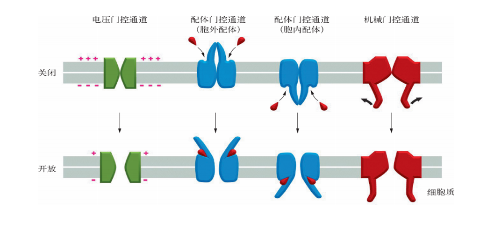
  - 电压闸门通道
    - 这类通道依据细胞内外带电离子的状态，通过膜电位的变化使其构象改变，从而使"门"打开 
  - 配体闸门通道
    - 这类通道在细胞内外的特定配体与其表面受体结合时，“门”打开
  - 机械闸门通道
    - 这类通道在细胞内外的机械压力发生变化时，“门”打开 
##### 离子通道蛋白介导的离子转运的特征：
- 转运速度很快
- 高度选择性
- 都是被动运输(被动运输的特征)

#### (三)易化扩散
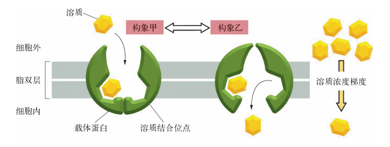
- 一些非脂溶性的物质，需要借助细胞膜上的***载体蛋白***顺浓度梯度运输
- 葡萄糖、氨基酸等物质的运输，需要载体蛋白的介导
  - 例：葡萄糖载体蛋白介导红细胞膜上葡萄糖的被动运输 

##### 特点
  - 顺浓度梯度运输
  - 不消耗细胞代谢能
  - 依靠膜载体蛋白协助
  - 高度特异性
  - 有载体饱和现象
    - 单个载体蛋白的运输速率有限
    - 载体蛋白的数量有限
  - 可抑制性
#### (四)水通道扩散
- 水是一种极性小分子，不溶于脂，但穿膜速度很快
- 1992年，转运水的特异性通道蛋白被发现，目前已发现13种
- 目前用$AQPs$表示水通道
- $AQPs$没有门控性、饱和性、膜电位依赖性
- 有些$AQPs$除了转运水，还会转运其他物质，如氨基酸、糖，甚至亚砷酸盐
  - AQPs3、AQPs7、AQPs9：水-葡萄糖通道
  - AQPs9：也能转运其他小的极性物质，包括氨基酸、糖，甚至亚砷酸盐

#### (五)离子泵
- 离子泵：是膜上的一种能将离子逆浓度梯度转运的载体蛋白，实质是一种ATP酶
- 离子泵有载体和酶的两重作用。
- 种类
  - 钠钾泵
  - 钙泵($Ca^{2+}-ATP$酶)
  - 质子泵：$P$-型质子泵、$V$-型质子泵、$H^+-ATP$酶
##### $Na^+-K^+$泵
> - 水解1个ATP=泵出3个$Na^+$=泵入2个$K^+$
- 大亚基：跨膜蛋白，具有ATP酶活性，是催化亚单位。在细胞质侧有$Na^+$和ATP结合的部位，外侧有$K^+$和乌本苷的结合部位
  - (乌本苷竞争性抑制钠钾泵)
- 小亚基：有组织特异性的糖蛋白，功能不详
- 作用
  - 维持细胞的渗透压，保持细胞的体积
  - 维持$低Na^+高K^+的细胞内环境$
  - 维持细胞的膜电位
  - 驱动糖与氨基酸等的主动运输(伴随运输)
#### (六)伴随运输=协同运输
- 是一类靠细胞代谢能间接提供能量的主动运输
- 物质跨膜的能量来自膜两侧离子的电化学浓度梯度，这个梯度由钠钾泵或质子泵维持、
- 物质逆浓度梯度运输同时***伴随***离子顺浓度运输
##### 分类
- 共运输(同向协同运输)
  - 例：葡萄糖的伴随运输
- 对运输(反向协同运输)

### 二、膜泡运输
- 通过膜包裹被转运物形成囊泡进行物质转运
- 是大分子和颗粒物的运输方式
- 均消耗代谢能
- 分类：
  - 胞吞作用
    - 吞噬作用
    - 胞饮作用
  - 胞吐作用 
#### (一)胞吞作用
> 是指细胞膜局部发生内陷，将外来的大分子或颗粒物质包裹成小囊泡，最终脱离细胞膜进入细胞内的转运过程
##### 1.吞噬作用
- 是指细胞内吞较大的颗粒物质或大分子复合物的过程
- 吞噬作用形成的囊泡较大，称为**吞噬体=吞噬泡**
##### 2.胞饮作用
- 是指细胞内吞液体和溶质或极小颗粒物质的过程
- 胞饮作用形成的囊泡较小，称为**胞饮小体=胞饮体=胞饮小泡**
##### 3.受体介导的内吞作用=受体介导的胞吞作用=有被小泡运输
- 通过特异性受体——配体结合而引发的吞饮作用，称为受体介导的内吞作用
- 是特异性很强的胞吞作用
- 是一种特异、高效地摄取细胞外大分子的方式
- 【例】细胞对胆固醇的摄取即LDL(低密度脂蛋白)受体介导的LDL胞吞
- > 胆固醇在肝中合成并包装成低密度脂蛋白(LDL)
  

###### 特点：
- 吸收速度快，具有选择性浓缩作用
###### 运输物质：
- 已发现25种受体参与不同大分子的胞吞作用，如：胰岛素、某些病毒、低密度脂蛋白(LDL)、转铁蛋白
#### (二)胞吐作用
- 是细胞以小泡方式向外界排除物质的过程
- 是一种与胞吞作用相反的外排过程
- 运输物质：细胞分泌产生的激素、酶类、未消化的残渣
- 过程：
- 分类：
  - 固有分泌=连续性分泌
  - 受调分泌
  - 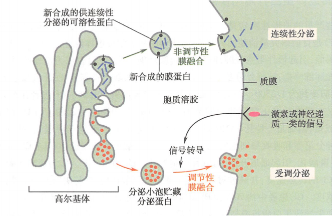

## 第三节 膜转运系统异常与疾病
- 膜转运蛋白结构、功能异常、缺损，会引起相应物质转运缺陷，导致膜转运系统异常疾病
- 病因：**膜转运蛋白基因**突变或表达异常
### 一、胱氨酸尿症
- 是一种影响**小肠上皮**和**肾小球**对**氨基酸**转运能力的**遗传性**膜转运异常疾病。
- 临床表现：以肾结石引起的肾功能损伤为主。
- 发病机制：氨基酸转运子1基因突变→近端肾小管上皮细胞及空肠粘膜转运胱氨酸及二碱基氨基酸(赖、精、鸟)的载体蛋白异常→**氨基酸转运障碍**→尿中排出过量  
- 胱氨酸不易溶于水，所以排出过量时，易形成结晶，造成尿路结石。 
- 因氨基酸丢失，可影响生长发育，导致矮小体型和智力低下。
### 二、肾性糖尿病
- 属**遗传性**膜**转运异常**疾病。  
- 发病机制：基因突变→**肾小管上皮细胞膜**转运**葡萄糖**的载体蛋白功能缺陷→肾近曲小管对葡萄糖的再吸能力下降→引起**糖尿**→发生肾性糖尿病。 
### 三、囊性纤维化
- 属**遗传性**膜**离子通道异常**疾病。
- 临床表现：呼吸系统主要表现为**反复支气管感染**和**气道阻塞**症状。  
- 发病机制：患者的上皮细胞氯离子通道调节有缺陷；呼吸道黏膜上皮的水、电解质跨膜转运有障碍。
### 四、家族性高胆固醇症
- 是由**19号染色体**上**相应基因突变**使细胞膜上的**低密度脂蛋白(LDL)受体缺陷**引起的遗传性疾病。
- 临床表现：动脉粥样硬化、黄瘤。 
- 发病机制：
- LDLR基因突变→LDL受体缺陷→失去对HMG-CoA还原酶合成的抑制作用→胆固醇合成不受抑制，胆固醇酯也不能形成→游离胆固醇过多→高胆固醇血病。
- LDL受体缺陷包括了数量减少、转运不良、亲和力下降、处理乏能等。 
---
# **第六章** 内膜系统
## 概述
- 内膜系统是指位于细胞质内，在结构、功能以及发生上有一定联系的膜性结构的总称
- 内膜系统是真核细胞特有的结构，包括：内质网、高尔基复合体、溶酶体、核膜、各种细胞质内的膜性转运小泡(囊泡)、*过氧化物酶体*
- 这些膜是相互流动的，处于动态平衡，功能上相互协调
- 内膜系统是真核细胞区别于原核细胞的重要标志之一

## 第一节 内质网(ER)
- ER是由一层单位膜包绕成的**管状、泡状和囊状结构**，相互连接形成一个**连续的、内腔相通的**膜性管道系统。
- 它从**核膜延伸至细胞质**中，靠近细胞质内侧。
- 一般情况下，***已分化细胞内质网发达，未分化细胞内质网不发达***
- **内质网发达与否**可以作为判断细胞**分化程度和功能**的**形态学指标**
### 分类
- 糙面内质网 rER
  - 神经元胞质内的尼氏体 
- 光面内质网 sER
  - 苏木精-伊红染色法不易识别
- 微粒体:破碎的内质网自我融合形成的特殊结构
  - 糙面微粒体：表面有核糖体具备蛋白质合成等糙面内质网的基本功能
  - 光面微粒体：表面光滑，可能来自光面内质网，细胞膜、高尔基复合体和其它膜性脆片
- 肌质网:**心肌**和**骨骼肌**细胞中的一种特殊的内质网，其功能是参与肌肉收缩活动。
### 内质网的化学组成
- 主要为蛋白质、脂类
  - 蛋白质：60%~70%，脂类：30%~40%
- 标志酶：**葡萄糖-6-磷酸酶=G-6-P**——内质网
    **细胞色素P450**——光面内质网
- **网质蛋白**普遍存在于**内质网网腔**中。网质蛋白的**羧基端**均含有一个由4个氨基酸残基所构成的**驻留信号KDEL**(赖氨酸-天冬氨酸-谷氨酸-亮氨酸)或**HDEL**(组氨酸-天冬氨酸-谷氨酸-亮氨酸)。该信号与内质网膜上的受体结合使蛋白**驻留**在内质网腔中。
  - **葡萄糖调节蛋白94(GRP94)**是内质网的**标志性分子伴侣**，主要参与新生肽链的折叠和转运。
### 内质网的功能
#### (一)RER的功能
##### 1.参与蛋白质的合成
> - **核糖体是细胞内蛋白质合成的唯一场所**
###### 糙面内质网合成的蛋白质类型：
  - 内源性蛋白质
    - 合成始终在游离的核糖体，不属于RER合成的
  - 外输性蛋白质
    - 合成起始于游离的核糖体，转移到糙面内质网，
    - 分类：
      - 外输性蛋白=分泌蛋白
      - 膜整合蛋白
      - 可溶性驻留蛋白
###### 蛋白质如何进入RER腔？——信号假说
- 蛋白质移位的必需成分
  - ①信号肽=信号序列
    - 新合成蛋白质**N末端**的一段由15~60个氨基酸的疏水序列
    - 该序列具有**引导**合成中的多肽链到**内质网膜上**的功能
    - 信号肽本身在蛋白质合成前被**信号肽酶**切除
  - ②信号识别颗粒=SRP
    - 存在于胞质内，是由一个7S的小分子RNA和6个多肽亚单位构成的复合体
    - 三个功能部位：
      - 信号肽结合位点(右上)
      - 翻译暂停结构域(无)
      - SPR受体结合位点(右下)
      - 
    - 作用：识别并结合**信号肽**和内质网膜中的**SRP受体**
  - ③信号识别颗粒受体=SRP-R=SRP受体=停靠蛋白
  - 是存在于**内质网膜中**的**整合蛋白**，为异二聚体
  - SRP受体能与SRP及其核糖体复合体结合，并把它们引导至内质网膜上被称为**位移子=转运体**的通道蛋白
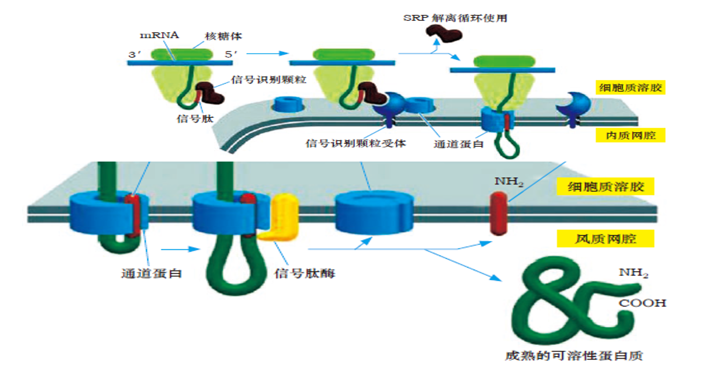
- 新生多肽链从游离的核糖体转移到内质网腔调**过程**：
  - ① 胞质游离核糖体合成**信号肽** 
  - ② **SRP**与信号肽结合，蛋白质的合成暂时终止 
  - ③ **SRP-核糖体复合体**与内质网膜上的**信号识别颗粒受体**结合
  - ④ SRP释放，多肽链经内质网膜上的**通道蛋白**中央的孔进入内质网腔
  - ⑤ 蛋白质协同翻译转运 
  - ⑥ 信号肽酶切除信号肽 
  - ⑦ 蛋白质合成结束

##### 2.帮助新生多肽链的折叠与装配
- 二硫键的形成：
  - 内质网腔中有丰富的**氧化型谷胱甘肽**(GSSG)使腔内形成**高氧化状态**的环境，**二硫键异构酶**使两个**半胱氨酸残基**之间形成**二硫键**。

- 多肽链的折叠
  - 由内质网腔中的**分子伴侣**协助完成(内质网标志性分子伴侣：GRP94)
  - 分子伴侣：是一类在细胞内协助蛋白质多肽链折叠、组装和转运的**蛋白质分子**，但其**本身却不参与**最终产物的形成。分子伴侣可**识别并结合**折叠**错误**的多肽及**尚未完成**装配的蛋白质，使其**滞留**并促使其**重新折叠与装配**，发挥**纠错功能**。
    - "分子伴侣就像是折叠的模具"
##### 3.进行蛋白质的糖基化修饰
- 糖基化：**单糖或寡糖**与蛋白质**共价结合**形成**糖蛋白**的过程
- 糖基化的两种方式：
  - N-连接的糖基化
    - 发生在糙面内质网。始于内质网，完成于*高尔基复合体*
    - 由N－乙酰葡萄糖胺、甘露糖、葡萄糖组成的寡糖与蛋白质的**天冬酰胺残基**侧链上的**氨基基团**共价结合形成(RER、Gc中)
  - O-连接的糖基化
    - 由寡糖与**酪氨酸、丝氨酸、苏氨酸等残基**侧链的**羟基基团**共价结合形成(Gc中)
##### 4.进行蛋白质的细胞内运输
- 在RER上合成的蛋白质进入ER腔经加工修饰后， ER膜以**出芽**的方式将蛋白质包裹形成**膜性转运小泡**，
  - 普遍和最常见的蛋白质分泌途径：运输到**高尔基复合体**，经加工和运输后胞吐出细胞。
  - 另种方式：进入大浓缩泡，发育为**酶原颗粒**，驻留在细胞质中，有**外来信号**刺激的情况下，通过胞吐出细胞。仅见于哺乳动物的胰腺外分泌细胞。
#### (二)SER的功能
- 光面内质网是一**多功能**的细胞器，**不同细胞**中的光面内质网有不同的功能：
  - 脂类合成与转运；
  - 参与脂类代谢；
  - 参与糖原代谢；
  - 参与肝脏的解毒作用；
  - 参与Ca2+储存和Ca2+浓度调节；(肌细胞中)
  - 参与胃酸、胆汁的合成和分泌
#### 糙面内质网和光面内质网的区别
|类别|糙面内质网RER|光面内质网SER|
|-|:-:|:-:|
|结构|扁囊状，排列整齐|分支管状和泡状|
|核糖体附着|附有核糖体|无核糖体附着|
功能|蛋白质的合成、折叠与装配、修饰|不同细胞中功能不同

### 内质网与医学
#### (一)内质网形态结构与功能异常
- 内质网敏感，**缺氧、辐射、中毒、感染及某些化学药物**均可引起内质网**形态、结构功能**的异常。内质网可作为细胞生理功能特性的**敏感指标**
- 形态结构改变常见：**肿胀(肥大)、脱粒、囊池塌陷、腔内物质累积**
- 内质网应激与疾病的关系。
#### (二)内质网与阿尔兹海默病(AD)
- **β-淀粉样蛋白(Aβ)** 在脑组织细胞内质网中**沉积**造成脑细胞大量死亡。
- 与AD病变有关的β－淀粉样蛋白、早老素都与内质网有联系。
- 内质网是生成β－淀粉样蛋白的主要场所，早老素定位在内质网上。

---

## 第二节 高尔基复合体(Gc)
> 内网器→高尔基体→高尔基复合体=高尔基堆
### 一、高尔基复合体的形态结构
- 由一层单位膜构成，略呈弓形，结构较为复杂，有极性(唯一有极性的细胞器)
- 主要由相互联系的三个部分组成：
  - 顺面高尔基网(CGN)，凸面朝向内质网，顺面=形成面=未成熟面
  - 中间高尔基网(MGN)
  - 反面高尔基网(TGN)，凹面朝向细胞膜，反面=成熟面=分泌面
  -  
- 顺面的小囊泡
  - 有两种：
    - ①表面光滑的小泡
    - ②表面有绒毛样结构的衣被小泡
  - 顺面的小泡由内质网芽生而来
  - 又称**转运囊泡=转运小泡**
- 反面分布相对小囊泡较大的囊泡——**大囊泡(分泌泡)**
- 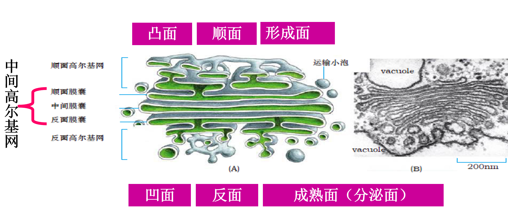
### 二、高尔基复合体的化学组成
- 主要是**蛋白质**和**脂类**
- 含有**多种酶**，如催化糖蛋白合成的**糖基转移酶(标志酶)**，催化糖脂合成的**磺基糖基转移酶**，以及*磷脂酶*、*糖苷酶*等。
### 三、高尔基复合体的极性
- 高尔基复合体是唯一具有极性的细胞器
- 原因：
  - ①构成Gc的各膜囊在形态、化学组成和功能上有**差异性**
  - Gc执行功能时具有**方向性**、**顺序性**
### 四、高尔基复合体的功能
#### (一)细胞内合成蛋白质及脂类运输和分泌的*中转站*
- 高尔基复合体在细胞分泌活动中起着重要的**运输作用**；在分泌颗粒的形成过程中起着   **浓缩、修饰、加工、分选** 等作用。
- .png)
- 普遍和最常见的蛋白质分泌蛋白的合成运输和分泌过程：附着核糖体→RER →转移小泡→顺面高尔基网→中间高尔基网→反面高尔基网→分泌泡→与细胞膜融合通过胞吐作用分泌到细胞外。
#### (二)细胞内合成蛋白质加工的*重要场所*
#####  1、对蛋白质进行糖基化
###### - 分类：
- **N**-连接糖蛋白——始于**糙面内质网**，完成于**高尔基复合体**
- **O**-连接糖蛋白——主要或完全进行和完成于**高尔基复合体** 
###### - 蛋白质糖基化的重要意义：
- 糖基化对蛋白质具有**保护作用**，使它们**免受水解酶的降解**。
- 糖基化具有**运输信号的作用**，可**引导**蛋白质包装形成**运输小泡**，进行蛋白质的**靶向运输**。
- 糖基化**形成细胞膜表面的糖被**，在细胞膜的**保护**、**识别**及**通讯联络**等生命活动中发挥重要作用。

#####  2、分泌性蛋白质 部分肽链的水解
- 将糙面内质网中合成的**无活性蛋白前体**(如胰岛素、甲状腺素、神经肽等)水解，切除部分肽链，转变为**具有生物活性的多肽**
- 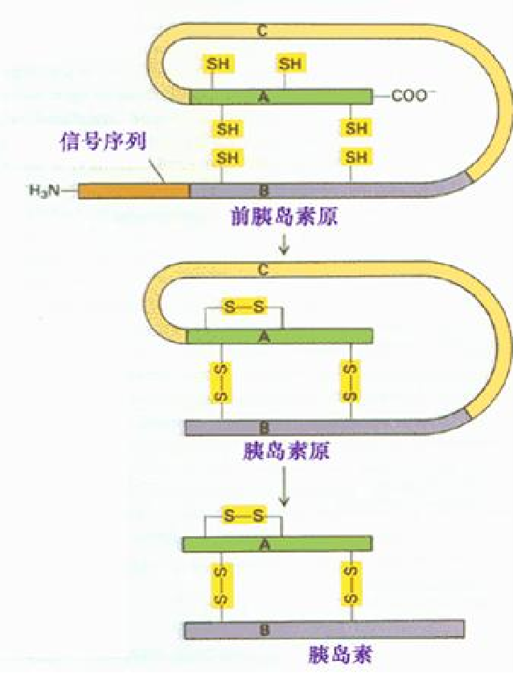

#####  3、对溶酶体酶的磷酸化作用
- 在溶酶体酶糖蛋白寡糖链的甘露糖残基上磷酸化生成**甘露糖-6-磷酸(M6P)**——**溶酶体酶的分选信号**
- (甘露糖被磷酸化为甘露糖-6-磷酸)
- 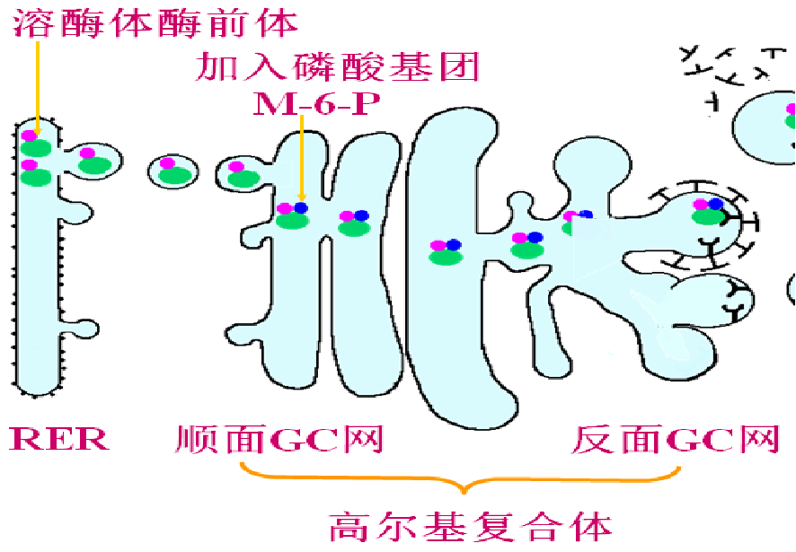

#### (三)高尔基复合体是细胞内**蛋白质分选**和**囊泡运输**的*枢纽*
- ①糙面内质网合成的**蛋白质**在**高尔基复合体中**被加上不同的**分选信号**(磷酸、半乳糖、唾液酸等)，
- ②带有不同**分选信号**的**蛋白质**可被**反面高尔基网**膜上的**专一受体**识别、浓缩、分选，
- ③最后形成不同的**运输小泡**输送到细胞的不同部位。

##### 囊泡运输的3条可能路径：
- 1.(溶酶体酶)以**小泡**的形式转运到**溶酶体**；
- 2.(分泌蛋白)**分泌**释放到细胞外；
- 3.(分泌蛋白)**储存**在细胞质中，在**需要的时候**分泌释放到细胞外(如**受调分泌**)；

#### (四)是错误选送蛋白质的*监督和遣送站*
- **内质网驻留蛋白**的**羧基**端都有内质网**驻留信号**，即**KDEL/HDEL**信号序列。
- KDEL**信号受体**存在于**高尔基复合体的膜上**。通过与**含有KDEL的蛋白**结合形成**小泡**，将这类网质蛋白 **“押送”回内质网**

### (五)高尔基复合体与医学
>- 高尔基复合体也是一种敏感的细胞器
#### ⒈ 肥大与萎缩
- 因**分泌功能亢进**或**代偿性功能亢进**而**肥大**。
- 肝细胞在**中毒**的病理情况下，常见高尔基复合体**萎缩、破坏或消失**。
#### ⒉ 高尔基复合体中内容物的改变
#### ⒊ 癌细胞内的变化
> 一般来说，**高尔基体复合体**在**分化成熟**、**分泌旺盛**的细胞中较为**发达**(参考内质网)
- 一般在**低分化状态**的肿瘤，**无典型结构**，仅为一些分泌小泡聚集在细胞核周围。
- 在**高分化状态**的肿瘤，具有**典型的高尔基复合体形态结构特点**。

## 第三节 溶酶体
### 一、溶酶体的形态结构和特性
- 形态结构：溶酶体是由**一层单位膜**构成的含有多种**酸性水解酶**的**囊泡状**细胞器。
- 溶酶体在形态上具有高度**多样性**和**异质性**：
  - **不同细胞**中溶酶体**数量**差异大。
  - **不同溶酶体含的酶**的**种类、数量**不等。
  - **不同溶酶体**的**大小**不等。
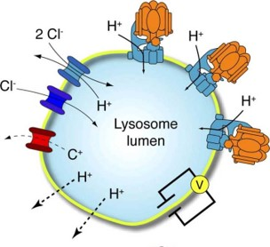
#### 溶酶体的特性(共性)
- 均含有多种酸性水解酶,(**最适pH=5.0**)
  - 溶酶体的**标志酶**——***酸性磷酸酶***
- 溶酶体膜上具有**H+泵**及 **$Cl^-$通道**，能将细胞质中的H+及Cl-运输到溶酶体中维持其**酸性环境** 
- 溶酶体膜的蛋白质表现为**高度糖基化**，寡糖链位于膜的**内表面**，可**防止溶酶体膜被自身的酸性水解酶消化**。
  - 溶酶体膜糖蛋白LGP=溶酶体相关膜蛋白LAMP=溶酶体整合膜蛋白LIMP
- 溶酶体膜中含有较多的**胆固醇**，促使**膜稳定**。
- 溶酶体上存在特殊的**膜转运蛋白**，能将溶酶体消化水解的**产物**运出溶酶体，供细胞加工重新利用或运出细胞外。

### 二、溶酶体的类型
#### 根据生理功能阶段的不同可分为
- 初级溶酶体(primary lysosome)
- 次级溶酶体(secondary lysosome)
  - 自噬性溶酶体(autophagic lysosome)
  - 异噬性溶酶体(heterophagic lysosome)
- 终末溶酶体(telolysosome)
- 
### 三、溶酶体的发生：甘露糖-6-磷酸(M-6-P)途径
- 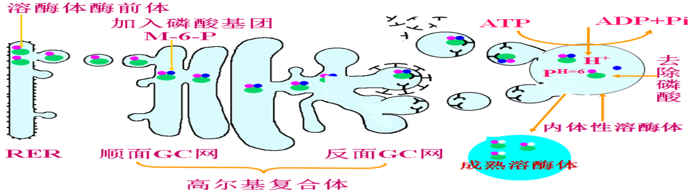
- ①溶酶体酶蛋白前体在糙面内质网进行合成、初加工(N-连接的糖基化(甘露糖))和转运。
- ②溶酶体酶蛋白前体在高尔基复合体进行标记(甘露糖被磷酸化为M-6-P)、分选和转运。
- ③内体性溶酶体在细胞质中的形成
- ④溶酶体的成熟
>- 内质网上核糖体合成溶酶体蛋白→进入内质网腔进行N-连接的糖基化修饰→进入高尔基体顺面膜囊→糖蛋白寡糖链上的甘露糖磷酸化作用下形成M-6-P(甘露糖-6-磷酸)→与高尔基体反面膜囊内侧的M-6-P受体结合→运输小泡形成并脱离反面高尔基网→运输小泡与内体结合形成内体性溶酶体→溶酶体酶前体与M-6-P 受体分离→
→溶酶体酶通过去磷酸化成熟(内体性溶酶体)
→卸载的M-6-P受体通过溶酶体膜出芽、包裹、脱落，以运输小泡的形式回到反面高尔基网再循环 。
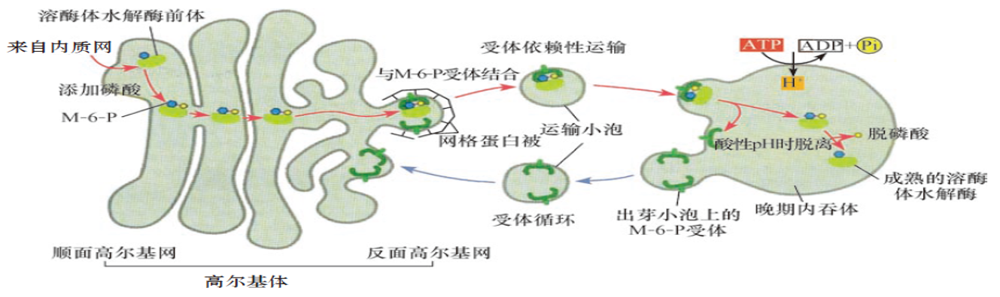
### 四、溶酶体的功能
#### (一)参与细胞防御——**异噬作用**
- 溶酶体具有强大的**物质消化分解能力**，可**吞噬**并**水解消化细菌**等——保护防御作用。 
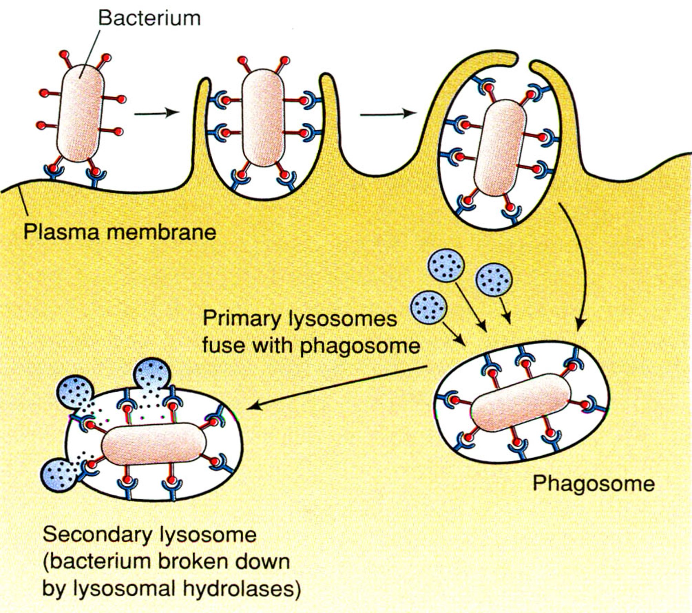
#### (二)参与细胞结构及细胞器的更新——**自噬作用**
- 溶酶体能够消化细胞内**损伤或衰老的细胞器**并将其清除，有利于**细胞器的更新**。 

#### (三)对吞噬的大分子营养物质进行消化分解，**提供细胞营养**
- 溶酶体对**吞噬**的**大分子营养物质**进行**消化作用**，是细胞获取营养物质的重要途径；
- 细胞**饥饿状态**下，可通过溶酶体分解一些**对细胞生存不重要的大分子物质**来维持细胞的基本生存。

#### (四)**参与机体组织器官的形态建成**
- 溶酶体通过**自溶作用**除去不必要的细胞或组织。

#### (五)参与受精过程
- **外消化作用**
- 顶体：是一个巨大的溶酶体
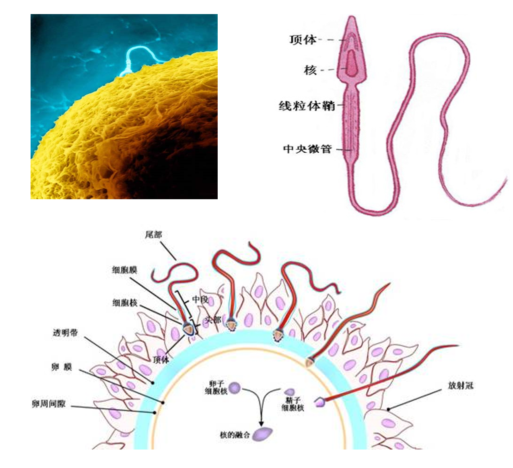
#### (六)**参与激素的合成**，调节激素水平
- 参与激素合成中**原料**摄取、加工、储存及**已合成激素**的加工、成熟等步骤；
  - 在分泌**类固醇激素**的细胞中，溶酶体主要参与激素原料**胆固醇**的代谢活动；
  - 在分泌**肽类激素**的细胞中，溶酶体主要作用是将**尚未加工完毕**的激素**水解**转化为**成熟的、分泌形式的**激素。
### 五、溶酶体与医学
#### (一)溶酶体**缺乏**导致的**贮积症**
- 糖原贮积症Ⅱ型：不能合成α－葡萄糖苷酶，
  - 使糖原无法分解，贮积在溶酶体内，使溶酶体越来越大，占据大部分细胞质
- 黏脂贮积症Ⅱ型：缺乏N-乙酰氨基葡糖磷酸转移酶
  - 使溶酶体酶到达高尔基复合体后，不能形成分选信号M-6-P，直接分泌到细胞外。血液中有溶酶体酶，溶酶体中没有溶酶体酶。组织细胞中黏多糖沉积
#### (二)溶酶体膜**稳定性异常**导致的疾病
##### 硅沉着病=矽肺
- **溶酶体膜稳定性下降**，溶酶体酶释放
- 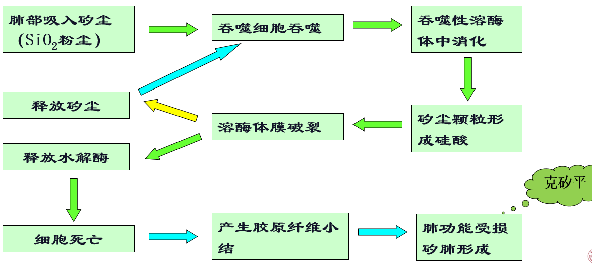
##### 痛风
- 当**尿酸盐生成与排出失衡**时，**血尿酸盐升高**，以**结晶**形式**沉积**于**关节及多种组织**中，并**被白细胞吞噬**。被吞噬的**尿酸盐结晶**以**氢键**和溶酶体膜**结合**，改变溶酶体的**稳定性**，溶酶体中**水解酶释放**，引起**白细胞自溶坏死**，导致沉积部位组织的**急性炎症反应**。
## 第四节 过氧化物酶体
> **过氧化物酶体=过氧化氢体=过氧小体=微体**
- 过氧化物酶体存在于**所有真核细胞**中
### 一、过氧化物酶体的形态结构
- 由**一层单位膜**包裹的**膜相**细胞器，多呈**圆形或卵圆形**有时也呈**半月形或长方形**。
- 其中含有极细的颗粒状物质，中央常含有电子密度很高的结晶状核心，称为**类核体**或**类晶体**，为**尿酸氧化酶的结晶**。
- **人和鸟类**细胞的过氧化物酶体中**不含尿酸氧化酶**，因而**没有类核体**。
### 二、过氧化物酶体的酶
- 和溶酶体一样，过氧化物酶体属于异质性细胞器
  - 形态、大小，所含酶类的数量、种类不同
#### 根据性质大致分为三类：
- **1. 氧化酶类**
  - 约占过氧化物酶体酶总量的**50%~60%**，
  - 基本特征是 对作用底物的氧化过程中，能**把氧还原成过氧化氢**，
  - 反应通式：$\ce{RH_2 +O_2->[氧化酶]R +H_2O_2}$
- **2. 过氧化氢酶类**
  - 约占过氧化物酶体酶总量的**40%**，
  - 其作用是**将过氧化氢水解成水和氧气**。
  - 反应通式：$\ce{2H_2O_2->T[过氧化氢酶]2H_2O +O_2}$
  - 过氧化氢酶是**过氧化物酶体的标志酶**。
- **3. 过氧化物酶类**
  - 仅存在于(如血细胞等)少数几种细胞类型的过氧化物酶体中，
  - 其作用**与过氧化氢酶相同**。
- 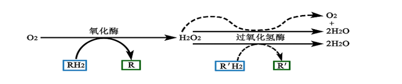
### 三、过氧化物酶体的功能
- 清除细胞代谢过程中产生的**过氧化氢**等**毒性物质**，发挥**解毒作用**
  - 消除细胞代谢过程中产生的过氧化氢以及其他有害物质，防止细胞中毒。这种类型的氧化反应在肝、肾细胞中特别重要。 
- 调节细胞内的**氧浓度**，使细胞**免受高浓度氧**的损害
- 进行**脂肪酸的氧化**，参与细胞代谢活动 
- 
## 第五节 细胞内蛋白质的分选
> - 蛋白质分选(protein sorting)：细胞内**新合成的蛋白质**被准确无误地**送到**有关膜结构和细胞器的过程，叫做细胞内蛋白质的分选。
- 蛋白质的分选是**细胞结构**和**生命活动** **有序性**的基础
### 一、**分选信号的不同**决定了蛋白质**去向的差异**
- 分选实现的条件：
  - 分选信号
  - 信号识别颗粒及其受体
  - 细胞器膜上的蛋白质传导通道
- 而定位于**胞质溶胶=细胞质基质**以及**细胞表面**的蛋白质是**没有分选信号**的，这种定位方式称为**缺省途径**(default pathway)。
#### 信号肽
- 是一段连续的**氨基酸序列**，长约15-60个氨基酸残基。一旦完成分选过程，常**被一种信号肽酶切除**。
#### 信号斑
- 是指在蛋白质折叠过程中一些**氨基酸残基**所构成的特异三维排列。构成信号斑的氨基酸残基在线型氨基酸序列中彼此**相距较远**，一般**保留在已完成的蛋白质中**。 

#### 蛋白质分选信号与运输途径：
- 
### 二、胞内蛋白的运输方式
#### 蛋白质在细胞内的基本运输途径有3种：
- 
##### (1)门孔运输
- 蛋白质在**核质间**的运输。
- 该运输需通过**核孔复合体(NPC)**，称为**门孔运输=控制运输**。**核孔复合体**具有**选择控制功能**，能**主动运输*****特异的***大分子和大分子组装物，而**小分子物质**可**自由扩散**。**亲核蛋白质**具有**核定位信号(NLS)**而核孔复合体上有**NLS受体**，二者结合后，亲核蛋白就能进入核内。 
##### (2)穿膜运输
- 蛋白质在**细胞质基质**与细胞质内**膜性细胞器之间**的运输
- 由膜上的**蛋白转运装置**(某种**膜蛋白**充当)运输***特异的***蛋白质穿过膜从细胞质基质到**各种不同的细胞器**。这样运输的蛋白质通常是**不折叠的**，运输过程常靠**分子伴侣**的帮助。
  - **[如]**：**蛋白质跨线粒体膜运输**
##### (3)囊泡运输
- 蛋白质在**膜性细胞器之间**的运输
- 蛋白质被**选择性**地包装成**膜囊泡**的形式(**运输小泡**)，**靶向运输**到**靶细胞器**。

## 第六节 囊泡与囊泡转运
### 一、囊泡是细胞内物质**定向运输**的主要载体
#### 两种类型的囊泡：
- 1、网格蛋白包被的囊泡：产生于细胞膜和高尔基复合体
- 2、包被蛋白包被的囊泡：
  - COPⅡ有被囊泡:主要负责蛋白质的正向运输
  - COPⅠ有被囊泡:主要负责内质网逃逸蛋白的回收
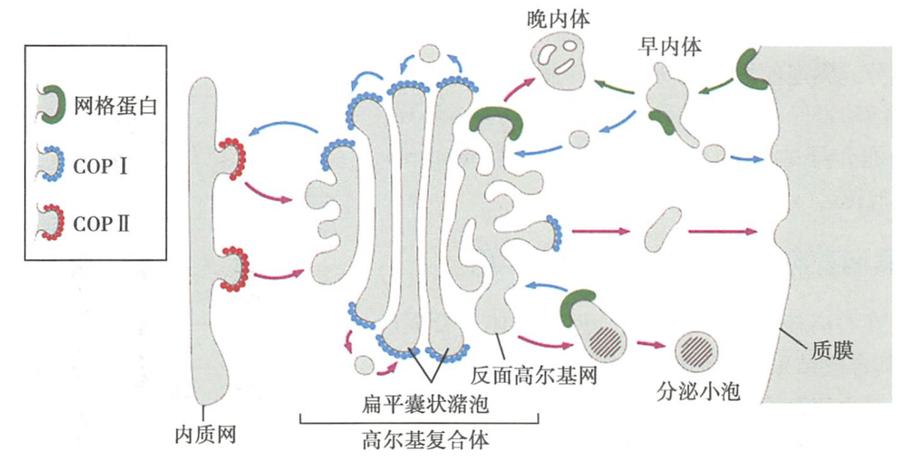
### 二、囊泡转运过程是一个高度有序、严格调控的定向物质运输过程
- 囊泡转运过程受到**严格的选择**和**精密控制**。
- 囊泡必须**特异性识别**锚定于靶膜并卸载货物

---

# **第七章** 线粒体(mt)
## 第一节 线粒体的形态结构
### 一、线粒体的形态、大小、数量、分布
- 形态：**短线状、颗粒状**
  - 随细胞生理状况变化可呈环形、哑铃形、泡状等
- 大小：不同细胞**差异较大**
- 数量：**新陈代谢**旺盛的细胞数目较多。 
- 分布：在细胞内**分布不均**，一般聚集在细胞**功能旺盛**，**需要能量供应**的**区域**。
- 线粒体是一个**敏感**多变的细胞器：对外界环境的变化非常敏感，其形态、大小、数量和分布会随细胞外界环境的改变而改变。
### 线粒体的特性
- 人和动物细胞中**95％**的**ATP**在**线粒体**中产生；其余**5％**的ATP在细胞质中经**糖酵解**产生。
- 线粒体的专一性活性染料：**詹纳斯绿B**。
-  线粒体是一个**敏感多变**的细胞器：
### 二、线粒体的亚微结构=亚显微结构=超微结构
>- 电镜结构：线粒体是由**两层单位膜**围成的封闭膜性结构，有**内膜**和**外膜**

- (一)外膜(outer membrane)
  - 膜上含有**孔蛋白**，其中央有**小孔**，可选择性通过分子量**5 kDa以下**的分子，外膜**通透性较高**。 
- (二)内膜(inner membrane) 
  - **通透性**较外膜**小**，对**分子和离子**的通透有**严格的控制**
    - 如丙酮酸、$H^+$需**内膜**上的**膜转运蛋白**协助才能进行**跨膜运输**。
  - 内膜**向内褶叠，形成嵴**。
  - 内膜上有基粒、呼吸链
- (三)膜间隙(略)
- (四)基质
  - 有mtDNA、核糖体等
- (五)基粒
  - **内膜** **内表面**及**嵴**上**有柄的球状小体**－－线粒体的**ATP合成酶**。
  - 在内膜或嵴膜上存在许多与膜面垂直的带柄的球形小体，由**头、柄、基片**三部分组成。又称为**ATP合酶复合体**，是线粒体功能发挥的关键结构。
    - **头部**：化学本质是水溶性ATP酶系，又称F1因子或F1 -ATPase。纯化的F1因子催化ATP水解，当**头部通过柄部与基片相连**时**催化ATP合成**。
    - **柄部**：连接头部（F1）和基片（F0）的结构。具有**质子转运活性**，化学本质是一种可**使F1对寡霉素敏感**的蛋白（OSCP），作用是**特异性阻断H+通道**，从而**抑制ATP合成**。
    - **基片**：又称F0因子或F0-ATPase，是镶嵌于内膜（嵴）脂双分子层中的**疏水蛋白复合体**，由多亚基组成，形成一个**跨膜的质子通道**。其周围有呼吸链，是将氧化过程中所释放的**能量**传递到头部催化ADP 磷酸化生成ATP的**中转站**。 

- （六（补充））呼吸链=电子转移链
  - 是指存在于线粒体**内膜上**一种**酶的复合体**。由一系列可逆地接受及释放电子或质子的脂蛋白复合体组成，彼此形成相互关联、有序排列的功能结构体系，能把代谢物在三羧酸循环过程中脱下的氢传递给氧生成水，并释放大量能量 。

## 第二节 线粒体的化学组成及酶定位
### 一、线粒体的化学组成
- 主要成分是**蛋白质**和**脂类**，尤以**蛋白质**为多，占线粒体**干重的65% -70%**，**内膜含量较多**。
  - （线粒体是细胞质中含酶最多的细胞器之一）
-  线粒体**脂质与蛋白质的比例**在**外膜为1：1**，而在**内膜为1：4**。此外，线粒体内、外膜所含脂质和蛋白质的**种类**也有**差异**。 
### 二、线粒体中酶的定位分布
- 线粒体是细胞质中**含酶最多**的细胞器之一。140余种，37％氧化还原酶，10％合成酶，9％水解酶，标志酶30余种，主要在**内膜和基质中**。
  - **三羧酸循环酶类**：线粒体**基质**中。 
  - **呼吸链酶类**：线粒体**内膜**上。 
  - **ATP酶复合体（基粒）**：线粒体**内膜**上,是**氧化磷酸化**的关键装置。

|酶类|分布|
|:--:|--|
|三羧酸循环酶类|基质|
|呼吸链酶类|内膜|
|ATP酶复合体（基粒）|内膜|
#### 线粒体功能部位的**标志酶**:
- **外膜——单胺氧化酶**
- **内膜——细胞色素氧化酶**
- **膜间腔——腺苷酸激酶**
- **基质——苹果酸脱氢酶**
## 第三节 线粒体的功能
- 主要功能是进行**三羧酸循环**和**氧化磷酸化**，**合成ATP**。
- 通过对三大营养物质（糖、脂肪、蛋白质）**有氧氧化释放能量**，并将**能量**通过**ADP磷酸化**，储存于**ATP**中，以ATP形式提供细胞生命活动所需能量的**95%以上**
- 
### 一、细胞呼吸及其基本过程
- **细胞氧化**=**细胞呼吸**：生物体从外界吸收$O_2$，将细胞内各种能源物质氧化分解，放出$CO_2$和$H_2O$，释放能量，供生命活动的需要。 
#### 基本过程：
- 1. 糖酵解（细胞质）
- 2. 乙酰CoA生成（线粒体基质）
- 3. 三羧酸循环（线粒体基质）
- 4. 电子传递和偶联的氧化磷酸化（线粒体内膜（基粒上））
  - 氧化磷酸化：在电子传递过程中有能量的释放和ADP磷酸化为ATP，**氧化和磷酸化偶联进行**，这一过程在线粒体内膜紧连呼吸链的**基粒**上进行
.png)
.png)

## 第四节 线粒体的半自主性
- 线粒体具有**自身的遗传体系**（mtDNA、tRNA、核糖体，氨基酸活化酶等），
  - **mtDNA**能自主 复制转录和翻译。
  - 但由于其**遗传信息量小**，只能合成**13种线粒体蛋白**（全在呼吸链上），线粒体**90％以上**的蛋白由**核基因编码**，
  - 因此线粒体是一个***半*****自主性**的细胞器（semiautonomous organelle）。 
### 一、mtDNA
- mtDNA被称为是真核细胞的第二遗传系统。存在于**线粒体基质**中，
- mtDNA为**裸露的闭合双链环状**结构（除草履虫等少数生物的mtDNA为开放的双链结构外）
- mtDNA所含碱基对少，可自我复制。其含量仅为全细胞DNA含量的1%。
- mtDNA**易于发生突变**
#### 人mtDNA的结构： 
- 由两条链组成的闭合环状分子，外环为重链（H链，富含G），内环为轻链（L链，富含C）。

### 二、mtDNA的功能
- 半保留复制
- 指导蛋白质合成（线粒体遗传密码与通用密码略有差别）
### 三、蛋白质跨线粒体膜的运送
#### 蛋白质的运输方式：
- 共转移形式
- 后转移形式

- 1、线粒体蛋白质**前体**由细胞质内的**游离核糖体合成**后，再转运至线粒体内，即属于**后转移形式** **单向跨膜运输**。
- 2、线粒体蛋白质的转运需要特定的**蛋白质分选信号**（**前导序列**）的引导。
  - 前导序列能识别线粒体表面的相应**受体**
- 3、线粒体蛋白质前体在跨膜运送前后，需经历一个**解折叠与重折叠**的**成熟过程**。该过程中，需**分子伴侣**的帮助。
- ４、线粒体蛋白通过其内外膜的**接触点**进入线粒体内。这一过程需要**线粒体外膜**的 **GIP蛋白(general insertion protein)** 的帮助。
- ５、**前导序列水解酶**和**前导序列水解激活酶** **水解切除** **前导序列**。

## 第五节 线粒体的生物发生
- 线粒体的增殖：分裂增殖
- 线粒体的起源：内共生学说
## 第六节 线粒体与医学
### 一、mtDNA突变与疾病
- 线粒体病常常表现为**肌病**和**神经系统疾病**，
  - 因为**心肌、骨骼肌**和**神经系统**是**耗能多**的器官的组织，依赖氧化磷酸化的程度高。
- 典型的线粒体病是Leber’s遗传性视神经病。视神经进行性退变，急性视觉丧失，通常在20岁左右发病。 
- 母系遗传
### 二、线粒体与肿瘤
- 癌变细胞线粒体数量为何减少？
  - 癌细胞的**线粒体有功能障碍**并主要由**糖酵解**获得能量 
  - 线粒体的减少也是细胞**未成熟和（或）去分化**的表现。
### 三、线粒体某些组分的治疗作用
> 用线粒体的一些特殊组分来治疗疾病，已越来越多地受到人们的关注。
- 例：细胞色素C－CO中毒、新生儿窒息、肺功能不全、高山缺氧、心肌炎及心绞痛的急救和辅助用-药；
- 辅酶（NAD＋）－进行性肌肉萎缩和肝炎；
- CoQ－心肌炎、牙周病、高血压、肌肉萎缩及急性黄胆性肝炎等。
# **第八章** 核糖体(r)
- 核糖体（ribosome）是一种**非膜性**颗粒状的细胞器，
- 由**rRNA**和**蛋白质**组成。
- 是**蛋白质合成**的中心场所，
- 存在于几乎所有类型的活细胞中，
- 是细胞最基本的不可缺少的重要结构，被称为生命活动的基本粒子。 
## 第一节 核糖体的基本形态结构与存在形式
### 一、形态结构
- 电镜结构：核糖体由**大、小两个亚基**组成。
- 
  - 大亚基：略呈圆锥形 ；中央部位有一条管道（**中央管道**），是新合成的**多肽链释放**的通道。 
  - 小亚基：长条状，呈略微弯曲的葫芦形 。
    - 大小亚基结合时在其结合面上形成一条**隧道**，这是**mRNA穿过**的通道。  
### 二、存在形式
- 大、小亚基
- 核糖体：也叫核糖体单体
- 多核糖体：又称多聚核糖体
- 附着核糖体
- 游离核糖体
> 
## 第二节 核糖体的基本类型与化学成分
### 一、核糖体的类型
#### 根据核糖体来源地生物类群分类：
- 原核生物核糖体
- 真核生物核糖体
  - 细胞质核糖体
  - 细胞器核糖体
    - 线粒体核糖体
    - 叶绿体核糖体
### 二、核糖体的化学成分
- **rRNA**和**核糖体蛋白质**（ribosome protein, **rP**）。
- **rRNA**位于核糖体**内部**，而**蛋白质**则主要分布在核糖体**表面**
  - 二者靠**非共价键结合**。
- 不同类型的核糖体在大小及化学成分上有差异。
#### 两种基本类型
- 一种是**70S**的核糖体（50S+30S），主要存在于**原核细胞**和真核细胞中的**叶绿体**。
  - 大亚基（50S）：23S、5S rRNA+34种蛋白质
  - 小亚基（30S）：16S rRNA +21种蛋白质
- 一种是**80S**的核糖体（60S+40S），存在于所有**真核细胞**（线粒体和叶绿体除外）。
  - 大亚基（60S）：5S、5.8S、28S rRNA+49种蛋白质
  - 小亚基（40S）：18s rRNA+33种蛋白质
 
## 第三节 核糖体的功能
### 一、核糖体的功能位点
- 核糖体的功能是**进行蛋白质的生物合成**。
- 核糖体上存在多个与蛋白质合成相关的**活性部位**，主要包括：
- 
  - 1、**mRNA结合部位**：位于**小亚基**上。
  - 2、**氨酰基结合位点**，又称**A位**(A site)或**受位**(entry site)：主要位于**大亚基**上，是与新掺入的**氨酰-tRNA**相结合的部位。           
  - 3、**肽酰基结合位点**，又称**P位**(P site)或**供位**(donor site)：主要位于**大亚基**上，是与延伸中的**肽酰基-tRNA**结合的部位。 
  - 4、**tRNA结合位点**，又称**E位**（exit site）：位于**大亚基**上，是肽酰-tRNA移交肽链后**tRNA的暂时停靠点**。
  - 5、**肽酰基转移酶位**：位于**大亚基**上，是与肽酰-tRNA从A位点转移到P位点有关的**转移酶（即延伸因子EF-G）的结合位点**。同时，此位点还**可能与**催化氨基酸之间**形成肽键**和**水解GTP**为肽酰-tRNA的转移**提供能量**有关。 
### 二、蛋白质合成的基本过程
#### （一）多聚核糖体
- 由mRNA分子和多个核糖体形成的聚合体，是蛋白质合成的功能集团。
- 多聚核糖体所含核糖体的**数量**是由 mRNA分子的**长度**决定的。
  - 一般情况下，mRNA分子越长，核糖体的个数就越多。
- 
#### (二)合成蛋白质时真核生物细胞质核糖体的存在形式：
- 1、附着核糖体（fixed ribosome）
  - 附着于**RER**和**核膜**的核糖体；主要合成**输出蛋白质=外输蛋白质=分泌蛋白质**。 
这种附着是临时性功能性附着。 
- 2、游离核糖体（free ribosome）
  - **游离于细胞质**中的核糖体；主要合成**结构蛋白质=内源性蛋白质**。
- 也有实验证明：附着核糖体也能产生结构蛋白质，游离核糖体也可产生外输性蛋白质

---

# **第九章** 细胞骨架
## 概述
- 是广泛存在于**真核细胞**中由**蛋白质纤维**组成的**网络系统**。
- 功能：保持细胞形态、参与细胞运动、细胞分裂、细胞内运输以及信息传递等。
### 广义细胞骨架
- 细胞质骨架（狭义细胞骨架）
  - 微管
  - 微丝
  - 中间纤维
- 细胞核骨架
- 细胞膜骨架
- 细胞外基质
## 第一节 微管(MT)
### 一、微管的形态结构、化学组成、存在形式及微管结合蛋白
#### （一）微管的形态结构
- 微管是一种具有**极性**、直而中空的圆筒状结构，直径24～26nm，长短不一。 
#### (二)微管的化学组成
##### 1.微管蛋白
###### 分类
- α-微管蛋白
- β-微管蛋白
- γ-微管蛋白
######
-  是构成微管的主要蛋白。是一种**酸性蛋白质**，由α和β两种单体构成。α-微管蛋白和β-微管蛋白的理化性质相似，分子大小相近。
- 通常α和β–微管蛋白各一个分子连在一起构成较稳定的**异二聚体**（heterodimer）。**异二聚体**是微管装配的基本结构单位。 
  - α、β-微管蛋白异二聚体上有鸟嘌呤核苷酸（**GTP/GDP**）、二价阳离子（**$Mg^{2+}与Ca^{2+}$**）、**秋水仙素**、**长春花碱**的**结合位点**
- γ–微管蛋白是近年来发现的第三种微管组成成分。**含量低**（不到1%），但作用同样重要。
- γ-微管蛋白通常以**γ-微管蛋白环状复合物=γ-微管蛋白环形复合体**（**γ-TuRC**, γ-tubulin ring complex）的形式存在于微管组织中心（MTOC），对微管的**正常组装**有**调节作用**。

##### 2.微管相关蛋白

- 种类较多，并非构成微管的基本构件，是维持微管**结构**和**功能**的**必需成分**。**决定不同微管间的差异**。
- 功能:
  - 促进微管**聚集成束**
  - 增加微管**稳定性和强度**
  - 促进微管**组装**
- 分类
  - 主要有**MAP-1**、**MAP-2**、**Tau**和**MAP-4**等几种，前三种主要存在于**神经元**中，MAP4广泛分布于**各种细胞**中。
  - 一般认为，**MAP**与**细胞骨架间的连接**有关，**Tau**蛋白的功能是**加速**微管蛋白的**聚合**。

###### Tau蛋白与阿尔兹海默病
- Tau蛋白作用：在**轴突中**，**与微管蛋白结合**促进其**聚合构建微管**。
- 病理改变：磷酸化，失去和微管结合的**活性**，并竞争结合正常Tau蛋白及其它微管相关蛋白。
- 结果：导致**微管解聚**，造成轴突**转运障碍**
#### (三)微管的存在形式
##### 单管
- 最常见的微管存在形式。由**13根原纤维**包围而成。
##### 二联管
- 由A、B**两根微管**组成，两管构造相同，有**3根原纤维**两管共有。主要存在于**鞭毛**和**纤毛**的**杆状部分**。
##### 三联管
- 由A、B、C**三根微管**组成，其中A与B、B与C各有**3根原纤维**共有。存在于**中心粒**和**纤毛**的***基体***。

-
#####
- **二联管**和**三联管**是细胞内某些**永久性功能结构**的**主体**，通常不易受低温、Ca2+及秋水仙素等的影响而发生解聚，是细胞内**稳定型微管结构**。

### 二、微管的组装
> 微管是一种具有**极性**、**动态**、**不稳定**结构，可依**细胞活动**不断**组装和去组装**（微管←→微管蛋白）。

#### (一)微管的体外组装过程
- 
- αβ异二聚体→寡聚体核心→片状结构→13根原纤维→微管→延长→长度相对稳定
##### 1.成核期=延迟期

- $\ce{αβ异二聚体->寡聚体核心->[延伸、扩展][侧面结合]片状结构->13根原纤维->[横向卷曲][合拢]微管}$
- αβ异二聚体聚合速度**缓慢**，是微管聚合的**限速阶段**
##### 2.聚合期=延长期
- 细胞内高浓度的**游离微管蛋白**，使微管蛋白二聚体在微管正端**聚合、组装的速度**远远**快于**负端的**解离速度**，微管因此得**不断地延长**。
- 
##### 3.稳定期=平衡期
- 随着**细胞质**中**游离微管蛋白浓度**的**下降**，微管在**正、负两端**的聚合与解聚**速度**达到**平衡**，使微管长度趋于**相对稳定**的状态。
#### （二）微管的体外组装与**踏车模型**
- **“踏车”模型** （treadmilling model） 
  - 微管具有**非稳定**的**动态特征**。
  - 微管的正端组装，微管延长；
  - 微管的负端可去组装,微管缩短
  - 
- 原理
  - 微管的组装是一个**消耗能量**的过程，组装微管的能量由**GTP水解**提供
  - 微管蛋白**迅速聚合**时，微管蛋白分子**添加到微管上的速度** **大于**它携带的**GTP水解的速度**，在新生成的微管末端（正端）**形成GTP帽**
  - **GTP微管蛋白二聚体**构成的原纤维是**直线型原纤维**
  - **GDP微管蛋白二聚体**构成的原纤维是**弯曲型原纤维**
  
- 结论  
  - GTP帽→"GDP帽"
    - 微管蛋白GTP帽：与GTP结合的微管蛋白构成，促进微管组装、延长。
    - 微管蛋白GDP帽：与GDP结合的微管蛋白构成，促进微管解聚、缩短。
#### (三)微管的体内组装
> 微管的体内组装远比体外组装更复杂
> - 除了要体外组装的条件外，更多受到严格的空间时间的控制
> - 还有特殊的始发区域——**微管组织中心MTOC**
- 常见的MTOC：**中心体**、**鞭毛和纤毛的基体**。
- MTOC是微管形成的**核心位点**，微管的组装由此开始。
- MTOC的作用：使微管生成和延长，控制细胞质中微管形成的数量、位置和方向。 
  - MTOC中含有**γ-TuRC**(**γ-微管蛋白环形复合体**)

- **γ-微管蛋白环状复合物（γ-TuRC）**作为微管蛋白二聚体结合的核心，是微管组装的始发位置。不但可促使微管的生长和延长，而且也控制着细胞质中微管形成的数量、位置和方向。
- 通常，微管的**负端**总是**指向MTOC**，而**正端**则与之相背，**游离**于胞质的一侧。
#### (四)影响微管组装与去组装的因素
##### 1.微管蛋白浓度
- 关键因素之一。微管的组装需要一定的微管蛋白浓度。<u>微管蛋白聚合与微管组装时必需的**最低**微管蛋白浓度</u>，称为**临界浓度**。
- 其值大约为1mg/ml，但会受到其他因素的影响。
###### 微管蛋白的合成可以自我调节
- 微管蛋白达到一定浓度时，多余的**微管蛋白单体**可**结合**于合成微管蛋白的**核糖体**上，导致编码 微管蛋白的**mRNA降解**。
  - 微管的组装受细胞周期的调控。
##### 2.GTP浓度
- 关键因素之二
##### 3.其他条件
- 高Mg2+浓度、适当pH（约6.9）、合适的温度（＞20℃）、GTP（关键因素之二）、氧化氘（D2O）的供应、紫杉醇能**促进**微管的组装。 
- 反之，小于4℃的温度、高Ca2+浓度、秋水仙碱、长春花碱等，可**抑制**微管的聚合组装，甚至使其解体。 
### 五、 微管的功能
#### 1.构成细胞的网状支架，维持细胞的形态，固定细胞器的位置。
#### 2.参与中心粒、纤毛和鞭毛的形成。
- **中心粒**由**9组三联管**围成，是动物细胞中主要的**微管组织中心(MTOC)**  
  - 中心粒——$9\times3+0$

- 纤毛和鞭毛以微管为主要成分构成，有特殊的结构形式。
#### 3.参与细胞内**大分子颗粒物质**及**囊泡**的**定向转送运输**。
- 如，细胞**分泌颗粒**、**色素颗粒**沿微管运输，**线粒体的快速运动**沿微管进行，
- 如果破坏微管，物质运输就会受到抑制。
#### 4.参与**细胞器**的**位移**和细胞分裂过程中**染色体**的**定向移动**。

#### 5.参与细胞内信号转导。
- 微管参与ERK、JNK、Wnt等多条信号转导通路。
- 信号分子可直接与微管作用或通过马达蛋白和一些支架蛋白来与微管作用。
- 微管的信号转导作用具有重要的生物学意义。

## 第二节 微丝(MF)
### 一、微丝的基本组成和形态结构
#### （一）微丝的基本组成
- **微丝=肌动蛋白丝**
- 是一种具有**极性**的**实心**纤维状结构，直径为7nm，直而长度不一。
- 由肌动蛋白组成
##### 肌动蛋白
  - 球状肌动蛋白=G肌动蛋白
    - 外观呈哑铃状，**有极性**；具有与ATP/ADP以及Mg2+、K+、Na+等阳离子结合的位点。 
    - 分类 
      - α肌动蛋白
        - 横纹肌、心肌、血管、肠壁平滑肌特有
      - β肌动蛋白
        - 可见于所有肌细胞和非肌细胞中
      - γ肌动蛋白
        - 可见于所有肌细胞和非肌细胞中
  - 微丝结合蛋白
    - 是微丝结构和功能的必需成分。其不仅**直接参与**微丝纤维系统高级结构的形成，而且对肌动蛋白纤维的动态组装具有重要的**调节功能**。
    - 种类较多。 
#### （二）微丝的形态结构
- 微丝是由G肌动蛋白单体形成的多聚体（纤维状肌动蛋白，F-肌动蛋白）。

- 球状肌动蛋白（G-肌动蛋白）→纤维状肌动蛋白(F-肌动蛋白)→两条F-肌动蛋白自身螺旋→微丝
### 二、微丝的组装
#### （一）微丝的体外组装过程
##### 1.成核期=延迟期
- 该期是微丝组装的限速阶段，会滞留相对较长的时间，故也称为延迟期。
- $\ce{G-肌动蛋白->三聚体或四聚体核心->F-肌动蛋白}$
##### 2.生长期=延长期
- 此期G肌动蛋白在核心**两端**的集结、聚合,速度不断加快，使得F肌动蛋白得以**迅速增长、延伸**。
- F肌动蛋白两端表显出明显的**差速生长和延伸**。一般，把生长、延伸速度**快**的一端称作**正（+）端**，另一端即为**负（－）端**。 
- 
##### 3.平衡期
## 第三节 中间纤维
## 第四节 细胞骨架组分的衍生结构
## 第五节 细胞骨架与医学

# **第十章** 细胞核
## 第一节 核膜
## 第二节 染色质与染色体
## 第三节 核仁
## 第四节 核骨架．

